# RTIv2 Technical Protocol Specification

Author:  Netbeheer Nederland<br>
Version: beta-1 rev. 2026-01-30

# Table of contents

[1 Introduction [4](#introduction)](#introduction)

[1.1 Background [4](#background)](#background)

[1.2 Intended Audience [4](#intended-audience)](#intended-audience)

[1.3 Quick overview of the direct mapping approach [4](#quick-overview-of-the-direct-mapping-approach)](#quick-overview-of-the-direct-mapping-approach)

[1.4 Contents of this document [5](#contents-of-this-document)](#contents-of-this-document)

[1.5 Glossary [6](#_Toc216358507)](#_Toc216358507)

[2 References [7](#references)](#references)

[2.1 Normative [7](#normative)](#normative)

[2.2 Others [7](#others)](#others)

[3 Specification of a WebSocket based SCSM [8](#specification-of-a-websocket-based-scsm)](#specification-of-a-websocket-based-scsm)

[3.1 Overview of the SCSM Protocol [9](#overview-of-the-scsm-protocol)](#overview-of-the-scsm-protocol)

[3.2 Application Protocol Definition [10](#application-protocol-definition)](#application-protocol-definition)

[3.3 Mapping of the TPAA Management Services [14](#mapping-of-the-tpaa-management-services)](#mapping-of-the-tpaa-management-services)

[3.3.1 Mapping of Associate service [17](#mapping-of-associate-service)](#mapping-of-associate-service)

[3.3.2 Mapping of Abort and Release services [18](#mapping-of-abort-and-release-services)](#mapping-of-abort-and-release-services)

[3.4 Mapping of the Data Exchange Services [19](#mapping-of-the-data-exchange-services)](#mapping-of-the-data-exchange-services)

[3.4.1 The invoke ID parameter of confirmed services [19](#the-invoke-id-parameter-of-confirmed-services)](#the-invoke-id-parameter-of-confirmed-services)

[3.4.2 Service errors [19](#service-errors)](#service-errors)

[3.4.3 Mapping of the GetServerDirectory service [20](#mapping-of-the-getserverdirectory-service)](#mapping-of-the-getserverdirectory-service)

[3.4.4 Mapping of the GetLogicalDeviceDirectory service [22](#mapping-of-the-getlogicaldevicedirectory-service)](#mapping-of-the-getlogicaldevicedirectory-service)

[3.4.5 Mapping of the GetLogicalNodeDirectory service [24](#mapping-of-the-getlogicalnodedirectory-service)](#mapping-of-the-getlogicalnodedirectory-service)

[3.4.6 Mapping of get data values service [25](#mapping-of-get-data-values-service)](#mapping-of-get-data-values-service)

[3.4.7 Mapping of set data values service [29](#mapping-of-set-data-values-service)](#mapping-of-set-data-values-service)

[3.4.8 Mapping of get data directory service [30](#mapping-of-get-data-directory-service)](#mapping-of-get-data-directory-service)

[3.4.9 Mapping of get data definition service [32](#mapping-of-get-data-definition-service)](#mapping-of-get-data-definition-service)

[3.4.10 Mapping of get dataset values service [37](#mapping-of-get-dataset-values-service)](#mapping-of-get-dataset-values-service)

[3.4.11 Mapping of set dataset values service [37](#mapping-of-set-dataset-values-service)](#mapping-of-set-dataset-values-service)

[3.4.12 Mapping of create dataset service [38](#mapping-of-create-dataset-service)](#mapping-of-create-dataset-service)

[3.4.13 Mapping of delete dataset service [40](#mapping-of-delete-dataset-service)](#mapping-of-delete-dataset-service)

[3.4.14 Mapping of get dataset directory service [41](#mapping-of-get-dataset-directory-service)](#mapping-of-get-dataset-directory-service)

[3.4.15 Mapping of get BRCB values service (GetBRCBValues) [42](#mapping-of-get-brcb-values-service-getbrcbvalues)](#mapping-of-get-brcb-values-service-getbrcbvalues)

[3.4.16 Mapping of set BRCB values service (SetBRCBValues) [43](#mapping-of-set-brcb-values-service-setbrcbvalues)](#mapping-of-set-brcb-values-service-setbrcbvalues)

[3.4.17 Mapping of get URCB values service (GetURCBValues) [45](#mapping-of-get-urcb-values-service-geturcbvalues)](#mapping-of-get-urcb-values-service-geturcbvalues)

[3.4.18 Mapping of set URCB values service (SetURCBValues) [47](#mapping-of-set-urcb-values-service-seturcbvalues)](#mapping-of-set-urcb-values-service-seturcbvalues)

[3.4.19 Mapping of the Report service [48](#mapping-of-the-report-service)](#mapping-of-the-report-service)

[3.4.20 Mapping of get LCB values service (GetLCBValues) [50](#mapping-of-get-lcb-values-service-getlcbvalues)](#mapping-of-get-lcb-values-service-getlcbvalues)

[3.4.21 Mapping of set LCB values service (SetLCBValues) [50](#mapping-of-set-lcb-values-service-setlcbvalues)](#mapping-of-set-lcb-values-service-setlcbvalues)

[3.4.22 Mapping of control services [50](#mapping-of-control-services)](#mapping-of-control-services)

[3.5 Mapping of the basic and common types [56](#mapping-of-the-basic-and-common-types)](#mapping-of-the-basic-and-common-types)

[3.5.1 Mapping of basic types [56](#mapping-of-basic-types)](#mapping-of-basic-types)

[3.5.2 Mapping of Timestamp [57](#mapping-of-timestamp)](#mapping-of-timestamp)

[3.5.3 Mapping of Quality [57](#mapping-of-quality)](#mapping-of-quality)

[3.6 Mapping of complex data [58](#mapping-of-complex-data)](#mapping-of-complex-data)

[3.7 Mapping of the TPAA services to the WebSocket protocol [60](#mapping-of-the-tpaa-services-to-the-websocket-protocol)](#mapping-of-the-tpaa-services-to-the-websocket-protocol)

[3.8 Security Features [61](#security-features)](#security-features)

[Annex A Table of Figures [64](#table-of-figures)](#table-of-figures)

# Introduction

## Background

The Realtime Interface (RTI) 1.0 specification was first published in February 2024, utilizing IEC 61850 for direct
communication between System Operator (SO) Endpoints and Connected Party Endpoints.

RTI 1.0 uses point-to-point IEC 61850/MMS connections between the System Operator and Connected Party endpoints. There
was a dedicated System Operator Endpoint for each connected customer. This approach works well for a limited number of
installations, but scalability issues arise when a larger number of customers need to be integrated. In this case, it
would be more efficient to have only a few central endpoints on the system operator side that could be connected to
multiple Connected Party Endpoints at the same time.

To overcome this limitation, Netbeheer decided to start working on a new version of RTI (v2.0) based on central System
Operator Endpoints and WebSocket technology. To reach this goal the development of a new WebSocket-based SCSM (Specific
Communication Service Mapping) of the IEC 61850 abstract services (or ACSI – abstract communication service interface)
is started.

The purpose of this document is to specify the new SCSM in a formal way that allows to be a base for the prototype
implementation as part of the RTIv2 PoC (Proof-of-Concept). In the following we will call this SCSM also the “direct
mapping” because it uses a protocol that maps the services parameters and service functions of the IEC 61850 ACSI in a
more direct way.

## Intended Audience

This document is intended for everybody who needs to understand the technical details of the direct mapping SCSM.

In particular, the following groups could be interested in the content:

- **System designer**

- **Protocol developers**

- **Test engineers**

- **End users**

- **…**

##   

## Quick overview of the direct mapping approach

This document defines the direct mapping of the client/server services of the ACSI (Abstract Communication Service
Interface) defined in IEC 61850-7-2. Direct mapping (see Figure 1) means that for every abstract client/server service
of the ACSI a concrete message schema (for the request and the response) is defined in ASN.1 (Abstract Syntax Notation
One). This contrasts with the MMS mapping as defined in IEC 61850-8-1 that maps the ACSI to an existing protocol (MMS)
that has a completely different data and service model.

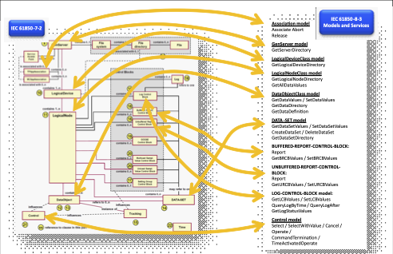

<span class="anchor" id="_Ref214017325"></span>Figure 1: The direct mapping approach provides a one-to-one mapping of
the ACSI services and protocol services.

## Contents of this document

This document provides a detailed technical specification of the “direct mapping” SCSM (Specific Communication Service
Mapping). Together with the ASN.1 schema and the documents referenced as normative references it should be sufficient to
implement a compliant solution. In addition to the detailed technical specification it should also provide an overview
of the basic concepts and technology choices.

- Overview of the protocol specification and design

- Motivation and difference to existing (especially the MMS) mappings

- Explication of the ASN.1 schema and how it is related to the protocol architecture

- Abstract definition of the services

    - Detailed description of the service parameters

    - Interaction diagrams between the ACSI client and the server

    - Related ASN.1 schema parts

- Integration of the application protocol into the WebSocket architecture

- Connection setup and handling

    - WebSocket client and server roles

    - Access point “routing”

- Security

    - Using TLS

    - Using OAuth 2.0 for WebSocket client authentication

## Glossary

ACSI Abstract Communication Service Interface – abstract definitions of the IEC 61850 services

APDU Application Protocol Data Unit – a message of the application layer protocol

ASN.1 Abstract Syntax Notation One – formal specification language for protocol messages

DUT Device Under Test

E2E End-to-end

FC Functional Constraint – property of data attributes that indicate that the data attribute has a specific function (
e.g. measurements, status values, settings, …)

FCD Functional Constraint Data – all data attributes of a data object with the same functional constraint.

IED Intelligent Electronic Device

TLS Transport Layer Security

MMS Manufacturing Message Specification (ISO 9605-1/2) – originally an industrial automation protocol nowadays used by
IEC 61850 and TASE.2/ICCP

MTLS Mutual Transport Layer Security

PKI Public Key Infrastructure

CA Certificate Authority

EST Enrollment over Secure Transport

SCEP Simple Certificate Enrollment Protocol

SO System Operator

RCB Report Control Block – an element in the server data model to configure and control reports

RTI Realtime Interface

DER Distributed Energy Resources

OAuth 2.0 Authorization framework for web applications

JSON Javascript Object Notation – a common data serialization format for web applications

OCSP Online Certificate Status Protocol

PDU Protocol Data Unit

PoC Proof of Concept

PoCC Point of Common Coupling

T-Profile Transport profile of IEC 62351 – a specific set of TLS parameters and features

A-Profile Application profile of IEC 62351 – e.g., E2E security

SCL Substation/System Configuration Language

SCSM Specific Communication Service Mapping – Mapping of the IEC 61850 ACSI services to a specific communication
protocol

TPAA Two Party Application Association: bidirectional connection-oriented information exchange model defined in IEC
61850

# References

## Normative

This document refers to the following standards as normative:

- *IEC 61850-7-2:2019 – Communication networks and systems for power utility automation – Part 7-2: Basic information
  and communication structure – Abstract communication service interface (ACSI)*

- IEC 62351-3: *2023 Power systems management and associated information exchange – Data and communications security –
  Part 4 Communication network and system security –*

*Profiles including TCP/IP*

- IEC 62351-4: ED1 *Power systems management and associated information exchange – Data and communications security –
  Part 4 Profiles including MMS and derivatives*

- RFC 6455: The WebSocket Protocol

- RFC 8705: OAuth 2.0 Mutual-TLS Client Authentication and Certificate-Bound Access Tokens

- ITU-T X.680-X.693:2021 Information Technology – Abstract Syntax Notation One (ASN.1) & ASN.1 encoding rules

- Nationaal Cyber Security Centrum: Transport Layer Security (TLS) – Security guidelines version 2025-05.

## Others

In addition to the normative references, the following references have been used in parts of this document:

- *ISO 9506-1:2003 Industrial automation systems – Manufacturing Message Specification – Part 1: Service definition*

- *ISO 9506-2:2003 Industrial automation systems – Manufacturing Message Specification – Part 2: Protocol specification*

- *IEC 61850-8-1:2020 - Communication networks and systems for power utility automation – Part 8-1: Specific
  communication service mapping (SCSM) – Mappings to MMS (IEC 9501-1 and ISO 9506-2) and to ISO/IEC 8802-3*

- *IEC 61850-8-2:2018 - Communication networks and systems for power utility automation - Part 8-2: Specific
  communication service mapping (SCSM) - Mapping to Extensible Messaging Presence Protocol (XMPP)*

- *IEC 61400-24-4:2016 - Wind energy generation systems - Part 25-4: Communications for monitoring and control of wind
  power plants - Mapping to communication profile*

<!-- -->

- 26.03.2025 NBNL Dutch implementation of RfG interface requirements Technical Specification Document RTI version 2.0

- 26.03.2025 NBNL Realtime Interface. System Operator – DER. Request for Proposal. Proof-of-Concept Realtime Interface
  v2.0. Communication using WebSocket and IEC 61850

- *CONNECT request method - HTTP \| MDN. (2025, July 4). MDN Web Docs.* 04 July 2025. 01 07 2025. \<https: connect\=""
  developer.mozilla.org="" docs="" en-us="" http="" methods="" reference="" web="">.

- Lubbers, P. *How HTML5 web sockets interact with proxy servers. InfoQ.* . 16 March 2010. 07 2025. \<https: \=""
  articles="" web-sockets-proxy-servers="" www.infoq.com="">.

- *RFC 6749: The OAUTH 2.0 Authorization Framework. (n.d.). IETF Datatracker.* n.d. \<https: datatracker.ietf.org=""
  doc="" html="" rfc6749#section-4.1\="">.

- Schaz, T. *OAuth 2.0: Der Client Credentials Flow im Detail.* 11 April 2025. \<https: blog.doubleslash.de="" en=""
  oauth-2-0-der-client-credentials-flow-im-detail#:~:text="
  With%20the%20Client%20Credentials%20Flow,ID%20and%20the%20client%20secret\" software-technologien="">.

- *Self-Encoded Access Tokens - OAUTH 2.0 Simplified*. 3 April 2023. \<https: \="" access-tokens="" oauth2-servers=""
  self-encoded-access-tokens="" www.oauth.com="">.

- *Token Introspection Endpoint - OAUTh 2.0 Simplified*. 16 December 2021. \<https: \="" oauth2-servers=""
  token-introspection-endpoint="" www.oauth.com="">.

# Specification of a WebSocket based SCSM

IEC 61850 defines an abstract service interface (ACSI - abstract communication service interface) to access the server
data model. This abstract service interface doesn’t define the protocols that have to be used to implement these
services. For this purpose, there are separate definitions for specific service implementations that are called SCSM (
specific communication service mapping). This separation allows us to use a common configuration methodology and a
common terminology across different technologies. IEC 61850 is often seen as just a communication protocol and an
extension of the MMS protocol. But this is not the case. Instead, IEC 61850 is focused on the definition of an abstract
data and service model and configuration methods and also defines different communication protocols and technologies for
different parts of the defined services. MMS e.g. focuses on the two-party-application-association (TPAA) where two
communication endpoints have a dedicated connection to exchange data. While other SCSMs focus on multicast communication
where a publisher provides the same information for multiple subscribers (GOOSE and Sampled Values).

The scope of this document is therefore the specification of a new specific communication service interface for the
two-party-application-association. Therefore, the protocol defined here can be seen as an alternative for the
existing MMS and XMPP mappings for specific use-cases where these existing mappings don’t fit very well.

In the following, this chapter defines the first draft of the new WebSocket/JSON based SCSM. It includes the selection
of a formal message specification method, service and protocol definitions, encoding rules, security layer definitions
and technologies, error handling mechanisms, and more. Essentially it is supposed to include all definitions that are
required to implement the proposed SCSM.

## Overview of the SCSM Protocol

The use of WebSocket protocol is mandatory as well as the JSON payload format.

This SCSM uses ASN.1 as a formal specification format for the protocol messages (APDU – application protocol data unit)
on top of the WebSocket layer. This allows flexibility to extend the SCSM protocol with other encoding options in the
future. Also, ASN.1 schemas are easily extendable with additional types and messages when required to extend the SCSM
with new services.

For the JSON payload format the ASN.1 defined message are encoded using the JSON Encoding Rules (JER). In addition to
the mandatory text-based JSON payload format, the usage of ASN.1 also enables the use of the protocol with a more
efficient binary encoding using the well-known ASN.1 Basic Encoding Rules (BER).

Therefore, there are two encoding options:

- The JSON based JER (“JSON Encoding Rules”) encoding to be in line with the current state of web technologies. This
  encoding option is mandatory for all implementations.

- A binary encoding (“Basic Encoding Rules” - BER could be an option here) for applications where a large amount of data
  is required or where bandwidth is limited. This encoding option is optional.

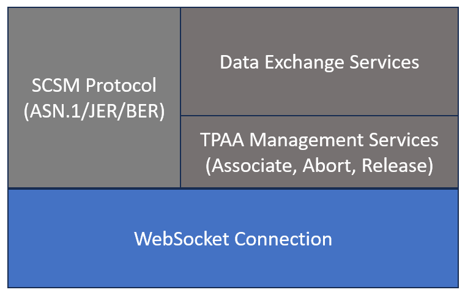
<span class="anchor" id="_Ref210885137"></span>Figure 2: Basic architecture of the SCSM protocol

To summarize, this SCSM consists of the mapping to the underlying protocol that in this case will be the WebSocket
protocol and the payload message format that is defined with ASN.1 (see Figure 2: Basic architecture of the SCSM
protocol). The WebSocket protocol is used to establish and maintain a permanent, full-duplex communication channel. The
header of the initial HTTP connection is used to select the syntax (ASN.1 schema version and encoding rules) of the
higher layers (SCSM Protocol).

The diagram above shows the main building blocks of the SCSM protocol, each responsible for a specific role in
establishing and managing communication:

- **WebSocket Connection:** This is the live link that lets two systems talk to each other in real time, sending and
  receiving data instantly.

- **SCSM Protocol (ASN.1 / JER / BER):** This defines the language and format of the data being exchanged, making sure
  both systems can understand each other whether the data is in text (JSON) or binary form. It also defines the message
  sequences required to implement the protocol services. This protocol consists of the service layers:

- **TPAA Management Services (Associate, Abort, Release):** These services take care of the connection itself. They
  start it, manage it while it is active, and close it properly when the communication is done.

- **Data Exchange Services:** This part is where the real conversation happens. It is responsible for sending,
  receiving, and interpreting the information shared between systems.

The diagram below shows how communication flows between the components when messages are received, starting from the
WebSocket link and ending with the data exchange.


When messages are sent the communication flows in the opposite direction.

## Application Protocol Definition

The application protocol consists of the exchange of application protocol messages between two IEC 61850 applications.
The application protocol messages are defined with ASN.1 types. The exchange of protocol messages between the IEC 61850
ACSI client application and the IEC 61850 ACSI server application is defined by interaction diagrams and textual
descriptions.

ASN.1 is an abstract message specification language that describes the protocol messages in an abstract way (like the
order of elements, element names and ids, element types, and the structure of complex elements). It’s a standardized way
of defining how data and messages are structured so that different systems can interpret them consistently. For the
serialization of the abstract models for the transmission over a communication channel an encoder is required. The ASN.1
standard therefore defines “encoding rules” that define how the abstract messages are serialized and deserialized. The
ASN.1 standard provides different encoding rules for different purposes. In the context of this standard the JSON
encoding rules (JER) and Basic encoding rules (BER) are used. JER provide the rules to transform data based on the ASN.1
schema into valid JSON messages. BER provide rules to transform the same data into a more compact binary format.

<span class="anchor" id="_Ref214017345"></span>Figure 3: Encoding and decoding ASN.1 based protocol messages.

Both ends of the communication channel must agree on a common ASN.1 schema and use the same encoding rules (see Figure
3).

The ASN.1 schema for this SCSM is available as a separate code component of this specification. Parts of the schema are
reproduced in this document.

At the highest level, the application protocol defines three main service types:

- **Association management services:** This handles how a connection is started, maintained, and properly closed. They
  are also known as TPAA management services.

- **Confirmed services:** Used when one system sends a request and expects a specific response. Like asking a question
  and waiting for an answer.

- **Unconfirmed services:** Used when a system sends information without expecting a reply, more like making an
  announcement.

In the ASN.1 schema used by this standard, the **TpaaPdu** type serves as the main message structure. It specifies that
each message must belong to one of four categories: an associate, request, response, or unconfirmed message. In simpler
terms, every message exchanged through this protocol fits into one of these four types, depending on whether the systems
are connecting, exchanging data, or sending information without expecting a reply.

The following definition means that a TpaaPdu is always one (a choice) of four sub-types.


<!-- asn1:TpaaPdu -->

```asn1
TpaaPdu ::= CHOICE
{
    associate   [0] AssociateType,
    request     [1] RequestType,
    response    [2] ResponseType,
    unconfirmed [3] UnconfirmedType,
}
```

The association request message (AssociateRequest) must be the first message once the communication (WebSocket) channel
is established. With the association messages the ACSI client and server endpoints exchange parameters that are used
during the following communication and also define the association ID, that is specific for this application session.
Once the session between the two application endpoints is established, the confirmed and unconfirmed services can be
used. The association ID is defined by the ACSI server within the associate response message (AssociateResponse) and is
included by both endpoints in all following messages of the application session. The association ID must be unique for a
specific server endpoint for a certain amount of time, so that it is clear to what session each message belongs to.

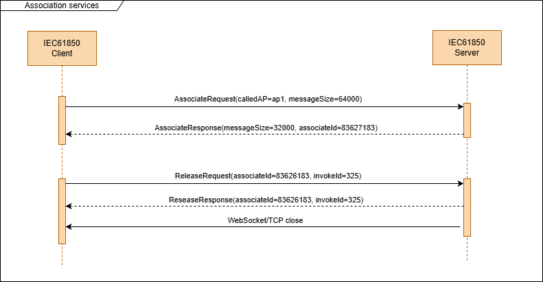
<span class="anchor" id="_Toc213261933"></span>Figure 4: The association services are used to start or end a two-party-application-association.

The **confirmed services** always consist of at least one request and one response message. It is possible that a single
service execution consists of multiple request and response messages. In this case there will always be the same number
of request and response messages and each request and response message are matched by a unique invocation identifier (
invokeId in the ASN.1 schema). It is recommended that the first used invokeId equals 1. The sender of a request should
increment the invokeId by 1 for each subsequent request message addressed to the same TPAA.

All confirmed services are implemented using the request type and the response type.

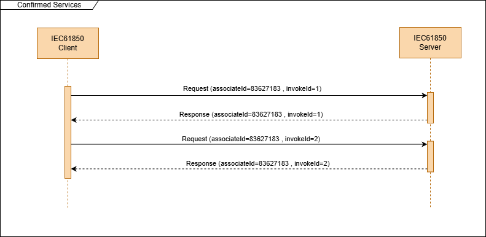
<span class="anchor" id="_Ref213084390"></span>Figure 5: Confirmed Services consist of request and response messages. The request and response messages are matched by the invokeId

The request type is sent by the application endpoint that wants to invoke a confirmed service (ACSI client).


<!-- asn1:RequestType -->

```asn1
RequestType ::= SEQUENCE
{
    associateId [0] AssociateID,
    invokeId    [1] IMPLICIT INTEGER,
    service     [2] RequestServiceType,
}
```

The response type is sent by the application endpoint that executes the confirmed service (ACSI server). The response
must always include the same invokeId that was sent in the request that caused the response.


<!-- asn1:ResponseType -->

```asn1
ResponseType ::= SEQUENCE
{
    associateId [0] AssociateID,
    invokeId    [1] IMPLICIT INTEGER,
    service     [2] ResponseServiceType,
}
```

In some cases, it can happen that a service consists of a sequence of consecutive request and response messages. This
can happen in two cases:

1. In case of a service that can return a large amount of data (like the directory browsing services) it can happen that
   the complete response wouldn’t fit into a single PDU. In this case a mechanism is implemented where the server gives
   a hint that more data is available by setting the “**moreFollows**” flag in the response. Then the client can request
   more data by using the “**continueAfter**” parameter in the follow-up request to read more data. This mechanism is
   stateless for the server as it treats all the service requests independently. And every follow-up request has to use
   a new unique invokeId parameter.

2. In some other cases the service has multiple states on the server side. This is especially required for the control
   related services that can consist of multiple steps and require different service states on the server side. E.g. in
   select-before-operate control models there are multiple steps involved: select à \[selected\] à operate à \[operation
   started\] … à \[operation terminated\] à command-termination. In this case the follow-up request messages will also
   have different invokeId parameter values. The continuation will be done by service specific parameters that identify
   a specific control process.

To implement unconfirmed services the UnconfirmedType and UnconfirmedServiceType definitions are used:


<!-- asn1:UnconfirmedType -->

```asn1
UnconfirmedType ::= SEQUENCE
{
    associateId [0] AssociateID,
    service     [1] UnconfirmedServiceType,
}
```

The UnconfirmedType only includes the association ID and defines the specific unconfirmed service to use with the
“service” parameter.


<!-- asn1:UnconfirmedServiceType -->

```asn1
UnconfirmedServiceType ::= CHOICE
{
    report  [0] Report,
    cmdTerm [1] CommandTerminationRequest,
}
```

Currently only two unconfirmed services are available, and both are sent only by the ACSI server.

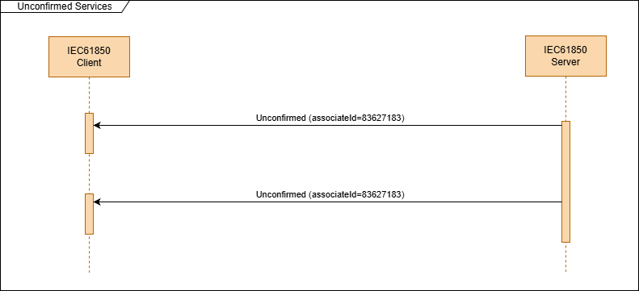
<span class="anchor" id="_Toc213261935"></span>Figure 6: Unconfirmed services are sent by the server without prior request from the client.

The main application for unconfirmed services is sending unsolicited messages from the ACSI server to the ACSI client.
One application is sending reports (measurement and status data), the other application (command termination) is to
inform the ACSI client that a control operation has been concluded.

## Mapping of the TPAA Management Services

This specification provides a mapping of the Two-Party-Application-Association (TPAA) model. A TPAA is a session between
two IEC 61850 applications. One side of this association is the client (ACSI client) that invokes services while the
other side is the server (ACSI server) that executes services invoked by the client.

The TPAA Management Services are responsible for creating, maintaining, and terminating the application association.

The following ACSI services for TPAA management must be implemented:

- **Associate** (initiates the session)

- **Release** (conclude the session normally, allowing to complete outstanding services)

- **Abort** (conclude the session immediately in case of an error)

All these services are confirmed services. This means they always consist of a request message (e.g. “associate
request”, “release request”) and a response message (e.g. “association response”).

The TPAA must be established before any other messages can be sent.

To establish the TPAA the ACSI client must send the association request to the ACSI server. This assumes that the
underlying WebSocket connection is already established.

In the case that the ACSI client is on the passive side of the WebSocket connection (listening side, WebSocket server),
it must receive an indication of the WebSocket layer, that a new connection has been established. After receiving the
connection indication from the WebSocket layer, the ACSI client is sending the association request. When accepted by the
ACSI server, it sends an associate response. When there is an error the ACSI server sends a ServiceError and closes the
underlying WebSocket connection.

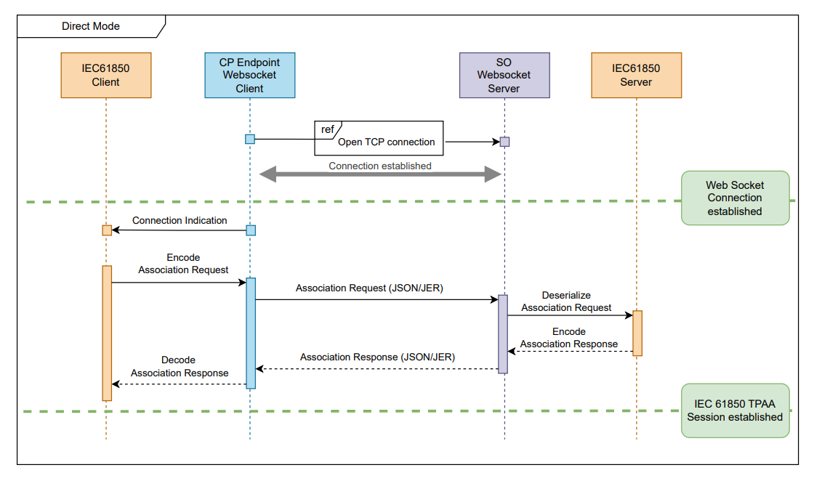
<span class="anchor" id="_Toc213261936"></span>Figure 7: ACSI Client sends the Association Request after receiving the indication of a new connection from the WebSocket layer (“direct mode”).

This specification allows the WebSocket and ACSI client and server roles to be independent. In the following we call the
case when the ACSI client role is implemented by the WebSocket client side (active endpoint) the “direct mode” (see
figure 4) and the case when the ACSI client role is implemented by the WebSocket server side (passive endpoint) the
“reverse mode” (see figure 5).

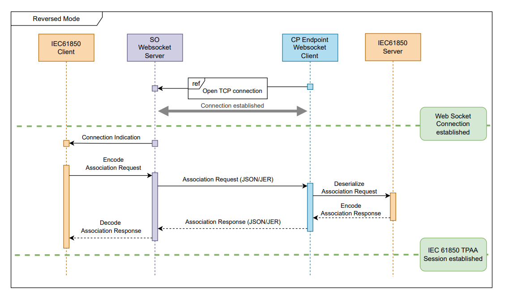
<span class="anchor" id="_Toc213261937"></span>Figure 8: ACSI Clients sends the Association Request after receiving the indication of a new connection from the WebSocket layer. This is in the "reverse mode" where the ACSI and WebSocket client roles are not identical.

Using the “direct” or “reverse” mode is a choice that can be made for a specific application to accommodate the specific
communication setup. E.g. for RTI 2.0 it is expected that the “reverse mode” is used where the WebSocket client (active
endpoint) is the ACSI server.

The following table provides an overview of the service parameters that are used in the different association service
related messages:

| Parameter                     | Description                                                                                                                                                                                                                                       | Mandatory (M)/ Optional (O) |
|-------------------------------|---------------------------------------------------------------------------------------------------------------------------------------------------------------------------------------------------------------------------------------------------|-----------------------------|
| Association ID                | Unique identifier for each TPAA. Can be used to distinguish multiple TPAA                                                                                                                                                                         | M                           |
| Called access point Reference | Allows to distinguish the service access points in case the ACSI server supports multiple access points                                                                                                                                           | O                           |
| Authentication Value          | Can be used to transport credentials/tokes for authentication and authorization                                                                                                                                                                   | O                           |
| Services Supported            | List of supported ACSI services of the ACSI server                                                                                                                                                                                                | M                           |
| Max. PDU size                 | Maximum size of an application layer message for a specific TPAA. Has to be negotiated between both applications. Allows the implementation to limit buffer sizes. The unit of the parameter is bytes. A reasonable default value would be 64 kB. | M                           |
| Max. outstanding calls        | Maximum number of concurrent service requests. This indicates the ACSI client to limit the number of request and wait for responses before sending more service requests (default 10).                                                            | M                           |
| Result                        | Result of the service request (success, failed)                                                                                                                                                                                                   | M                           |
| ServiceError                  | Error code in case the service failed                                                                                                                                                                                                             | M                           |

The details for the protocol messages can be found in the ASN.1 schema.

### Mapping of Associate service

The purpose of the Associate service is to establish a TPAA between an ACSI client and an ACSI server. The ACSI client
is always the instance that sends the associate request and the ACSI server answers with an associate response or a
ServiceError.

This service uses the following parameters:

| **Request**             |                       |                                                                                                                                                                                                                                                                                                      |     |
|-------------------------|-----------------------|------------------------------------------------------------------------------------------------------------------------------------------------------------------------------------------------------------------------------------------------------------------------------------------------------|-----|
| Parameter name          | Parameter type        | Description                                                                                                                                                                                                                                                                                          | M/O |
| calledAP                | VisString255          | Identifies the called access point reference with which the application association shall be established. Use default access point when missing.                                                                                                                                                     | O   |
| AuthenticationParameter | *To be defined*       | Information required to grant permission to access instances of a specific access view to a server. This could be a username/password pair, a X.509 certificate, access token, … This parameter is optional and authentication can also be done on other protocol layers (e.g. TLS or HTTP headers). | O   |
| maxMessageSize          | Integer               | Maximum message size supported by the client                                                                                                                                                                                                                                                         | M   |
| **Response+**           |                       |                                                                                                                                                                                                                                                                                                      |     |
| Parameter name          | Parameter type        | Description                                                                                                                                                                                                                                                                                          | M/O |
| AssociationId           | Integer               | Used to differentiate the application associations                                                                                                                                                                                                                                                   | M   |
| MaxPduSize              | Integer               | Maximum message size negotiated                                                                                                                                                                                                                                                                      | M   |
| MaxOutstandingCalls     | Integer (default 12)  | Maximum number of concurrent service requests.                                                                                                                                                                                                                                                       | M   |
| ServicesSupported       | ServicesSupportedType | The supported ACSI services                                                                                                                                                                                                                                                                          | M   |
| **Response-**           |                       |                                                                                                                                                                                                                                                                                                      |     |
| Parameter name          | Parameter type        | Description                                                                                                                                                                                                                                                                                          | M/O |
| ServiceError            | ServiceStatusKind     | Appropriate service error                                                                                                                                                                                                                                                                            | M   |

The server will send a Response+ when the association is accepted. Otherwise, the server will send a Response-.

The reason for a negative response could be one of the following:

| **ServiceError value**             | **Reason**                                                                                                                             |
|------------------------------------|----------------------------------------------------------------------------------------------------------------------------------------|
| *instanceNotAvailable* (1)         | The given access point reference (calledAP) does not match an existing access point                                                    |
| *accessViolation* (3)              | Authentication failure (missing or invalid AuthenticationParameter when authentication is configured, IP address of client blocked, …) |
| *failedDueToServerConstraint* (12) | The maximum number of associations supported by the server has been reached.                                                           |

Example of the associate request message:

```json
{
  "associate": {
    "service": {
      "associateRequest": {
        "calledAP": "cp",
        "maxMessageSize": 65000
      }
    }
  }
}
```

And the related associate response message:

```json
{
  "associate": {
    "service": {
      "associateResponse": {
        "maxMessageSize": 65000,
        "associateId": "id_cp"
      }
    }
  }
}
```

### Mapping of Abort and Release services

Both the Abort and Release services may be used to terminate a TPAA. The purpose of the Abort service is to immediately
terminate the TPAA. The Release service is a request from the client to the server to terminate the TPAA as soon as all
outstanding requests from this TPAA are concluded.

When the underlying WebSocket connection is only for one TPAA then the WebSocket connection can be closed as soon as the
TPAA is terminated.

In case of the abort service, the initiator can immediately close the connection after sending the abort request.

In case of the release service the receiver can close the connection immediately after sending the response message.

Usually, the following cases for closing a TPAA and WebSocket connection can happen:

- Connection is lost.

    - That means that there is no TCP handshake to close the connection. The detection of this event is done by timeouts
      and should be considered an error and logged. After the detection of this event the TPAA should be considered
      terminated.

- Connection is closed by closing the WebSocket/TCP connection without terminating the TPAA before.

    - this can happen, e.g. when the client or server connection is stopped for some reason (e.g. the services has been
      closed by the operating system). In this case the TPAA should also be considered terminated.

- Connection is aborted by sending the abort message and then closing the TCP connection.

    - This is a normal way of terminating the TPAA and should not be considered as an error.

- Connection is release by sending the release request.

    - After finishing the running service the server is closing the connection. This is a normal way of terminating the
      TPAA and should not be considered as an error.

## Mapping of the Data Exchange Services

The mapping of the data exchange services consists of confirmed services (request/response) and unconfirmed services.

These services are used by ACSI clients to request information from servers. Examples can be requesting information
about the data model and type information of data objects, requesting the current values of specific objects, requesting
the current values of report control blocks or other control clocks, sending commands, reading dataset information and
values, etc.

The details of the protocol messages can be found in the ASN.1 schema and in the service specific sections below.

### The invoke ID parameter of confirmed services

The confirmed service requests and responses always include the “invokeId” service parameter. Every request of a TPAA
session has a unique invokeId. As the only exception the Associate request and response messages do not include an
invokeId.

The response for a specific request is sent with the same invokeId as the request. The invokeId is increased by one by
the client for each sent request. The first request of a session is sent with the invokeId = 1. See also Figure 5.

The invokeId is important for the client to relate a response to one of the requests that is sent earlier. It also
allows the client to send multiple requests without waiting for the response. The number of allowed outstanding
requests (requests that have not yet been answered by the ACSI server) is a server specific parameter.

When the client receives a response with an invokeId that it didn’t send it should close the TPAA.

### Service errors

Most services use a ServiceError message to indicate that there has been an error during the execution of the service.
The ServiceError message consists of a single error code that has to be a value that is one of the defined values of the
ServiceStatusKind enumeration.

Definition of the ServiceStatusKind:


<!-- asn1:ServiceStatusKind -->

```asn1
ServiceStatusKind ::= ENUMERATED
{
    noError                             (0),
    instanceNotAvailable                (1),
    instanceInUse                       (2),
    accessViolation                     (3),
    accessNotAllowedInCurrentState      (4),
    parameterValueInappropriate         (5),
    parameterValueInconsistent          (6),
    classNotSupported                   (7),
    instanceLockedByOtherClient         (8),
    controlMustBeSelected               (9),
    typeConflict                        (10),
    failedDueToCommunicationsConstraint (11),
    failedDueToServerConstraint         (12),
}
```

Most of the values have specific meanings in specific services. The *classNotSupported* error is also used in case a
service is not supported by the server.

### Mapping of the GetServerDirectory service

The purpose of this service is to request a list of logical devices or files available at the server. With the
“objectClass” parameter the client can select between receiving the list of files or the list of logical devices.

| **Request**    |                   |                                                                                                                   |     |
|----------------|-------------------|-------------------------------------------------------------------------------------------------------------------|-----|
| Parameter name | Parameter type    | Description                                                                                                       | M/O |
| objectClass    | ObjectClass       | Select between the file directory (value “fileSystem” – 1) or logical device directory (value “logicalDevice” -2. | M   |
| continueAfter  | VisString255      | Object name of the logical deivce or file directory entry where to continue with the response                     | O   |
| **Response+**  |                   |                                                                                                                   |     |
| Parameter name | Parameter type    | Description                                                                                                       | M/O |
| result         | VisString255      | List of logical devices of file directoy entries                                                                  | M   |
| moreFollows    | BOOLEAN           | More results available new request with continueAfter parameter required                                          | O   |
| **Response-**  |                   |                                                                                                                   |     |
| Parameter name | Parameter type    | Description                                                                                                       | M/O |
| ServiceError   | ServiceStatusKind | Appropriate service error                                                                                         | M   |

The mapping of this service consists of one or more request and response messages:


<!-- asn1:ObjectClass -->

```asn1
--server
{
    logicalDevice (0),
    fileSystem    (1),
}
```

When the list of logical devices or file directory entries is too large to fit into a single response message the list
is filled with the first entries of the list and truncated. The server indicates that more results are available with
the presence of the “moreFollows” parameter with the value “TRUE”. In this case the client is sending a new request
including the “continueAfter” parameter containing the string value of the last received list entry.

The list of logical devices should be returned in the same order as defined in the server data model.

Example of a request message for the list of logical devices:

```json
{
  "request": {
    "associateId": "id_cp1",
    "invokeId": 0,
    "service": {
      "getServerDirectory": {
        "objectClass": "logicalDevice"
      }
    }
  }
}
```

}
Example of a response message with the list of logical devices:

```json
{
  "response": {
    "associateId": "id_cp1",
    "invokeId": 0,
    "service": {
      "getServerDirectory": {
        "result": [
          "LD0",
          "PROT"
        ]
      }
    }
  }
}
```

The following pictures show the message sequences to request the list of logical devices from the server. The first
sequence shows a single request and response for a server with a small number of logical devices (see Figure 9). This is
the standard case.

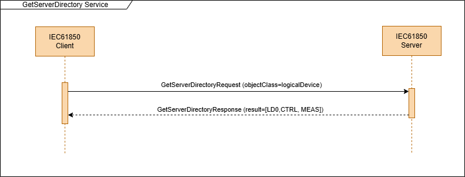
<span class="anchor" id="_Ref212564357"></span>Figure 9: GetServerDirectory request and response sequence.

For very large server data models with a large number of logical devices or for a large filesystem a single APDU might
not be enough to send the complete server directory. In this case the moreFollows/continueAfter mechanism is required to
split the response data into multiple APDUs (see Figure 10). Every request APDU in this sequence has its own unique
invokeId.

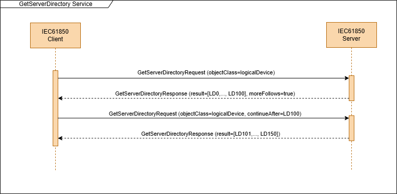
<span class="anchor" id="_Ref212564250"></span>Figure 10: GetServerDirectory message sequence using the moreFollows/continueAfter mechanism to split the response data in multiple APDUs.

**Error handling**

In case of an error the server shall send a “Response-“ containing a ServiceError with one of the following values:

| **ServiceError value**            | **Reason**                                                                                                      |
|-----------------------------------|-----------------------------------------------------------------------------------------------------------------|
| *accessViolation* (3)             | the access to the object/service is blocked by an access control restriction (ACL - access control list)        |
| *parameterValueInappropriate (5)* | The continueAfter parameter value is invalid or doesn’t belong to an object that would be part of the response. |
| *classNotSupported (7)*           | The server doesn’t support/implement this service or the requested objectClass                                  |

### Mapping of the GetLogicalDeviceDirectory service

The purpose of the service is to request the list of logical nodes in a specific logical device that is indicated with
the “ldName” request parameter.

| Parameter name | Parameter type    | Description                                                                    | M/O |
|----------------|-------------------|--------------------------------------------------------------------------------|-----|
| **Request**    |                   |                                                                                |     |
| Parameter name | Parameter type    | Description                                                                    | M/O |
| ldName         | ObjectName        | The name of the logical device                                                 | M   |
| continueAfter  | ObjectReference   | Object reference of the logical node where to continue with the response       | O   |
| **Response+**  |                   |                                                                                |     |
| Parameter name | Parameter type    | Description                                                                    | M/O |
| lnRef [0 .. n] | ObjectReference   | List of logical nodes in the requested logical device                          | M   |
| moreFollows    | BOOLEAN           | More logical nodes available new request with continueAfter parameter required | O   |
| **Response-**  |                   |                                                                                |     |
| Parameter name | Parameter type    | Description                                                                    | M/O |
| ServiceError   | ServiceStatusKind | Appropriate service error                                                      | M   |

The mapping of this service consists of one or more request and response messages:


<!-- asn1:GetLogicalDeviceDirectoryRequest -->

```asn1
--logicalDevice
{
    ldName        [0] ObjectName,
    continueAfter [1] ObjectReference OPTIONAL,
}
```

When the list of logical nodes too large to fit into a single response message the list is filled with the first entries
of the list and truncated. The server indicates that more logical nodes are available with the presence of the
“moreFollows” parameter with the value “TRUE”. In this case the client is sending a new request including the
“continueAfter” parameter containing the ObjectReference of the last received list entry.

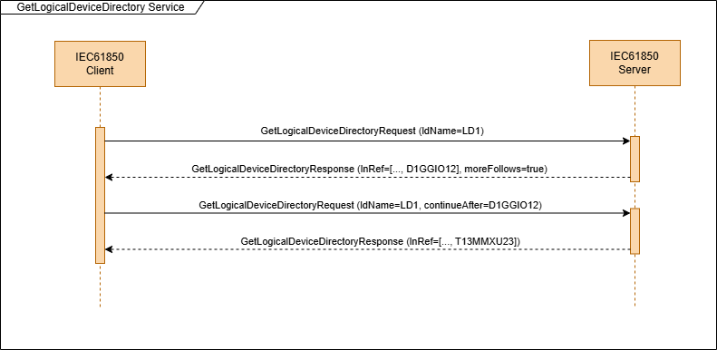
<span class="anchor" id="_Toc213261940"></span>Figure 11: GetLogicalDeviceDirectory service messages showing the moreFollows/continueAfter mechanism to split the service in multiple APDUs.

The list of logical nodes should be returned in the same order as defined in the server data model.

**Error handling**

In case of an error the server shall send a “Response-“ containing a ServiceError with one of the following values:

| **ServiceError value**            | **Reason**                                                                                                      |
|-----------------------------------|-----------------------------------------------------------------------------------------------------------------|
| *instanceNotAvailable* (1)        | The requested logical device does not exist                                                                     |
| *accessViolation* (3)             | the access to the object/service is blocked by an access control restriction (ACL - access control list)        |
| *parameterValueInappropriate (5)* | The continueAfter parameter value is invalid or doesn’t belong to an object that would be part of the response. |
| *classNotSupported (7)*           | The server doesn’t support/implement this service.                                                              |

### Mapping of the GetLogicalNodeDirectory service

The purpose of this service is to request the list of objects of a specific type that are part of a specific logical
node. The local node is selected by the lnRef parameter. The type of object is selected by the aCSIClass parameter.

| Parameter name         | Parameter type         | Description                                                                                   | M/O |
|------------------------|------------------------|-----------------------------------------------------------------------------------------------|-----|
| **Request**            |                        |                                                                                               |     |
| Parameter name         | Parameter type         | Description                                                                                   | M/O |
| lnRef                  | ObjectReference        | The object reference of the logical node including the logical device name (e.g. “LD0/LLN0”). | M   |
| aCSIClass              | ACSIClassKind (enum)   | Type of object (e.g. dataObject, urcb)                                                        | M   |
| continueAfter          | ObjectName             | Object name of the object where to continue with the response                                 | O   |
| **Response+**          |                        |                                                                                               |     |
| Parameter name         | Parameter type         | Description                                                                                   | M/O |
| instanceNames [0 .. n] | ObjectName SEQUENCE OF | List of objects of a specific type in the requested logical node                              | M   |
| moreFollows            | BOOLEAN                | More objects of this type available new request with continueAfter parameter required         | O   |
| **Response-**          |                        |                                                                                               |     |
| Parameter name         | Parameter type         | Description                                                                                   | M/O |
| ServiceError           | ServiceStatusKind      | Appropriate service error                                                                     | M   |

The mapping of this service consists of one or more request and response messages following these ASN.1 descriptions:


<!-- asn1:GetLogicalNodeDirectoryRequest -->

```asn1
--logicalNode
{
    lnRef         [0] ObjectReference,
    aCSIClass     [1] ACSIClassKind,
    continueAfter [2] ObjectName OPTIONAL,
    --            Format: \p{L}[\d,\p{L},\_]\*/[\p{L},\_]\*[\d]\*,
}
```

Every request is only for a specific ACSI class. In order to fetch all the elements of a logical node the service has to
be called for each ACSI class value separately (see Figure 12).

In case the logical node does not have objects of the requested ACSI class the server answers with a Response+ but with
an empty instanceNames parameter.

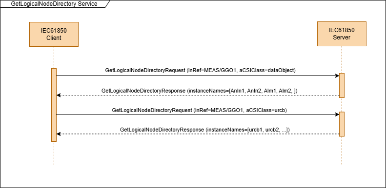
<span class="anchor" id="_Ref212564932"></span>Figure 12: GetLogicalNodeDirectory service message sequences. The first one is to get the data objects of the logical node and the second one to get the unbuffered report control blocks.

**Error handling**

In case of an error the server shall send a “Response-“ containing a ServiceError with one of the following values:

| **ServiceError value**            | **Reason**                                                                                                      |
|-----------------------------------|-----------------------------------------------------------------------------------------------------------------|
| *instanceNotAvailable* (1)        | The requested logical node does not exist                                                                       |
| *accessViolation* (3)             | the access to the object/service is blocked by an access control restriction (ACL - access control list)        |
| *parameterValueInappropriate (5)* | The continueAfter parameter value is invalid or doesn’t belong to an object that would be part of the response. |
| *classNotSupported (7)*           | The server doesn’t support/implement this service.                                                              |

### Mapping of get data values service

The GetDataValues service is supposed to request data (process data, configuration data, setpoint values, …) from the
ACSI server. The request can be used to get the value(s) of a single functional constraint data (FCD – all data of a
data object that has a specific functional constraint) or functional constraint data attribute (FCDA).

| **Request**         |                                  |                                                                                                                                                       |     |
|---------------------|----------------------------------|-------------------------------------------------------------------------------------------------------------------------------------------------------|-----|
| Parameter name      | Parameter type                   | Description                                                                                                                                           | M/O |
| ref                 | FcdFcdaType (ObjectReference)    | The object reference of the FCD or FCDA of the data object whose data attribute values are to be retrieved.                                           | M   |
| includeElementName  | BOOLEAN (default FALSE)          | Indicate if the element names on all levels of the returned object are included.                                                                      | O   |
| **Response+**       |                                  |                                                                                                                                                       |     |
| Parameter name      | Parameter type                   | Description                                                                                                                                           | M/O |
| dataAttrVal\[1..n\] | DataAttributeValue (SEQUENCE OF) | The value of the FCDA. The value can be a structure in case of the access to FCD or a complex data attribute. The value can also be an array in case. | M   |
| **Response-**       |                                  |                                                                                                                                                       |     |
| Parameter name      | Parameter type                   | Description                                                                                                                                           | M/O |
| ServiceError        | ServiceStatusKind                | Appropriate service error                                                                                                                             | M   |

When the FCD or FCDA is an array it is only possible to read the entire array or a single array element.

The mapping of this service consists of a single request and response message following these ASN.1 descriptions:


<!-- asn1:GetDataValuesRequest -->

```asn1
GetDataValuesRequest ::= SEQUENCE
{
    ref                [0] FcdFcdaType,
    includeElementName [1] BOOLEAN DEFAULT FALSE,
}
```

The DataAttributeValue type in the GetDataValuesResponse has the following definition:


<!-- asn1:DataAttributeValue -->

```asn1
DataAttributeValue ::= SEQUENCE
{
    name [0] VisibleString OPTIONAL,
    data [1] Data,
}
```

The “data” element contains the actual data and the optional “name” elements contains the name of the data attribute
related to the “data” element. The “name” element is present when the “includeElementName” parameter of the request is
true.


<!-- asn1:Data -->

```asn1
Data ::= CHOICE
{
    boolean          [1] BOOLEAN,
    int8             [2] INTEGER (-128..127),
    int16            [3] INTEGER (-32768..32767),
    int24            [4] INTEGER (-8388608..8388607),
    int32            [5] INTEGER (-2147483648..2147483647),
    int64            [6] INTEGER,
    int8u            [7] INTEGER (0..255),
    int16u           [9] INTEGER (0..65535),
    int24u          [10] INTEGER (0..16777215),
    int32u          [11] INTEGER (0..4294967295),
    float32         [12] REAL,
    octetString     [13] OCTET STRING,
    visString64     [14] UTF8String (SIZE(0..64)),
    visString129    [15] UTF8String (SIZE(0..129)),
    visString255    [16] UTF8String (SIZE(0..255)),
    array           [17] IMPLICIT DataSequence,
    structure       [18] IMPLICIT DataSequence,
    bitstring       [19] IMPLICIT BIT STRING,
    generalizedtime [21] IMPLICIT GeneralizedTime,
    binarytime      [22] IMPLICIT TIME-OF-DAY,
    quality         [23] IMPLICIT Quality,
    timeStamp       [24] IMPLICIT TimeStamp,
    enumerated      [25] INTEGER (0..255),
    check           [26] CheckConditions,
    --              context tag 0 is reserved for AccessResult,
    --              8 is reserved,
}
```

To allow data attribute and sub data attribute names on all level the DataSequence type also includes an optional “name”
element that has to be present when “includeElementName” was selected in the request.


<!-- asn1:DataSequence -->

```asn1
DataSequence ::= SEQUENCE
{
    name [0] VisibleString OPTIONAL,
    data [1] SEQUENCE OF Data,
}
```

In the following is an example of a request and response message using the JSON encoding rules.

This is a simple request message to read the value of the object with the reference “LD0/MMXU1.MinWPhs”:

```json
{
  "request": {
    "associateId": "id_cp1",
    "invokeId": 3,
    "service": {
      "getDataValues": {
        "ref": {
          "ref": "LD0/MMXU1.MinWPhs",
          "fc": "mx"
        },
        "includeElementName": true
      }
    }
  }
}
```

And the matching GetDataValues response+ message:

```json
{
  "response": {
    "associateId": "id_cp1",
    "invokeId": 3,
    "service": {
      "getDataValues": {
        "dataAttrVal": [
          {
            "name": "mag",
            "data": {
              "structure": {
                "name": "f",
                "data": [
                  {
                    "float32": 0.0
                  }
                ]
              }
            }
          },
          {
            "name": "q",
            "data": {
              "quality": {
                "validity": "good",
                "source": "process",
                "test": false,
                "operatorBlock": false
              }
            }
          },
          {
            "name": "t",
            "data": {
              "timeStamp": {
                "secondSinceEpoch": 1720458123,
                "fractionOfSecond": 1234567,
                "timeQuality": {
                  "clockFailure": false,
                  "clockNotSynchronized": false,
                  "timeAccuracy": 3
                }
              }
            }
          }
        ]
      }
    }
  }
}
```

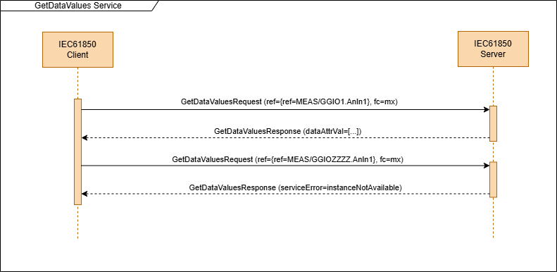
<span class="anchor" id="_Ref212565805"></span>Figure 13: GetDataValues messages sequences. The first sequence is for the positive case when the server answers with the requested data. The second sequence is showing a negative response where the server is returning a serviceError.

**Handling of array elements**

When an access to array elements is required the array element should be notated using parenthesis containing the index
of the array element. The array element index starts by 0 to access the first array element. The target index is n-1
where n is the number of array elements.

Example reference with array element: LD0/GGIO1.phsAHar(3).cVal.mag.f

**Error handling**

In case of an error the server shall send a “Response-“ containing a ServiceError with one of the following values:

| **ServiceError value**     | **Reason**                                                                                               |
|----------------------------|----------------------------------------------------------------------------------------------------------|
| *instanceNotAvailable* (1) | The requested object doesn’t exist                                                                       |
| *accessViolation* (3)      | the access to the object/service is blocked by an access control restriction (ACL - access control list) |
| *classNotSupported (7)*    | The server doesn’t support/implement this service.                                                       |

### Mapping of set data values service

The purpose of the SetDataValues service is to set the value of a single FCD or FCDA object. The value can be a simple
or complex (structure or array) value. This service can be used to set writable configuration values or setpoints.

**Request**
<!-- table-id:auto-1-request -->

| Parameter name      | Parameter type                   | Description                                                                                                                                                    | M/O |
|---------------------|----------------------------------|----------------------------------------------------------------------------------------------------------------------------------------------------------------|-----|
| ref                 | FcdFcdaType                      | The object reference of a data object, sub data object, data attribute, or sub data attribute.                                                                 | M   |
| dataAttrVal[1 .. n] | DataAttributeValue (SEQUENCE OF) | A single data attribute value instance (when the referenced object is a FCDA) or multiple data attribute value instance (when the referenced object is a FCD). | O   |

**Response+**
<!-- table-id:auto-1-response+ -->

| Parameter name | Parameter type | Description                                 | M/O |
|----------------|----------------|---------------------------------------------|-----|
| result         | Result         | Ok (0) when the service has been successful | M   |

**Response-**
<!-- table-id:auto-1-response- -->

| Parameter name | Parameter type    | Description               | M/O |
|----------------|-------------------|---------------------------|-----|
| ServiceError   | ServiceStatusKind | Appropriate service error | M   |

**Note**: It is not allowed to use this service to write to a data attribute with the special CO FC. These data
attributes are reserved for the control related services. Trying to use the SetDataValues on these attributes should
result in a ServiceError with the value “accessViolation”.

The dataAttrVal (type DataAttributeValue) is the same as in the GetDataValues service. The client doesn’t have to send
the “name” fields. In this case the client has to send the attributes in the exact order as they are defined in the
server data model.

The mapping of this service consists of a single request and response message following these ASN.1 descriptions:


<!-- asn1:SetDataValuesRequest -->

```asn1
SetDataValuesRequest ::= SEQUENCE
{
    ref         [0] FcdFcdaType,
    dataAttrVal [1] SEQUENCE OF DataAttributeValue,
}
```

**Error handling**

In case of an error the server shall send a “Response-“ containing a ServiceError with one of the following values:

### Mapping of get data directory service

The purpose of the GetDataDirectory service is to request the list of sub data objects and data attributes for a
specific data object or data attribute.

This service doesn’t return nested structures but only a flat list of object names that represents the direct child
elements of the element that is referenced by the dataRef parameter.

**Request**
<!-- table-id:auto-3-request -->

| Parameter name | Parameter type  | Description                                                                                                                                                                                        | M/O |
|----------------|-----------------|----------------------------------------------------------------------------------------------------------------------------------------------------------------------------------------------------|-----|
| dataRef        | ObjectReference | The object reference of a data object, sub data object, data attribute, or sub data attribute.                                                                                                     | M   |
| continueAfter  | ObjectReference | Object name of the object where to continue with the response. The object must be a sub object of the object specified with dataRef (a sub data object or a data attribute or sub data attribute). | O   |

**Response+**
<!-- table-id:auto-3-response+ -->

| Parameter name          | Parameter type           | Description                                                                                             | M/O |
|-------------------------|--------------------------|---------------------------------------------------------------------------------------------------------|-----|
| subDataObjectName[0..n] | ObjectName (SEQUENCE OF) | This field is mandatory if the data object has sub data objects.                                        | O   |
| dataAttrName[1..m]      | ObjectName (SEQUENCE OF) | This field is mandatory of the data object or data attribute has data attributes or sub data attributes | O   |
| moreFollows             | BOOLEAN                  | More objects of this type available new request with continueAfter parameter required                   | O   |

**Response-**
<!-- table-id:auto-3-response- -->

| Parameter name | Parameter type    | Description               | M/O |
|----------------|-------------------|---------------------------|-----|
| ServiceError   | ServiceStatusKind | Appropriate service error | M   |

The mapping of this service consists of a one or more request and response messages following these ASN.1 descriptions:


<!-- asn1:GetDataDirectoryRequest -->

```asn1
GetDataDirectoryRequest ::= SEQUENCE
{
    dataRef       [0] ObjectReference,
    continueAfter [1] ObjectReference OPTIONAL,
}
```

**Error handling**

In case of an error the server shall send a “Response-“ containing a ServiceError with one of the following values:

| **ServiceError value**            | **Reason**                                                                                                      |
|-----------------------------------|-----------------------------------------------------------------------------------------------------------------|
| *instanceNotAvailable* (1)        | The requested object doesn’t exist                                                                              |
| *accessViolation* (3)             | the access to the object/service is blocked by an access control restriction (ACL - access control list)        |
| *parameterValueInappropriate (5)* | The continueAfter parameter value is invalid or doesn’t belong to an object that would be part of the response. |
| *classNotSupported (7)*           | The server doesn’t support/implement this service.                                                              |

### Mapping of get data definition service

The purpose of this service is to request the detailed type and structure of a data object or sub data object. This
includes the CDC (common data class) of the data object, the number of array elements in case that the node represents
an array, the complete list of sub data objects (when present), and the complete list of data attributes.

The service can be used by a client to get detailed information about the data model in case the corresponding SCL file
information is not available or to verify the SCL file information. The detailed data structure information is required
for the efficient execution of some service (e.g. to receive reports without having to encode the names of sub data
elements).

This is a more complex service as it requires multiple complex nested ASN.1 types to be implemented.

**Request**
<!-- table-id:auto-4-request -->

| Parameter name | Parameter type  | Description                                                                                                                                                                                        | M/O |
|----------------|-----------------|----------------------------------------------------------------------------------------------------------------------------------------------------------------------------------------------------|-----|
| dataRef        | ObjectReference | The object reference of data object or sub data object.                                                                                                                                            | M   |
| continueAfter  | ObjectReference | Object name of the object where to continue with the response. The object must be a sub object of the object specified with dataRef (a sub data object or a data attribute or sub data attribute). | O   |

**Response+**
<!-- table-id:auto-4-response+ -->

| Parameter name                | Parameter type                        | Description                                                                                                                                                         | M/O |
|-------------------------------|---------------------------------------|---------------------------------------------------------------------------------------------------------------------------------------------------------------------|-----|
| cdc                           | VisibleString                         | A string representing the common data class (CDC) of the data object (e.g. “mv”, “spc”, ..). This field is mandatory for data objects that implement standard CDCs. | M   |
| count                         | INTEGER                               | Number of array elements in case the object represents an array. The value is 0 in case the object is not an array.                                                 | O   |
| subDataDefinition[0..n]       | DataObjectDefinition (SEQUENCE OF)    | This field is mandatory if the data object has sub data objects.                                                                                                    | O   |
| dataAttributeDefinition[1..m] | DataAttributeDefinition (SEQUENCE OF) | The list of data attribute definition of the data object instance refered by “dataRef”                                                                              | M   |
| moreFollows                   | BOOLEAN                               | More objects of this type available new request with continueAfter parameter required                                                                               | O   |

**Response-**
<!-- table-id:auto-4-response- -->

| Parameter name | Parameter type    | Description               | M/O |
|----------------|-------------------|---------------------------|-----|
| ServiceError   | ServiceStatusKind | Appropriate service error | M   |

The mapping of this service consists of a one or more request and response messages following these ASN.1 descriptions:


<!-- asn1:GetDataDefinitionRequest -->

```asn1
GetDataDefinitionRequest ::= SEQUENCE
{
    dataRef       [0] ObjectReference,
    continueAfter [1] ObjectReference OPTIONAL,
}
```

For the encoding of the result additional ASN.1 types are required to define the structure of the sub data objects and
data attributes. These types can represent nested structures to describe the complete data model for the requested data
object.


<!-- asn1:DataObjectDefinition -->

```asn1
DataObjectDefinition ::= SEQUENCE
{
    name                    [0] ObjectName,
    cdc                     [1] VisibleString OPTIONAL,
    count                   [2] INTEGER OPTIONAL,
    subDataDefinition       [3] SEQUENCE OF DataObjectDefinition OPTIONAL,
    dataAttributeDefinition [4] SEQUENCE OF DataAttributeDefinition OPTIONAL,
}
```

For each sub data object an instance of DataObjectDefinition will be included in the response. This instance contains
all the elements of the GetDataDefinitionResponse and add also a “name” field that contains the object name of the sub
data object.

For the data attribute description two other ASN.1 types are required:


<!-- asn1:DataAttributeDefinition -->

```asn1
DataAttributeDefinition ::= SEQUENCE
{
    daRef  [0] ObjectName,
    fc     [1] FC,
    daType [2] TypeSpecification,
}
```

For bitstring and octet string the absolute value of the integer is referring to the number of bits (for bitstring) or
byte/octets (for octetstring). When the value is a positive number, then it means that the bitstring or octetstring has
exactly that number of bits or bytes. If the number is a negative number then it represents a maximum for the size of
the bitstring or octetstring. In this case the actual used bitstring or octetstring can also have a smaller size or even
be empty.

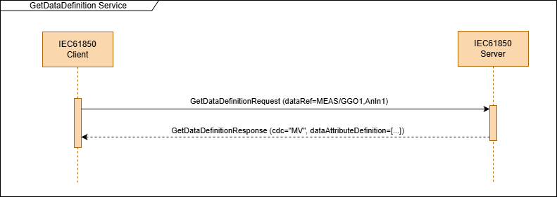
<span class="anchor" id="_Toc213261943"></span>Figure 14: A client is requesting the definition of a data object.

Here is a simple example showing the request of the defintion of a data object:

```json
{
  "request": {
    "associateId": "id_cp",
    "invokeId": 41,
    "service": {
      "getDataDefinition": {
        "dataRef": "LD0/DWMX1.WMaxSpt"
      }
    }
  }
}
```

The response includes the complete definition including the CDC, and all the data attributes and sub data attributes
together with the names, types, and functional constraints:

```json
{
  "response": {
    "associateId": "id_cp",
    "invokeId": 41,
    "service": {
      "getDataDefinition": {
        "cdc": "apc",
        "count": 0,
        "subDataDefinition": [],
        "dataAttributeDefinition": [
          {
            "daRef": "Oper",
            "fc": "co",
            "daType": {
              "structure": [
                {
                  "cmpName": "ctlVal",
                  "cmpType": {
                    "structure": [
                      {
                        "cmpName": "f",
                        "cmpType": {
                          "float32": null
                        }
                      }
                    ]
                  }
                },
                {
                  "cmpName": "origin",
                  "cmpType": {
                    "structure": [
                      {
                        "cmpName": "orCat",
                        "cmpType": {
                          "enumerated": null
                        }
                      },
                      {
                        "cmpName": "orIdent",
                        "cmpType": {
                          "octetString": 0
                        }
                      }
                    ]
                  }
                },
                {
                  "cmpName": "ctlNum",
                  "cmpType": {
                    "int8u": null
                  }
                },
                {
                  "cmpName": "T",
                  "cmpType": {
                    "timeStamp": null
                  }
                },
                {
                  "cmpName": "Test",
                  "cmpType": {
                    "boolean": null
                  }
                },
                {
                  "cmpName": "Check",
                  "cmpType": {
                    "check": null
                  }
                }
              ]
            }
          },
          {
            "daRef": "mxVal",
            "fc": "mx",
            "daType": {
              "structure": [
                {
                  "cmpName": "f",
                  "cmpType": {
                    "float32": null
                  }
                }
              ]
            }
          },
          {
            "daRef": "q",
            "fc": "mx",
            "daType": {
              "quality": null
            }
          },
          {
            "daRef": "t",
            "fc": "mx",
            "daType": {
              "timeStamp": null
            }
          }
        ]
      }
    }
  }
}
```

**Error handling**

In case of an error the server shall send a “Response-“ containing a ServiceError with one of the following values:

| **ServiceError value**            | **Reason**                                                                                                      |
|-----------------------------------|-----------------------------------------------------------------------------------------------------------------|
| *instanceNotAvailable* (1)        | The requested object doesn’t exist                                                                              |
| *accessViolation* (3)             | the access to the object/service is blocked by an access control restriction (ACL - access control list)        |
| *parameterValueInappropriate (5)* | The continueAfter parameter value is invalid or doesn’t belong to an object that would be part of the response. |
| *classNotSupported (7)*           | The server doesn’t support/implement this service.                                                              |

### Mapping of get dataset values service

The purpose of the GetDatasetValues service is to read the values of all entries of a dataset. For every dataset entry
the service will return a single value. This value can be a basic or complex value.

**Request**
<!-- table-id:auto-5-request -->

| Parameter name | Parameter type  | Description                                                     | M/O |
|----------------|-----------------|-----------------------------------------------------------------|-----|
| dsRef          | ObjectReference | The object reference of a dataset in the form LD/LN.DATASETNAME | M   |

**Response+**
<!-- table-id:auto-5-response+ -->

| Parameter name        | Parameter type                   | Description                        | M/O |
|-----------------------|----------------------------------|------------------------------------|-----|
| dsMemberValue[0 .. n] | DataAttributeValue (SEQUENCE OF) | The values of all dataset members. | M   |

**Response-**
<!-- table-id:auto-5-response- -->

| Parameter name | Parameter type    | Description               | M/O |
|----------------|-------------------|---------------------------|-----|
| ServiceError   | ServiceStatusKind | Appropriate service error | M   |

The mapping of this service consists of a single request and response message following these ASN.1 descriptions:


<!-- asn1:GetDataSetValuesRequest -->

```asn1
GetDataSetValuesRequest ::= SEQUENCE
{
    dsRef [0] ObjectReference,
}
```

The *DataAttributeValue* type in the response is the same type as is used in the GetDataValues response. For details on
how to handle this type see the chapter about the GetDataValues service.

**Error handling**

In case of an error the server shall send a “Response-“ containing a ServiceError with one of the following values:

| **ServiceError value**                     | **Reason**                                                                                               |
|--------------------------------------------|----------------------------------------------------------------------------------------------------------|
| *instanceNotAvailable* (1)                 | The requested dataset doesn’t exist                                                                      |
| *accessViolation* (3)                      | the access to the object/service is blocked by an access control restriction (ACL - access control list) |
| *failedDueToCommunicationsConstraint* (11) | the response wouldn’t fit into a single PDU)                                                             |
| *classNotSupported (7)*                    | The server doesn’t support/implement this service.                                                       |

### Mapping of set dataset values service

The purpose of the SetDataSetValues service is to set all values of a dataset with a single request.

**Request**
<!-- table-id:auto-6-request -->

| Parameter name     | Parameter type                   | Description                                                            | M/O |
|--------------------|----------------------------------|------------------------------------------------------------------------|-----|
| dsRef              | ObjectReference                  | The object reference of a dataset in the form LD/LN.DATASETNAME        | M   |
| dataAttrVal [0..n] | DataAttributeValue (SEQUENCE OF) | The list of objects that should be added to the newly created dataset. | M   |

**Response+**
<!-- table-id:auto-6-response+ -->

| Parameter name | Parameter type | Description                                            | M/O |
|----------------|----------------|--------------------------------------------------------|-----|
| result         | Result         | Ok (0) when the dataset has been created successfully. | M   |

**Response-**
<!-- table-id:auto-6-response- -->

| Parameter name | Parameter type    | Description               | M/O |
|----------------|-------------------|---------------------------|-----|
| ServiceError   | ServiceStatusKind | Appropriate service error | M   |

The mapping of this service consists of a single request and response message following these ASN.1 descriptions:


<!-- asn1:SetDataSetValuesRequest -->

```asn1
SetDataSetValuesRequest ::= SEQUENCE
{
    dsRef       [0] ObjectReference,
    dataAttrVal [1] SEQUENCE OF DataAttributeValue,
    --pattern: "\p{L}[\d,\p{L},\_]\*/[\p{L},\_]\*[\d]\*.[\p{L}]\*\|@[\p{L},\_]\*"/
}
```

**Error handling**

In case of an error the server shall send a “Response-“ containing a ServiceError with one of the following values:

| **ServiceError value**            | **Reason**                                                                                               |
|-----------------------------------|----------------------------------------------------------------------------------------------------------|
| *instanceNotAvailable* (1)        | The requested dataset doesn’t exist                                                                      |
| *accessViolation* (3)             | the access to the object/service is blocked by an access control restriction (ACL - access control list) |
| *parameterValueInappropriate* (5) | One or more dataAttrVal values are not valid (e.g. value out of range or of wrong type)                  |
| *classNotSupported (7)*           | The server doesn’t support/implement this service.                                                       |

### Mapping of create dataset service

The purpose of the CreateDataSet service is to create a new dynamic dataset in an existing logical node of the server.

**Request**
<!-- table-id:auto-7-request -->

| Parameter name     | Parameter type            | Description                                                            | M/O |
|--------------------|---------------------------|------------------------------------------------------------------------|-----|
| dsRef              | ObjectReference           | The object reference of a dataset in the form LD/LN.DATASETNAME        | M   |
| dsMemberRef [0..n] | FcdFcdaType (SEQUENCE OF) | The list of objects that should be added to the newly created dataset. | M   |

**Response+**
<!-- table-id:auto-7-response+ -->

| Parameter name | Parameter type | Description                                            | M/O |
|----------------|----------------|--------------------------------------------------------|-----|
| result         | Result         | Ok (0) when the dataset has been created successfully. | M   |

**Response-**
<!-- table-id:auto-7-response- -->

| Parameter name | Parameter type    | Description               | M/O |
|----------------|-------------------|---------------------------|-----|
| ServiceError   | ServiceStatusKind | Appropriate service error | M   |

The FcdFcdaType is a ObjectReference with a functional constraint. This structure can be used to define Functional
Constraint Data (the data attributes of a DataObject that share the same functional constraint).

The mapping of this service consists of a single request and response message following these ASN.1 descriptions:


<!-- asn1:CreateDataSetRequest -->

```asn1
CreateDataSetRequest ::= SEQUENCE
{
    dsRef       [0] ObjectReference,
    dsMemberRef [1] SEQUENCE OF FcdFcdaType,
}
```

Figure 15 shows a sequence diagram where a client successfully requests the creation of a dynamic dataset with the name
“LD0/LLN0.ds1” that has to FCD dataset members.

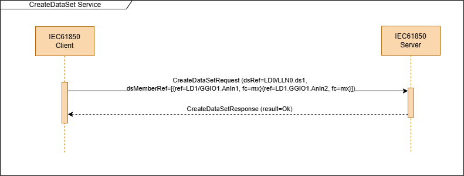
<span class="anchor" id="_Ref212820736"></span>Figure 15: CreateDataSet service request and response sequence. In the positive case the response contains result=Ok

**Error handling**

In case of an error the server shall send a “Response-“ containing a ServiceError with one of the following values:

| **ServiceError value**            | **Reason**                                                                                               |
|-----------------------------------|----------------------------------------------------------------------------------------------------------|
| *instanceNotAvailable* (1)        | the logical node where the dataset should be created doesn’t exist                                       |
| *instanceInUse* (2)               | the dataset cannot be created because it already exists                                                  |
| *accessViolation* (3)             | the access to the object/service is blocked by an access control restriction (ACL - access control list) |
| *parameterValueInappropriate* (5) | One or more dsMemberRef values are not valid                                                             |
| *classNotSupported (7)*           | The server doesn’t support/implement this service.                                                       |

### Mapping of delete dataset service

The purpose of the DeleteDataSet service is to delete dynamic datasets.

It is not possible to delete static datasets. Dynamic datasets can only be deleted when the server is not using the
datasets for other services (like report control blocks).

| **Request**    |                   |                                                                 |     |
|----------------|-------------------|-----------------------------------------------------------------|-----|
| Parameter name | Parameter type    | Description                                                     | M/O |
| dsRef          | ObjectReference   | The object reference of a dataset in the form LD/LN.DATASETNAME | M   |
| **Response+**  |                   |                                                                 |     |
| Parameter name | Parameter type    | Description                                                     | M/O |
| result         | Result            | Confirmation when the dataset has been deleted                  | M   |
| **Response-**  |                   |                                                                 |     |
| Parameter name | Parameter type    | Description                                                     | M/O |
| ServiceError   | ServiceStatusKind | Appropriate service error                                       | M   |

When the dataset was deleted the server response with result=Ok(0). Otherwise the server will return a ServiceError.

The mapping of this service consists of a single request and response message following these ASN.1 descriptions:


<!-- asn1:DeleteDataSetRequest -->

```asn1
DeleteDataSetRequest ::= SEQUENCE
{
    dsRef [0] ObjectReference,
}
```

**Error handling**:

In case of an error the server shall send a “Response-“ containing a ServiceError with one of the following values:

| **ServiceError value**     | **Reason**                                                                                           |
|----------------------------|------------------------------------------------------------------------------------------------------|
| *instanceNotAvailable* (1) | The requested dataset doesn’t exist                                                                  |
| *instanceInUse* (2)        | the dataset cannot be deleted because it is in use (e.g. by a report control block or other service) |
| *accessViolation* (3)      | the access to the object is blocked by an access control restriction (ACL - access control list)     |
| *classNotSupported (7)*    | The server doesn’t support/implement this service.                                                   |

### Mapping of get dataset directory service

The purpose of this service is to get the directory of the dataset specified by the dsRef parameter. The directory is
the list of functional constraint data objects (FCD) or functional constraint data attributes (FCDA) that form the
members of the dataset.

**Request**
<!-- table-id:auto-8-request -->

| Parameter name | Parameter type  | Description                                                     | M/O |
|----------------|-----------------|-----------------------------------------------------------------|-----|
| dsRef          | ObjectReference | The object reference of a dataset in the form LD/LN.DATASETNAME | M   |
| continueAfter  | FcdFcdaType     | The object refernce and FC of the last received dataset member  | O   |

**Response+**
<!-- table-id:auto-8-response+ -->

| Parameter name    | Parameter type            | Description                         | M/O |
|-------------------|---------------------------|-------------------------------------|-----|
| dsMemberRef[0..n] | FcdFcdaType (SEQUENCE OF) | The list of dataset members         | O   |
| moreFollows       | BOOLEAN                   | More data set members are available | O   |

**Response-**
<!-- table-id:auto-8-response- -->

| Parameter name | Parameter type    | Description               | M/O |
|----------------|-------------------|---------------------------|-----|
| ServiceError   | ServiceStatusKind | Appropriate service error | M   |

The mapping of this service consists of a one or more request and response messages following these ASN.1 descriptions:


<!-- asn1:GetDataSetDirectoryRequest -->

```asn1
GetDataSetDirectoryRequest ::= SEQUENCE
{
    dsRef         [0] ObjectReference,
    continueAfter [1] FcdFcdaType OPTIONAL,
}
```

**Error handling**:

In case of an error the server shall send a “Response-“ containing a ServiceError with one of the following values:

| **ServiceError value**     | **Reason**                                                                                       |
|----------------------------|--------------------------------------------------------------------------------------------------|
| *instanceNotAvailable* (1) | The requested dataset doesn’t exist                                                              |
| *accessViolation* (3)      | the access to the object is blocked by an access control restriction (ACL - access control list) |
| *classNotSupported (7)*    | The server doesn’t support/implement this service.                                               |

### Mapping of get BRCB values service (GetBRCBValues)

The purpose of this service is to fetch the parameter values of a buffered report control block (BRCB). The service
response always returns all available parameters of the BRCB.

| **Request**    |                   |                                                                      |     |
|----------------|-------------------|----------------------------------------------------------------------|-----|
| Parameter name | Parameter type    | Description                                                          | M/O |
| brcbRef        | ObjectReference   | The object reference of the BRCB whose values are to be retrieved.   | M   |
| **Response+**  |                   |                                                                      |     |
| Parameter name | Parameter type    | Description                                                          | M/O |
| rptID          | VisString129      | Report identifier                                                    | M   |
| rptEna         | BOOLEAN           | Report enabled                                                       | M   |
| dataSet        | ObjectReference   | Object reference of the report dataset in the form LD/LN.DATASETNAME | M   |
| confRef        | UINT32            | Configuration revision of BRCB                                       | M   |
| optFlds        | OptFldsRCB        | Optional fields to be included in the reports                        | M   |
| bufTm          | UINT32            | Buffer time in milliseconds                                          | M   |
| sqNum          | UINT16            | Sequence number of latest sent report.                               | M   |
| trgOp          | TrgOps            | Active trigger options                                               | M   |
| intgPd         | INT32             | Integrity period in milliseconds                                     | M   |
| gi             | BOOLEAN           | General interrogation active                                         | M   |
| purgeBuf       | BOOLEAN           | Buffer purged                                                        | M   |
| entryID        | EntryID           | Entry ID of last sent report                                         | M   |
| timeOfEntry    | TimeStamp         | Entry time of the last sent report                                   | M   |
| rsvdTimeSec    | INT16             | Reserved time in seconds                                             | M   |
| Owner          | OCTET STRING 64   | ID of the owner of the RCB                                           | O   |
| **Response-**  |                   |                                                                      |     |
| Parameter name | Parameter type    | Description                                                          | M/O |
| ServiceError   | ServiceStatusKind | Appropriate service error                                            | M   |

The mapping of this service consists of a single request and response message following these ASN.1 descriptions:


<!-- asn1:GetBRCBValuesRequest -->

```asn1
GetBRCBValuesRequest::= SEQUENCE
{
    brcbRef [0] ObjectReference,
    --pattern: \p{L}[\d,\p{L},\_]\*/[\p{L},\_]\*[\d]\*.[\p{L},\_]"/
}
```


<span class="anchor" id="_Toc213261945"></span>Figure 16: The client reads all the values of a BRCB with the GetBRCBValues service.

**Error handling**:

In case of an error the server shall send a “Response-“ containing a ServiceError with one of the following values:

| **ServiceError value**     | **Reason**                                                                                       |
|----------------------------|--------------------------------------------------------------------------------------------------|
| *instanceNotAvailable* (1) | The requested report control block does not exit                                                 |
| *accessViolation* (3)      | the access to the object is blocked by an access control restriction (ACL - access control list) |
| *classNotSupported (7)*    | The server doesn’t support/implement this service.                                               |

### Mapping of set BRCB values service (SetBRCBValues)

The purpose of this service is to configure and enable or disable a buffered report control block (BRCB). The request
can include one or more BRCB parameters to change/set.

| **Request**    |                   |                                                                    |     |
|----------------|-------------------|--------------------------------------------------------------------|-----|
| Parameter name | Parameter type    | Description                                                        | M/O |
| brcbRef        | ObjectReference   | The object reference of the BRCB whose values are to be retrieved. | M   |
| bufTm          | UINT32            | Buffer time in milliseconds                                        | O   |
| dataSet        | ObjectReference   | Object reference of the report dataset                             | O   |
| entryID        | EntryID           | Entry ID of last received report for resync procedure              | O   |
| gi             | BOOLEAN           | Trigger general interrogation report                               | O   |
| intgPd         | INT32             | Integrity period                                                   | O   |
| optFlds        | OptFldsRCB        | Optional fields to be included in the reports                      | O   |
| purgeBuf       | BOOLEAN           | Trigger purge buffer                                               | O   |
| rptEna         | BOOLEAN           | Enable or disable the RCB                                          | O   |
| rptID          | VisString129      | Report identifier                                                  | O   |
| rsvdTimeSec    | INT16             | Reserved for a specific duration in seconds                        | O   |
| trgOp          | TrgOps            | Enable/disable trigger options                                     | O   |
| **Response+**  |                   |                                                                    |     |
| Parameter name | Parameter type    | Description                                                        | M/O |
| Result         | Result            | Result code (Ok)                                                   | O   |
| **Response-**  |                   |                                                                    |     |
| Parameter name | Parameter type    | Description                                                        | M/O |
| ServiceError   | ServiceStatusKind | Appropriate service error                                          | M   |

The mapping of this service consists of a single request and response message following these ASN.1 descriptions:


<!-- asn1:SetBRCBValuesRequest -->

```asn1
SetBRCBValuesRequest ::= SEQUENCE
{
    brcbRef      [0] ObjectReference,
    bufTm        [1] INTEGER (0..4294967295) OPTIONAL,
    dataSet      [2] ObjectReference OPTIONAL,
    entryID      [3] EntryID OPTIONAL,
    gi           [4] BOOLEAN OPTIONAL,
    intgPd       [5] INTEGER (0..4294967295) OPTIONAL,
    optFlds      [6] OptFldsRCB OPTIONAL,
    purgeBuf     [7] BOOLEAN OPTIONAL,
    rptEna       [8] BOOLEAN OPTIONAL,
    rptID        [9] VisString64 OPTIONAL,
    rsvdTimeSec [10] INTEGER (-32768..32767) OPTIONAL,
    trgOp       [11] TrgOps OPTIONAL,
}
```

Figure 17 shows the typical process to enable a buffered report control block. The trigger options are set so that
reports are sent whenever a value of quality of a data object changes. To transmit the initial process state a general
interrogation (GI) request is sent at the same time to trigger a GI report that includes the values for the whole report
dataset.

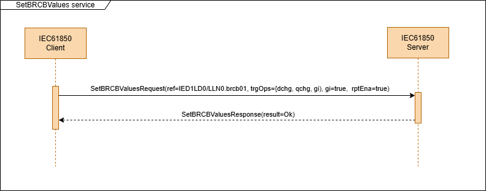
<span class="anchor" id="_Ref212818112"></span>Figure 17: SetBRCBValues service setting the trigger options to trigger reports on value and quality changes, and enabled the report and requests an integrity report at the same time.

**Error handling**:

In case of an error the server shall send a “Response-“ containing a ServiceError with one of the following values:

| **ServiceError value**            | **Reason**                                                                                                                      |
|-----------------------------------|---------------------------------------------------------------------------------------------------------------------------------|
| *instanceNotAvailable* (1)        | the object referenced by the “brcbRef” parameter does not exist                                                                 |
| *instanceInUse* (2)               | the RCB is already enabled or reserved by another client                                                                        |
| *accessViolation* (3)             | the access to the object is blocked by an access control restriction (ACL - access control list)                                |
| *parameterValueInappropriate* (5) | one of the sent values is out of range or otherwise invalid (e.g. a dataset reference is used for a dataset that doesn’t exist) |
| *typeConflict* (10)               | one of the sent values is not compatible with the type of the respective RCB element property                                   |
| *classNotSupported (7)*           | The server doesn’t support/implement this service.                                                                              |

### Mapping of get URCB values service (GetURCBValues)

The purpose of this service is to fetch the parameter values of a unbuffered report control block (URCB). The service
response always returns all available parameters of the URCB.

| **Request**    |                   |                                                                    |     |
|----------------|-------------------|--------------------------------------------------------------------|-----|
| Parameter name | Parameter type    | Description                                                        | M/O |
| urcbRef        | ObjectReference   | The object reference of the URCB whose values are to be retrieved. | M   |
| **Response+**  |                   |                                                                    |     |
| Parameter name | Parameter type    | Description                                                        | M/O |
| rptID          | VisString129      | Report identifier                                                  | M   |
| rptEna         | BOOLEAN           | Report enabled                                                     | M   |
| dataSet        | ObjectReference   | Object reference of the report dataset                             | M   |
| confRef        | UINT32            | Configuration revision of URCB                                     | M   |
| optFlds        | OptFldsRCB        | Optional fields to be included in the reports                      | M   |
| bufTm          | UINT32            | Buffer time in milliseconds                                        | M   |
| sqNum          | UINT16            | Sequence number of latest sent report.                             | M   |
| trgOp          | TrgOps            | Active trigger options                                             | M   |
| intgPd         | INT32             | Integrity period                                                   | M   |
| gi             | BOOLEAN           | General interrogation active                                       | M   |
| resv           | BOOLEAN           | Indicates that the URCB is reserved by a specific TPAA             | M   |
| owner          | OCTET STRING 64   | ID of the owner of the RCB                                         | O   |
| **Response-**  |                   |                                                                    |     |
| Parameter name | Parameter type    | Description                                                        | M/O |
| ServiceError   | ServiceStatusKind | Appropriate service error                                          | M   |

The mapping of this service consists of a single request and response message following these ASN.1 descriptions:


<!-- asn1:GetURCBValuesRequest -->

```asn1
GetURCBValuesRequest::= SEQUENCE
{
    urcbRef [0] ObjectReference,
    --pattern: \p{L}[\d,\p{L},\_]\*/[\p{L},\_]\*[\d]\*.[\p{L},\_]"/
}
```

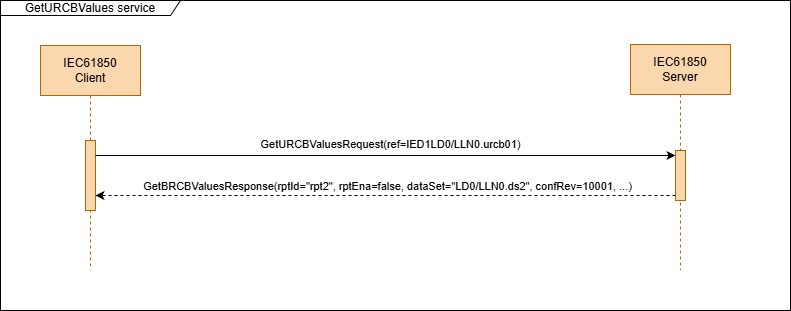
<span class="anchor" id="_Toc213261947"></span>Figure 18: GetURCBValue service sequence to read the current values of the RCB.

**Error handling**:

In case of an error the server shall send a “Response-“ containing a ServiceError with one of the following values:

| **ServiceError value**     | **Reason**                                                                           |
|----------------------------|--------------------------------------------------------------------------------------|
| *instanceNotAvailable* (1) | The requested report control block does not exit                                     |
| *accessViolation* (3)      | The caller of the service doesn’t have sufficient rights for this service invokation |
| *classNotSupported (7)*    | The server doesn’t support/implement this service.                                   |

### Mapping of set URCB values service (SetURCBValues)

The purpose of this service is to configure a unbuffered report control block (URCB). The request can include one or
more URCB parameters to change/set.

| **Request**    |                   |                                                                    |     |
|----------------|-------------------|--------------------------------------------------------------------|-----|
| Parameter name | Parameter type    | Description                                                        | M/O |
| urcbRef        | ObjectReference   | The object reference of the URCB whose values are to be retrieved. | M   |
| bufTm          | UINT32            | Buffer time in milliseconds                                        | O   |
| dataSet        | ObjectReference   | Object reference of the report dataset                             | O   |
| gi             | BOOLEAN           | Trigger general interrogation report                               | O   |
| intgPd         | INT32             | Integrity period                                                   | O   |
| optFlds        | OptFldsRCB        | Optional fields to be included in the reports                      | O   |
| rptEna         | BOOLEAN           | Enable or disable the RCB                                          | O   |
| rptID          | VisString129      | Report identifier                                                  | O   |
| resv           | BOOLEAN           | Reserve the URCB for this TPAA                                     | O   |
| trgOp          | TrgOps            | Enable/disable trigger options                                     | O   |
| **Response+**  |                   |                                                                    |     |
| Parameter name | Parameter type    | Description                                                        | M/O |
| Result         | Result            | Result code (Ok)                                                   | O   |
| **Response-**  |                   |                                                                    |     |
| Parameter name | Parameter type    | Description                                                        | M/O |
| ServiceError   | ServiceStatusKind | Appropriate service error                                          | M   |

The request always includes the urcbRef parameter to indicate which RCB has to be modified. At least one other request
parameter is required.

If the RCB is not reserved at the time of receiving the request it will be implicitly reserved for the current TPAA.

When the RCB is reserved by another TPAA when receiving the request a ServiceError with the value
*instanceLockedByOtherClient* (8) will be returned.

The mapping of this service consists of a single request and response message following these ASN.1 descriptions:


<!-- asn1:SetURCBValuesRequest -->

```asn1
SetURCBValuesRequest ::= SEQUENCE
{
    urcbRef  [0] ObjectReference,
    bufTm    [1] INTEGER (0..4294967295) OPTIONAL,
    dsRef    [2] ObjectReference OPTIONAL,
    gi       [4] BOOLEAN OPTIONAL,
    intgPd   [5] INTEGER (0..4294967295) OPTIONAL,
    optFlds  [6] OptFldsRCB OPTIONAL,
    rptEna   [7] BOOLEAN OPTIONAL,
    rptID    [8] VisString64 OPTIONAL,
    resv     [9] BOOLEAN OPTIONAL,
    trgOp   [10] TrgOps OPTIONAL,
}
```


<span class="anchor" id="_Toc213261948"></span>Figure 19: SetBRCBValues service setting the intgPd attribute value, integrity trigger option, and enabled the report at the same time.

**Error handling**:

In case of an error the server shall send a “Response-“ containing a ServiceError with one of the following values:

| **ServiceError value**            | **Reason**                                                                                                                      |
|-----------------------------------|---------------------------------------------------------------------------------------------------------------------------------|
| *instanceNotAvailable* (1)        | the object referenced by the “brcbRef” parameter does not exist                                                                 |
| *instanceInUse* (2)               | the RCB is already enabled or reserved by another client                                                                        |
| *accessViolation* (3)             | the access to the object is blocked by an access control restriction (ACL - access control list)                                |
| *parameterValueInappropriate* (5) | one of the sent values is out of range or otherwise invalid (e.g. a dataset reference is used for a dataset that doesn’t exist) |
| *typeConflict* (10)               | one of the sent values is not compatible with the type of the respective RCB element property                                   |
| *classNotSupported (7)*           | The server doesn’t support/implement this service.                                                                              |

### Mapping of the Report service

The Report service is an unconfirmed service. Its purpose is to send unsolicited messages from the ACSI server to the
ACSI client to inform the client about status and value changes in the server data model. Because a report is an
unconfirmed message there is no confirmation or other response from the client. A single service invocation can consist
of a single unconfirmed message, or of multiple unconfirmed messages in case of a segmented report (a report where the
report data doesn‘t fit into a single APDU).

**Unconfirmed**
<!-- table-id:auto-9-unconfirmed -->

| Parameter name     | Parameter type          | Description                                                                                                                                          | M/O |
|--------------------|-------------------------|------------------------------------------------------------------------------------------------------------------------------------------------------|-----|
| rptId              | VisString129            | ID to identify the report and distinguish between reports from different RCBs.                                                                       | M   |
| sqNum              | INT16U                  | Report sequence number. Will be increased by one for every new report.                                                                               | O   |
| subSqNum           | INT16U                  | Segment number for segmented reports                                                                                                                 | O   |
| moreSegmentsFollow | BOOLEAN                 | TRUE: More report segements follow, FALSE if this message is the last message of a segmented report sequence.                                        |     |
| dataSet            | ObjectReference         | Object reference of the report dataset. The format LD/LN.DSNAME should be used. For compatibility with MMS also the format LD/LN$DSNAME can be used. | O   |
| bufOvfl            | BOOLEAN                 | Indicates a report buffer overflow for buffered reporting.                                                                                           | O   |
| confRev            | INT32U                  | Configuration revision. Can be used to verify that the client and server use the same configuration.                                                 | O   |
| entry              | Entry                   | The report entry including the report data                                                                                                           | M   |
| entry.timeOfEntry  | TimeStamp               | Time when the report entry was created.                                                                                                              | O   |
| entry.entryID      | EntryID                 | Unique ID of the report entry (can be used for resync in case of buffered reporting)                                                                 | O   |
| Entry.entryData    | EntryData (SEQUENCE OF) | List of entry data elements (data set elements that are reported)                                                                                    | M   |

The report service consists of a single message that is sent from the ACSI server to the ACSI client and uses the
following ASN.1 types:


<!-- asn1:Report -->

```asn1
Report ::= SEQUENCE
{
    rptID              VisString129,
    sqNum              INT16U OPTIONAL,
    subSqNum           INT16U DEFAULT 0,
    moreSegmentsFollow BOOLEAN DEFAULT FALSE,
    dataSet            ObjectReference OPTIONAL,
    bufOvfl            BOOLEAN DEFAULT FALSE,
    confRev            INT32U OPTIONAL,
    entry              Entry,
}
```

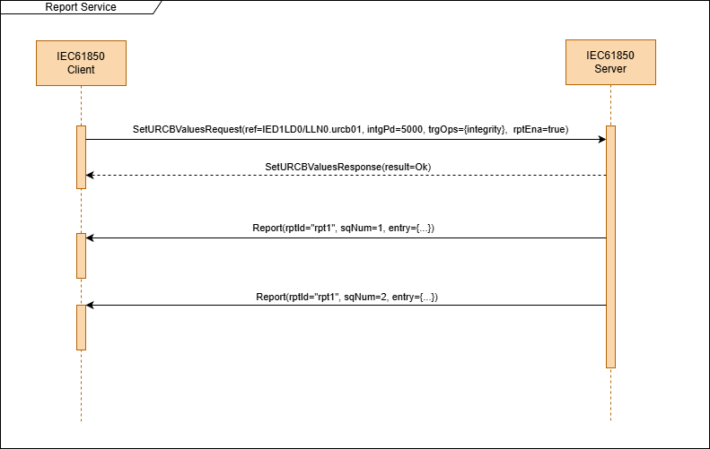
<span class="anchor" id="_Toc213261949"></span>Figure 20: A server sends two consecutive reports for the same RCB to the client that enabled (subscribed) the RCB with the SetURCBValues service.

### Mapping of get LCB values service (GetLCBValues)

The purpose of this service is to fetch the values of a log control block.

*To be defined later.*

### Mapping of set LCB values service (SetLCBValues)

The purpose of this service is to configure the values of a log control block.

*To be defined later.*

### Mapping of control services

In order to define the control services and the control service parameters in the SCL file a special functional
constraint is required. For the MMS mapping the FC=CO is used for this purpose, and the control service parameters are
defined as part of the data model in the respective controllable data objects (e.g. CDCs SPC, INC, APC, …).

To be compatible with the existing data model descriptions in SCL files we define the same for the new SCSM. This SCSM
also uses the additional functional constraint “CO” to add the control service parameters to the data model. Also, the
data attribute definitions in the SCL have to define the “ProtNS” element with the value and the “type”-attribute with
value “8-MMS”. The purpose of the “ProtNS” element is to define a protocol specific extension of the data model.

The following is an example of the definition of an “Oper” service parameter in the SCL file with the “ProtNS” attribute
highlighted:

\<datype \="" id="OperAnalog">

\<bda \="" btype="Struct" name="ctlVal" type="AnalogueValue">

\<bda \="" btype="Struct" name="origin" type="Originator">

\<bda \="" btype="INT8U" name="ctlNum">

\<bda \="" btype="Timestamp" name="T">

\<bda \="" btype="BOOLEAN" name="Test">

\<bda \="" btype="Check" name="Check">

<span class="mark">\<protns \="" type="8-MMS">IEC 61850-8-1:2003\</protns></span>

\

Control services are defined as special data attributes in control objects that have the FC=CO.

These services data attributes are

- “Oper” (for the Operate and TimeActivatedOperate services)

- “SBO” (for the Select service)

- “SBOw” (for the Select-with-Value service)

- “Cancel” (for the Cancel service)

Their presence of these elements in the SCL data model depends on the selected control model. Some control models
require the presence of certain elements.

The services are realized by specific service requests and responses.

Depending on the control model a single control operation can consist of one or multiple request and response messages.

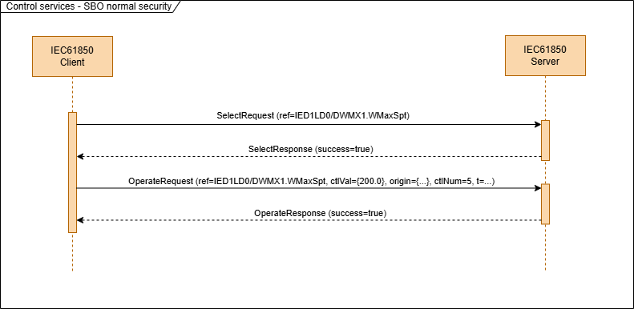
<span class="anchor" id="_Toc213261950"></span>Figure 21: Example of a control operation consisting as a sequence of multiple request and response messages. This example shows the positive path in case of "Select before operate with normal security" control model.

For the error handling in control services the parameters serviceError (type: ServiceStatusKind) and addCause (type:
ControlServiceStatusKind) are used. For e.g. Figure 22 shows the sequence for the case when the control object was
already selected when receiving the select request.

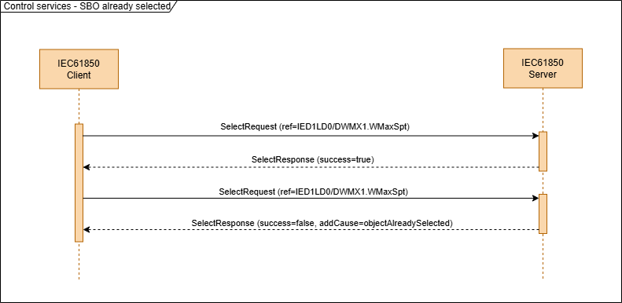
<span class="anchor" id="_Ref212570590"></span>Figure 22: SBO control sequence when the control object is already selected.

In addition to the ServiceStatusKind enumeration that is used for Service Error in multiple service for the control
services there is another more specific list of error codes. This list is defined in the ControlServiceStatusKind
enumeration.

Definition of the ControlServiceStatusKind:


<!-- asn1:ControlServiceStatusKind -->

```asn1
ControlServiceStatusKind ::= ENUMERATED
{
    unknown                     (0),
    notSupported                (1),
    blockedBySwitchingHierarchy (2),
    selectFailed                (3),
    invalidPosition             (4),
    positionReached             (5),
    parameterChangeInExecution  (6),
    stepLimit                   (7),
    blockedByMode               (8),
    blockedByProcess            (9),
    blockedByInterlocking       (10),
    blockedBySynchrocheck       (11),
    commandAlreadyInExecution   (12),
    blockedByHealth             (13),
    oneOfNControl               (14),
    abortionByCancel            (15),
    timeLimitOver               (16),
    abortionByTrip              (17),
    objectNotSelected           (18),
    objectAlreadySelected       (19),
    noAccessAuthority           (20),
    endedWithOvershoot          (21),
    abortionDueToDeviation      (22),
    abortionByCommunicationLoss (23),
    blockedByCommand            (24),
    none                        (25),
    inconsistentParameters      (26),
    lockedByOtherClient         (27),
}
```

#### Operate Service

The operate service has the purpose to send a control command to a server. This service is used in all control models.

| **Request**    |                          |                                                                                    |     |
|----------------|--------------------------|------------------------------------------------------------------------------------|-----|
| Parameter name | Parameter type           | Description                                                                        | M/O |
| ref            | ObjectReference          | The object reference of the control object                                         | M   |
| ctlVal         | Data                     | Control value (target value or setpoint)                                           | M   |
| origin         | Originator               | Identifier of the source of the command (to be defined by the client)              | M   |
| ctlNum         | INT8U                    | Control sequence number                                                            | M   |
| t              | TimeStamp                | Control timestamp (time when the client issues the request)                        | M   |
| test           | BOOLEAN                  | Indicates if command is for test purposes                                          | M   |
| check          | CheckConditions          | Test to be performed before accepting/executing the command (only for DPC objects) | O   |
| **Response+**  |                          |                                                                                    |     |
| Parameter name | Parameter type           | Description                                                                        | M/O |
| success        | BOOLEAN                  | True operation has been accepted                                                   | M   |
| **Response-**  |                          |                                                                                    |     |
| Parameter name | Parameter type           | Description                                                                        | M/O |
| serviceError   | ServiceStatusKind        | Appropriate service error                                                          | O   |
| addCause       | ControlServiceStatusKind | Additional error information                                                       | O   |

The mapping of this service consists of a single request and response message following these ASN.1 descriptions:


<!-- asn1:OperateRequest -->

```asn1
OperateRequest ::= SEQUENCE
{
    ref    [0] ObjectReference,
    ctlVal [1] Data,
    origin [2] Originator,
    ctlNum [3] INT8U,
    t      [4] TimeStamp,
    test   [5] BOOLEAN DEFAULT FALSE,
    check  [6] CheckConditions OPTIONAL,
}
```

The OperateResponse type is used for the positive and negative responses. When the operate request has been accepted by
the server then it answers with an OperateResponse message with success=true. In case the operate request has not been
accepted the server answers with the OperateResponse message with success=false and the serviceError and addCause
elements using the appropriate values.

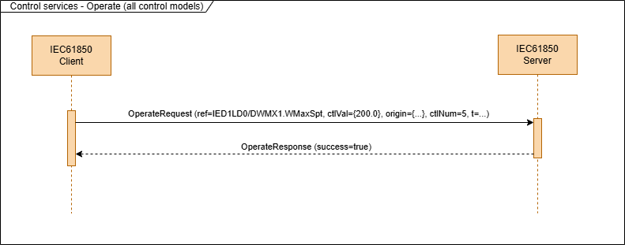
<span class="anchor" id="_Toc213261952"></span>Figure 23: A successful operate sequence

In the case of a negative response the serviceError should have the value “noError” when addCause is used. When
serviceError has a value different than “noError” and none of the values of ControlServiceStatusKind applies than the
value “none(25)” should be used for addCause.

#### Select Service

The purpose of the select service is to select a control object for a specific client. This service is used together
with the control model “SBO with normal security”. When this control model is selected then the client has to send a
select request before it can send an operate request.

| **Request**    |                          |                                            |     |
|----------------|--------------------------|--------------------------------------------|-----|
| Parameter name | Parameter type           | Description                                | M/O |
| ref            | ObjectReference          | The object reference of the control object | M   |
| **Response+**  |                          |                                            |     |
| Parameter name | Parameter type           | Description                                | M/O |
| success        | BOOLEAN                  | True operation has been accepted           | M   |
| **Response-**  |                          |                                            |     |
| Parameter name | Parameter type           | Description                                | M/O |
| serviceError   | ServiceStatusKind        | Appropriate service error                  | O   |
| addCause       | ControlServiceStatusKind | Additional error information               | O   |

The mapping of this service consists of a single request and response message following these ASN.1 descriptions:


<!-- asn1:SelectRequest -->

```asn1
SelectRequest ::= SEQUENCE
{
    ref [0] ObjectReference,
}
```

In the positive case (select is successful), the SelectResponse only includes the “success” parameter with the value
true. After the client receives the SelectResponse with success=true it can continue with sending the OperateRequest to
perform the actual control operation (see Figure 24)


<span class="anchor" id="_Ref212584222"></span>Figure 24: Select service sequence followed by the operate sevice sequence is the normal operation in the control model "SBO with normal security".

In the negative test case the “success” parameter is missing or has the value “false” and one of the “serviceError” or
“addCause” elements is present, depending on the type of error or state that caused the select to fail (see Figure 25).

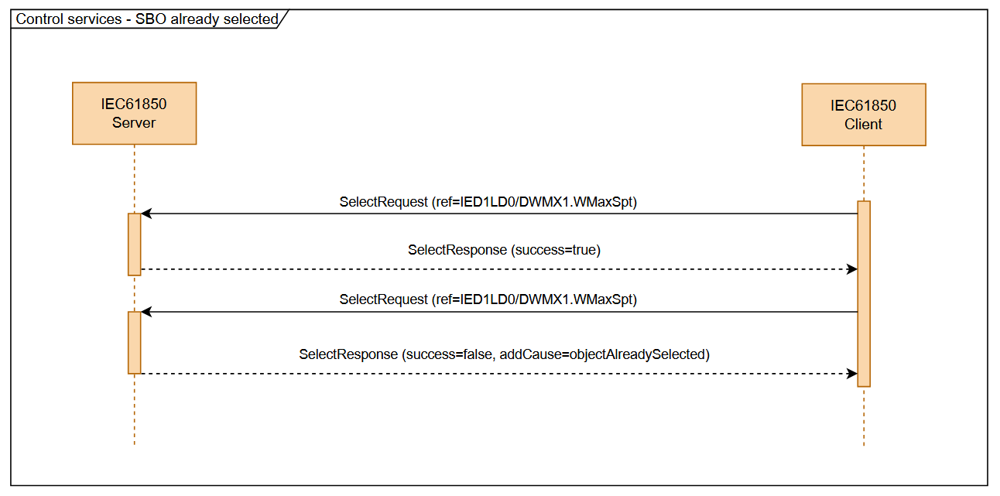
<span class="anchor" id="_Ref212584343"></span>Figure 25: Second select failed with a negative SelectResponse because the control object has already been selected and the select timeout didn't expire.

#### Select with Value Service

The purpose of the select-with-value service is to select a control object for a specific client. This service is used
together with the control model “SBO with enhanced security”. When this control model is selected then the client has to
send a select request before it can send an operate request. Also the control parameters that are sent in the operate
request have to match the control parameter values in the prior select-with-value request.

| **Request**    |                          |                                                                                    |     |
|----------------|--------------------------|------------------------------------------------------------------------------------|-----|
| Parameter name | Parameter type           | Description                                                                        | M/O |
| ref            | ObjectReference          | The object reference of the control object                                         | M   |
| ctlVal         | Data                     | Control value (target value or setpoint)                                           | M   |
| origin         | Originator               | Identifier of the source of the command (to be defined by the client)              | M   |
| ctlNum         | INT8U                    | Control sequence number                                                            | M   |
| t              | TimeStamp                | Control timestamp (time when the client issues the request)                        | M   |
| test           | BOOLEAN                  | Indicates if command is for test purposes                                          | M   |
| check          | CheckConditions          | Test to be performed before accepting/executing the command (only for DPC objects) | O   |
| **Response+**  |                          |                                                                                    |     |
| Parameter name | Parameter type           | Description                                                                        | M/O |
| success        | BOOLEAN                  | True control is selected                                                           | M   |
| **Response-**  |                          |                                                                                    |     |
| Parameter name | Parameter type           | Description                                                                        | M/O |
| serviceError   | ServiceStatusKind        | Appropriate service error                                                          | O   |
| addCause       | ControlServiceStatusKind | Additional error information                                                       | O   |

## Mapping of the basic and common types

Basic and common types are the types used to represent the values for basic data attributes. They can also be used for
service parameters.

### Mapping of basic types

The basic types represent the BasicTypes from IEC 61850-7-2 and can be mapped to a simple ASN.1 type (like BOOLEAN or
INTEGER).

| **IEC 61850-7-2 BasicType Name** | **ASN.1 Type**                    | **ASN.1 Type Value Range** | **JSON Type (JER)** | **Comment**                                               |
|----------------------------------|-----------------------------------|----------------------------|---------------------|-----------------------------------------------------------|
| **BOOLEAN**                      | BOOLEAN                           | TRUE or FALSE              | boolean             | Logical true/false                                        |
| **INT8**                         | INTEGER (-128..127)               | -128 to 127                | number              | Signed 8-bit integer                                      |
| **INT16**                        | INTEGER (-32768..32767)           | -32,768 to 32,767          | number              | Signed 16-bit integer                                     |
| **INT32**                        | INTEGER (-2147483648..2147483647) | -2³¹ to 2³¹-1              | number              | Signed 32-bit integer                                     |
| **INT64**                        | INTEGER (-2⁶³..2⁶³-1)             | -9.22×10¹⁸ to 9.22×10¹⁸    | string              | Use string in JSON to avoid precision loss                |
| **INT8U**                        | INTEGER (0..255)                  | 0 to 255                   | number              | Unsigned 8-bit integer                                    |
| **INT16U**                       | INTEGER (0..65535)                | 0 to 65,535                | number              | Unsigned 16-bit integer                                   |
| **INT24U**                       | INTEGER (0..16777215)             | 0 to 16,777,215            | number              | Unsigned 24-bit integer                                   |
| **INT32U**                       | INTEGER (0..4294967295)           | 0 to 4,294,967,295         | string              | Use string in JSON to preserve full 32-bit unsigned range |
| **FLOAT32**                      | REAL                              | ~±1.18×10⁻³⁸ to ±3.4×10³⁸  | number              | 32-bit IEEE floating point                                |
| **Octet64**                      | OCTET STRING (SIZE(64))           | 64 bytes                   | string (base64)     | Typically base64-encoded in JSON                          |
| **VisString64**                  | VisibleString (SIZE(0..64))       | 0 to 64 characters         | string              | Human-readable string                                     |
| **VisString129**                 | VisibleString (SIZE(0..129))      | 0 to 129 characters        | string              | Human-readable string                                     |
| **VisString255**                 | VisibleString (SIZE(0..255))      | 0 to 255 characters        | string              | Human-readable string                                     |

**CODED ENUM** and **ENUMERATED** types are both mapped to **INT32** (number when the JSON encoding rules are used).

### Mapping of Timestamp

The Timestamp type is mapped to a structure (ASN.1 SEQUENCE) consisting of the TimeStamp and TimeQuality ASN.1 types.


<!-- asn1:TimeStamp -->

```asn1
TimeStamp ::= SEQUENCE
{
    secondSinceEpoch INTEGER (0..4294967295),
    fractionOfSecond INTEGER (0..16777215), -- 24bit unsigned integer),
    timeQuality      TimeQuality,
}
```

The time quality flags default to the common (good) case to save bandwidth.

### Mapping of Quality

The quality is mapped to a structure (ASN.1 SEQUENCE).

The structure consists of the validity field that is mandatory and is an enumeration and other fields like “detailQual”,
“test”, … that are optional and their presence depends on the value of these field. When they have a default value (e.g.
test=FALSE) they are supposed to be skipped but can optionally be included.

When all flags of the detailQual field are FALSE the detailQual field should not be included to save bandwidth.

The Qualty type is implemented by the Quality, Validity, Source, and DetailQual ASN.1 types:


<!-- asn1:Quality -->

```asn1
Quality ::= SEQUENCE
{
    detailQual    DetailQual OPTIONAL,
    validity      Validity,
    source        Source,
    test          BOOLEAN DEFAULT FALSE,
    operatorBlock BOOLEAN DEFAULT FALSE,
}
```

## Mapping of complex data

In addition to the basic and common types that are used to represent single data attributes and ACSI service parameters
there are also complex types required in some services.

These complex types are required to represent the data of complex data attributes with sub data attributes or (
functional constraint) data objects.

The “Data” type in the ASN.1 schema is used to represent values of data objects and data attributes.

In order to map the complex data types the “Data” ASN.1 schema type includes support for “array” (a sequence of elements
of equal type) and “structure” (a sequence of elements of different types).

Complex data values can optionally include the element names for sub-elements. This can help a client to interpret the
data or display data with an unknown structure in a more user-friendly way. However, this is not required when the
client knows the structure in advance. This is usually the case when the client was configured with the SCD/CID file of
the server, or the client requested the data structure with the directory and get-data-definition services. Excluding
the names should be the default case to save bandwidth and to improve the performance.

Complex data is encoded throughout different services with the Data and DataSequence types.

The Data type is a choice that has a specific value field for each type of data.


<!-- asn1:Data -->

```asn1
Data ::= CHOICE
{
    boolean          [1] BOOLEAN,
    int8             [2] INTEGER (-128..127),
    int16            [3] INTEGER (-32768..32767),
    int24            [4] INTEGER (-8388608..8388607),
    int32            [5] INTEGER (-2147483648..2147483647),
    int64            [6] INTEGER,
    int8u            [7] INTEGER (0..255),
    int16u           [9] INTEGER (0..65535),
    int24u          [10] INTEGER (0..16777215),
    int32u          [11] INTEGER (0..4294967295),
    float32         [12] REAL,
    octetString     [13] OCTET STRING,
    visString64     [14] UTF8String (SIZE(0..64)),
    visString129    [15] UTF8String (SIZE(0..129)),
    visString255    [16] UTF8String (SIZE(0..255)),
    array           [17] IMPLICIT DataSequence,
    structure       [18] IMPLICIT DataSequence,
    bitstring       [19] IMPLICIT BIT STRING,
    generalizedtime [21] IMPLICIT GeneralizedTime,
    binarytime      [22] IMPLICIT TIME-OF-DAY,
    quality         [23] IMPLICIT Quality,
    timeStamp       [24] IMPLICIT TimeStamp,
    enumerated      [25] INTEGER (0..255),
    check           [26] CheckConditions,
    --              context tag 0 is reserved for AccessResult,
    --              8 is reserved,
}
```

For complex types (structure and arrays) a recursion is added with the DataSequence type. The DataSequence type also
includes an optional field for the name of elements.


<!-- asn1:DataSequence -->

```asn1
DataSequence ::= SEQUENCE
{
    name [0] VisibleString OPTIONAL,
    data [1] SEQUENCE OF Data,
}
```

The following example message shows as Data values (in red) as part of the dataAttrVal parameter in the getDataValues
response:

```json
{
  "response": {
    "associateId": "id_cp",
    "invokeId": 55,
    "service": {
      "getDataValues": {
        "dataAttrVal": [
          {
            "name": "mag",
            "data": {
              "structure": {
                "data": [
                  {
                    "float32": 0
                  }
                ]
              }
            }
          },
          {
            "name": "q",
            "data": {
              "quality": {
                "validity": "questionable",
                "source": "process",
                "test": false,
                "operatorBlock": false
              }
            }
          },
          {
            "name": "t",
            "data": {
              "timeStamp": {
                "secondSinceEpoch": 1720458123,
                "fractionOfSecond": 1234567,
                "timeQuality": {
                  "clockFailure": false,
                  "clockNotSynchronized": false,
                  "timeAccuracy": 3
                }
              }
            }
          }
        ]
      }
    }
  }
}
```

## Mapping of the TPAA services to the WebSocket protocol

Every TPAA protocol message is sent within a single WebSocket binary or text frame.

A service interaction (request/response) can consist of one or multiple protocol messages going back and forth. In the
latter case the service will also require multiple WebSocket messages, as every protocol message is mapped to a single
WebSocket message.

The “Sec-WebSocket-Protocol” header is used to determine the encoding option (JER/BER) and protocol version. E.g. to
indicate version 1 of the protocol with BER encoding is used over the WebSocket connection, the following header value
can be set: “iec61850-tpaa-ber-v1”. When the “Sec-WebSocket-Protocol” header is absent the JER encoding is used. This
can also be explicitly defined by using the value “iec61850-tpaa-jer-v1” in this header.

JER encoded messages must be sent in a WebSocket text frame and BER encoded messages must be sent in a WebSocket binary
frame.

WebSocket ping and pong messages should be used as a keep-alive service and together with inactivity timeouts are used
to detect a loss-of-connection. WebSocket uses this mechanism to keep the connection open and to verify that the
connection is still alive. In case of inactivity an endpoint is sending a ping message and is waiting for the pong
message as a response. When there is no pong received after a certain timeout then the connection is considered dead and
closed. This is a standard mechanism of the WebSocket protocol and usually automatically handled by the WebSocket
implementation.

The value for the ping interval and timeout is application dependent. There is a trade-off between the required time for
detection of a loss-of-connection and the probability of false positives for the detection (in the sense that the
connection was not dead but e.g. had a temporary peak in latency or only a short-time disturbance where the connection
could recover). When the ping timeout is too small then the connection will become instable when the network connection
has a high latency. When it is too small it takes more time to detect the loss-of-connection.

A reasonable value for most applications could be ping interval could be 10 seconds. The default inactivity timeout
should then also be 10 seconds. This would result in a maximum time of approx. 20 seconds to detect a
loss-of-connection.

The ping interval and inactivity timeout values should be user configurable.

The WebSocket client/server relationship is independent of the ACSI (IEC 61850) client and server relationships. A
WebSocket client can host an IEC 61850 client or an IEC 61850 server. A WebSocket client/server can also host both, an
IEC 61850 client and an IEC 61850 server. It is also possible that a single WebSocket client or server can host multiple
IEC 61850 clients or servers. However, it is not expected that all compliant implementations will support all the
options mentioned.

## Security Features

This section defines the technologies to be used to provide a reasonable level of protocol security. It does not
describe how secrets or X.509 certificates are exchanged. This is out of scope of this specification and application
specific.

### Overview and Security Profiles

The basic connection security is provided by TLS. The WebSocket server should only allow secure connections (HTTPS, WSS)
with a recent and secure version of TLS (version 1.2 and 1.3 at the time being).

This specification allows different security profiles. The selection of a security profile depends on the security
requirements and organizational requirements of the application:

- **No security**: This profile is not using TLS and provides no encryption or messages authentication. It is not
  recommended. It should only be used in a controlled environment where security is provided by another mechanism (e.g.
  closed physical boundaries or VPN technology that separates communication).

- **mTLS security**: This security profile provides endpoint authentication on the transport layer, message encryption,
  and message authentication. It is compliant with IEC 62351-3.

- **TLS + OAuth 2.0 security**: This security profile uses TLS for server authentication, message encryption, and
  message authentication, and OAuth 2.0 for client authentication and authorization. It is compliant with modern
  web-based standards.

- **E2E security profile**: (optional for later specification) This security profile can be used to provide end-to-end
  application layer endpoint authentication, message encryption, and message authentication. It is based on IEC 62351
  standards.

Most applications require that both endpoints should be authenticated. This can be provided by both mTLS and TLS + OAuth
2.0 profiles.

When TLS is used, the TLS requirements from IEC 62351-3 should be applied with the exception that it is not mandatory to
use mTLS if the WebSocket client is sufficiently authenticated otherwise (TLS + OAuth 2.0).

At least the WebSocket server should provide a X.509 certificate that should be validated by the WebSocket client to
verify the identity of the WebSocket server. To do this the WebSocket client has to have pre-installed CA certificates
to validate the server certificate.

For TLS the latest version of the Durch Security Guidelines for Transport Layer Security should be applied (at the time
being this is version 2025-05).

### TLS + OAuth 2.0 Security Profile

When OAuth 2.0 is used, the access token must be sent as a bearer token as part of the initial HTTP header. To refresh
the access token for an ongoing session a special application layer message is defined to send the refreshed token. The
WebSocket client must request a new access token from the AS before the old access token is required and send it with
the TPAA payload. As an alternative the WebSocket client can close the connection and open a new connection and sending
the new access token as bearer token in the HTTP request.

Before the WebSocket connection is initiated the WebSocket client has to request an access token from the Authorization
server. The access token received is used to authenticate the WebSocket client. The WebSocket server must validate the
access token with the public key of the Authorization server. For long-running WebSocket connections, the WebSocket
server should also use the introspection endpoint of the Authorization Server to verify that the access token has not
been revoked.

The OAuth 2.0 uses the client credentials workflow. To be configured correctly the client requires the configuration of
a client ID and a client secret that it uses to authenticate against the Authorization server (AS).

The following parameters are required for the OAuth 2.0 configuration on the WebSocket server side:

- URL of the certificate endpoint of the AS

- URL of the token issuer endpoint of the AS

- CA certificate of the AS to validate the AS certificate

The following parameters are required for the OAuth 2.0 configuration on the WebSocket client side:

- URL of the token endpoint of the AS

- Client ID

- Client Secret

- CA certificate of the AS to validate the AS certificate

- The token refreshment mechanism and interval

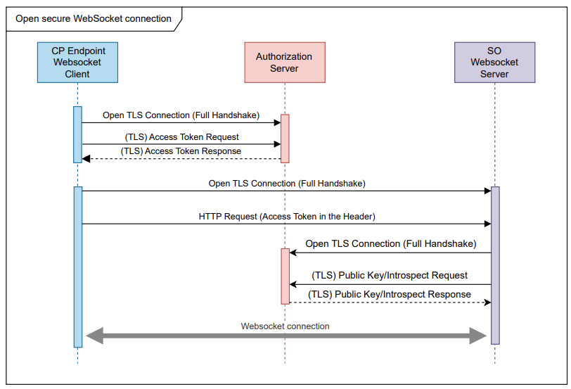
<span class="anchor" id="_Toc213261955"></span>Figure 26: Access token handling and verification when OAuth 2.0 is used for WebSocket client authorization.

### E2E-Security Profile

To better fit into the security framework for IEC 61850 it would be good to have the ability to later add support for
the IEC 62351 E2E-Security (E2E = End-to-end).

E2E-Security provides an additional layer of protection to the application layer by encapsulating the normal application
layer messages in security envelopes that add encryption and/or message authentication to the application layer
messages. Also, it provides handshake mechanisms to verify the identity of the application endpoint and the negotiate
cryptographic algorithms and session keys.

The future support for E2E security can be achieved by reserving tags in the ASN.1 schema to allow the later addition of
the security envelop data types.

###   

# Table of Figures

[Figure 1: The direct mapping approach provides a one-to-one mapping of the ACSI services and protocol services. [5](#_Ref214017325)](#_Ref214017325)

[Figure 2: Basic architecture of the SCSM protocol [9](#_Ref210885137)](#_Ref210885137)

[Figure 3: Encoding and decoding ASN.1 based protocol messages. [10](#_Ref214017345)](#_Ref214017345)

[Figure 4: The association services are used to start or end a two-party-application-association. [11](#_Toc213261933)](#_Toc213261933)

[Figure 5: Confirmed Services consist of request and response messages. The request and response messages are matched by the invokeId [12](#_Ref213084390)](#_Ref213084390)

[Figure 6: Unconfirmed services are sent by the server without prior request from the client. [13](#_Toc213261935)](#_Toc213261935)

[Figure 7: Client sends the Association Request after receiving the indication of a new connection from the WebSocket layer (“direct mode”). [14](#_Toc213261936)](#_Toc213261936)

[Figure 8: Clients sends the Association Request after receiving the indication of a new connection from the WebSocket layer. This is in the "reverse mode" where the ACSI and WebSocket client roles are not identical. [15](#_Toc213261937)](#_Toc213261937)

[Figure 9: GetServerDirectory request and response sequence. [20](#_Ref212564357)](#_Ref212564357)

[Figure 10: GetServerDirectory message sequence consisting using the moreFollows/continueAfter mechanism to split the response data in multiple APDUs. [21](#_Ref212564250)](#_Ref212564250)

[Figure 11: GetLogicalDeviceDirectory service messages showing the moreFollows/continueAfter mechanism to split the service in multiple APDUs. [22](#_Toc213261940)](#_Toc213261940)

[Figure 12: GetLogicalNodeDirectory service message sequences. The first one is to get the data objects of the logical node and the second one to get the unbuffered report control blocks. [24](#_Ref212564932)](#_Ref212564932)

[Figure 13: GetDataValues messages sequences. The first sequence is for the positive case when the server answers with the requested data. The second sequence is showing a negative response where the server is returning a serviceError. [28](#_Ref212565805)](#_Ref212565805)

[Figure 14: A client is requesting the definition of a data object. [33](#_Toc213261943)](#_Toc213261943)

[Figure 15: CreateDataSet service request and response sequence. In the positive case the response contains result=Ok [38](#_Ref212820736)](#_Ref212820736)

[Figure 16: The client reads all the values of a BRCB with the GetBRCBValues service. [42](#_Toc213261945)](#_Toc213261945)

[Figure 17: SetBRCBValues service setting the trigger options to trigger reports on value and quality changes, and enabled the report and requests an integrity report at the same time. [44](#_Ref212818112)](#_Ref212818112)

[Figure 18: GetURCBValue service sequence to read the current values of the RCB. [45](#_Toc213261947)](#_Toc213261947)

[Figure 19: SetBRCBValues service setting the intgPd attribute value, integrity trigger option, and enabled the report at the same time. [47](#_Toc213261948)](#_Toc213261948)

[Figure 20: A server sends two consecutive reports for the same RCB to the client that enabled (subscribed) the RCB with the SetURCBValues service. [49](#_Toc213261949)](#_Toc213261949)

[Figure 21: Example of a control operation consisting as a sequence of multiple request and response messages. This example shows the positive path in case of "Select before operate with normal security" control model. [50](#_Toc213261950)](#_Toc213261950)

[Figure 22: SBO control sequence when the control object is already selected. [51](#_Ref212570590)](#_Ref212570590)

[Figure 23: A successful operate sequence [53](#_Toc213261952)](#_Toc213261952)

[Figure 24: Select service sequence followed by the operate sevice sequence is the normal operation in the control model "SBO with normal security". [54](#_Ref212584222)](#_Ref212584222)

[Figure 25: Second select failed with a negative SelectResponse because the control object has already been selected and the select timeout didn't expire. [54](#_Ref212584343)](#_Ref212584343)

[Figure 26: Access token handling and verification when OAuth 2.0 is used for WebSocket client authorization. [60](#_Toc213261955)](#_Toc213261955)
