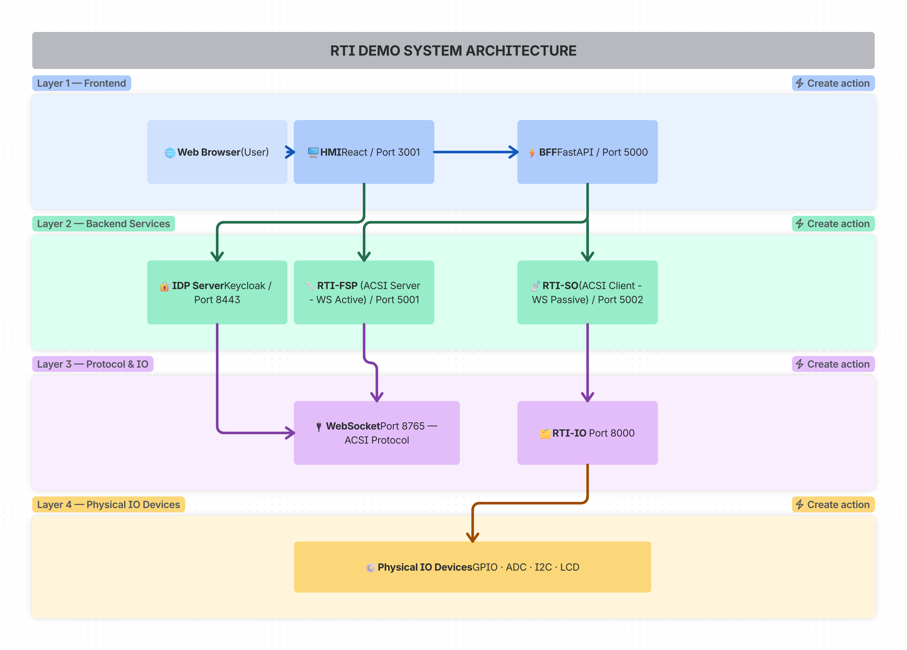

<!--
SPDX-FileCopyrightText: 2026 Netbeheer Nederland

SPDX-License-Identifier: Apache-2.0
-->

# RTI demo: system overview

The RTI demo is an IEC 61850-based Real-Time Infrastructure: an RTI-SO (system operator, ACSI client) and one or more
RTI-FSPs (flexibility service providers, ACSI servers) exchange ACSI services over WebSocket, managed through a BFF and
a React HMI, with physical feedback from a Raspberry Pi IO service.

This page is the system view: components, how they communicate, the data model and the main flows. How to run each
part is in the module READMEs (see [Components](#components)); why it is built this way is in
[decisions/](decisions/README.md).

## Components

| Component | Type | ACSI role | Default port |
|---|---|---|---|
| HMI | Frontend | - | 8080 |
| BFF | Backend | - | 3000 |
| RTI-FSP | Service | ACSI server | 5001 (REST); WebSocket client of the SO |
| RTI-SO | Service | ACSI client | 5000 (REST), 8765 (WebSocket server) |
| IO | Service | - | 9000 |
| IDP server (Keycloak) | Service | - | 8081 (HTTP), 8443 (HTTPS) |



Each component's README is its reference: run and test commands, configuration, API and design.

| Component | Reference |
|---|---|
| RTI-FSP (ACSI server, WebSocket active) | [modules/fsp/README.md](../../examples/rti-demo/modules/fsp/README.md) |
| RTI-SO (ACSI client, WebSocket passive) | [modules/so/README.md](../../examples/rti-demo/modules/so/README.md) |
| BFF (backend for frontend) | [modules/bff/README.md](../../examples/rti-demo/modules/bff/README.md) |
| HMI (React frontend) | [modules/hmi/README.md](../../examples/rti-demo/modules/hmi/README.md) |
| IO (Raspberry Pi devices) | [modules/io/README.md](../../examples/rti-demo/modules/io/README.md) |
| Demo playbooks | [playbooks/README.md](../../examples/rti-demo/playbooks/README.md) |

## Communication

| From | To | Protocol | Port |
|---|---|---|---|
| HMI | BFF | HTTP/REST | 3000 |
| BFF | FSP | HTTP/REST | 5001 |
| BFF | SO | HTTP/REST | 5000 |
| FSP | SO | WebSocket (ACSI) | 8765 |
| FSP, SO | IO | HTTP/REST | 9000 |
| IO | physical devices | direct hardware | GPIO, SPI (ADC), I2C (LCD) |
| BFF | IDP server | HTTP (discovery, health) | 8081 |
| FSP | IDP server | OAuth 2.0 token request | 8081 |
| SO | IDP server | OAuth 2.0 signing keys (JWKS) | 8081 |

All REST traffic is `application/json`.

### WebSocket (ACSI)

- The IEC 61850 ACSI protocol: read, write, control, reports, status.
- The FSP is the WebSocket client (active) and the ACSI server; the SO is the WebSocket server (passive, port 8765)
  and the ACSI client.
- The FSP connects to the SO: FSP (ACSI server, WebSocket client) → SO (ACSI client, WebSocket server, port 8765).

### OAuth 2.0

- IDP server: Keycloak, on 8081 (HTTP) or 8443 (HTTPS); see `scripts/keycloak`.
- Flow: the FSP requests a token from the IDP (client credentials) and sends it when it connects to the SO; the SO
  checks it against the IDP's signing keys (JWKS) and token issuer.
- Settings: entered in the HMI, stored per connection in the BFF's `connections.json`; the BFF adds them to the calls
  it forwards to the FSP and SO.
- Fields: `enable_oauth`, `idp_server`, `realm`, `token_endpoint`, `certificate_endpoint`, `token_issuer`,
  `client_id`, `client_secret`, `auth_server_ca`, `enable_token_refresh`.

### TLS

- Versions: TLSv1.2 and TLSv1.3.
- Passive mode (server, the SO): `server_key` and `server_cert`.
- Active mode (client, the FSP): `server_ca`, the CA certificate.
- Configured per connection in `connections.json`.

## IEC 61850 data model

### Hierarchy

```
Substation
+-- Logical Device (LD)
    +-- Logical Node (LLN0, LPHD, MMXU, etc.)
        +-- Data Object (Mod, Beh, NamPlt, etc.)
            +-- Data Attribute (stVal, q, t, etc.)
```

### Example

`LD0/LLN0$ST$Mod`

- `LD0`: Logical Device 0
- `LLN0`: Logical Node Zero
- `ST`: functional constraint (status information)
- `Mod`: Mode (data object)

### Data types

| Type | Values |
|---|---|
| BOOLEAN | ON/OFF, True/False |
| INTEGER | signed integer |
| FLOAT | floating point |
| STRING | text |
| ENUMERATED | predefined values |
| OCTET-STRING | binary |

### SCL files

- SCL is the XML-based configuration format.
- The HMI's Tools page parses it (`sclParser.js`), extracts the IEDs, access points and data objects, and generates the
  Python model code for an FSP.

## Main flows

### Read or write on the FSP itself

HMI → BFF → FSP (REST 5001) → the FSP's own model. This is local model access: no WebSocket frames. A write that is
mapped to an IO device also updates that device (LED, LCD).

### Read, write or operate through the SO

HMI → BFF → SO (REST 5000) → WebSocket (SO port 8765) → FSP → the FSP's model, and the response back the same way.
Reports travel FSP → SO over the same WebSocket.

### Connection management

HMI → BFF (`POST /api/add-connection`) → `connections.json` → `BffClient` registration. In the background, the BFF's
status monitor checks every connection's health every 10 seconds.

## Running the demo

[examples/rti-demo/README.md](../../examples/rti-demo/README.md) covers starting the services (`launch.py` or Docker
Compose), their ports and URLs, Keycloak, the hardware demo, logs and troubleshooting.
