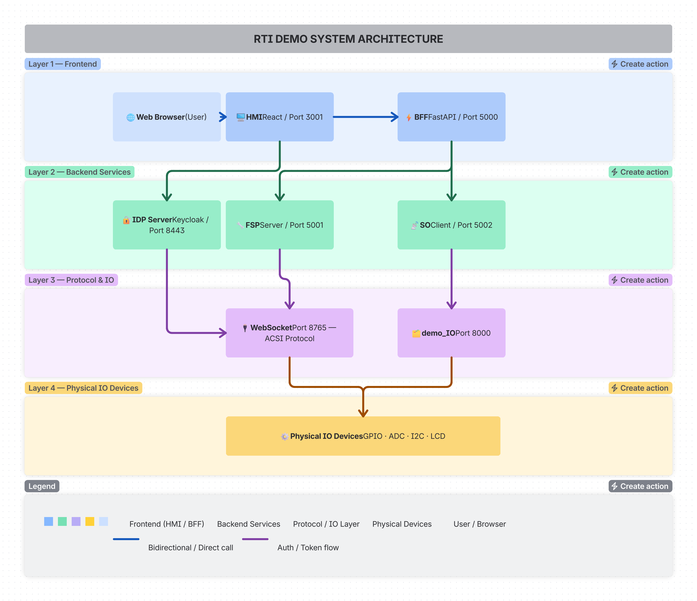

= RTI Demo - Complete System Documentation
:doctype: book
:encoding: utf-8
:lang: en
:toc: left
:toclevels: 4
:icons: font
:source-highlighter: pygments

*Document Version:* 1.0  
*Last Updated:* 2026-08-28  
*Primary Focus:* FSP (ACSI-Server) and SO (ACSI-Client) - System Operator

== System Overview

The RTI Demo implements a complete IEC 61850-based Real-Time Infrastructure with distributed components communicating via WebSocket (ACSI protocol) and HTTP/REST (management APIs).

Unified entry point for launching RTI (Real-Time Infrastructure) demo services.

=== Components Overview

[cols="1,1,1,1",options="header"]
|===
|Component |Type |ACSI Role |Default Port

|HMI |Frontend |N/A |3001

|BFF |Backend |N/A |5000

|FSP |Service |ACSI-Server |5001 (REST), 8765 (WebSocket)

|SO |Service |ACSI-Client |5002 (REST), 8765 (WebSocket)

|demo_IO |Service |N/A |8000

|IDP Server |Service |N/A |8443 (HTTPS)

|===

=== Main Architecture Diagram

=== Communication Matrix

[cols="1,1,1,1",options="header"]
|===
|From |To |Protocol |Port

|HMI |BFF |HTTP/REST |5000

|BFF |FSP |HTTP/REST |5001

|BFF |SO |HTTP/REST |5002

|BFF |demo_IO |HTTP/REST |8000

|FSP (Internal) |FSP (External) |WebSocket/ACSI |8765

|SO (Internal) |FSP |WebSocket/ACSI |8765

|demo_IO |Physical Devices |Direct Hardware |GPIO/ADC/I2C

|HMI |IDP Server |OAuth 2.0 |8443 (HTTPS)

|BFF |IDP Server |OAuth 2.0 |8443 (HTTPS)

|===

== Quick Start Guide

=== Launch All Services

[source,bash]
----
# Launch all services (default: all services with foreground & verbose mode)
python launch.py

# Launch individual services
python launch.py bff
python launch.py fsp
python launch.py so
python launch.py frontend
----

=== Common Commands

[source,bash]
----
# Show help
python launch.py --help

# List available services
python launch.py list

# Launch with custom port
python launch.py bff --port 5005

# Disable foreground mode (run in background)
python launch.py --background

# Disable verbose logging
python launch.py --no-verbose

# Check running services
python launch.py --status

# Stop all services
python launch.py --stop

# Docker mode
python launch.py --docker
----

=== Access URLs

[cols="1,1,1",options="header"]
|===
|Service |Port |Access URL

|BFF |5000 |http://localhost:5000

|FSP |5001 |http://localhost:5001

|SO |5002 |http://localhost:5002

|Frontend (HMI) |8080 |http://localhost:8080

|===

== Main Demo README

include::includes/main.adoc[]

== FSP - Functional Server Platform (ACSI-Server)

include::includes/fsp.adoc[]

== SO - System Operator (ACSI-Client)

include::includes/so.adoc[]

== BFF - Backend For Frontend

include::includes/bff.adoc[]

== HMI - Human Machine Interface

include::includes/hmi.adoc[]

== demo_IO - IO Device Control

include::includes/demo_io.adoc[]

== Deployment Configuration

include::includes/demo_setup.adoc[]

== Communication Protocols

=== WebSocket (ACSI)

- IEC 61850 ACSI protocol
- FSP: Active mode (initiates connections)
- SO: Passive mode (waits for connections)
- Port: 8765
- Connection: FSP (Server, Port 8765) <--WebSocket--> SO (Client)
- Message Types: Read, Write, Control, Reports, Status

=== HTTP/REST

[cols="1,1,1,1",options="header"]
|===
|From |To |Port |Content-Type

|HMI |BFF |5000 |application/json

|BFF |FSP |5001 |application/json

|BFF |SO |5002 |application/json

|BFF |demo_IO |8000 |application/json

|FSP/SO |demo_IO |8000 |application/json

|===

=== OAuth 2.0

- IDP Server: Keycloak
- Port: 8443 (HTTPS)
- Flow: HMI -> BFF (enriches) -> Backend (validates with IDP) -> IDP
- Configuration: Per connection in connections.json
- Fields: enable_oauth, idp_server, realm, token_endpoint, client_id, client_secret

=== TLS

- Supported Versions: TLSv1.2, TLSv1.3
- Passive Mode (Server): server_key + server_cert
- Active Mode (Client): server_ca (CA certificate)
- Configuration: Per connection in connections.json

== IEC 61850 Data Model

=== Hierarchy

----
Substation
+-- Logical Device (LD)
    +-- Logical Node (LLN0, LPHD, MMXU, etc.)
        +-- Data Object (Mod, Beh, NamPlt, etc.)
            +-- Data Attribute (stVal, q, t, etc.)
----

=== Example

`LD0/LLN0$ST$Mod`

- LD0 = Logical Device 0
- LLN0 = Logical Node Zero
- ST = Status (Data Object type)
- Mod = Mode (Data Object name)

=== Data Types

- BOOLEAN: ON/OFF, True/False
- INTEGER: Signed integer
- FLOAT: Floating point
- STRING: Text
- ENUMERATED: Predefined values
- OCTET-STRING: Binary

=== SCL File Parsing

- XML-based configuration format
- Parsed by sclParser.js in HMI Tools page
- Extracts: IEDs, AccessPoints, Data Objects
- Generates: Python model code for FSP

== Operational Workflows

=== Data Read Flow (FSP)

HMI -> BFF -> FSP (REST:5001) -> FSP (WebSocket:8765) -> Model  
HMI <- BFF <- FSP (REST:5001) <- FSP (WebSocket:8765) <- Model

=== Data Write Flow (FSP)

HMI -> BFF -> FSP (REST:5001) -> FSP (WebSocket:8765) -> Model -> demo_IO -> Physical Device

=== Control Operation Flow (SO)

HMI -> BFF -> SO (REST:5002) -> SO (WebSocket:8765) -> FSP (WebSocket:8765) -> Model

=== Connection Management

HMI -> BFF (**POST** `/api/add-connection`) -> connections.json -> BffClient registration  
BFF background: status_monitor checks health every 10 seconds

== Troubleshooting Guide

=== Common Issues

[cols="1,1,1",options="header"]
|===
|Service |Issue |Solution

|FSP |Port 5001 in use |`PORT=5002 python bff_endpoint.py`

|FSP |Port 8765 in use |Change WS port in start request

|SO |Port 5002 in use |`PORT=5003 python bff_endpoint.py`

|BFF |Port 5000 in use |`PORT=5005 python bff_server.py`

|demo_IO |Port 8000 in use |`PORT=8001 python main.py`

|All |Docker not found |Install Docker Desktop

|FSP/SO |Module not found |`pip install -e .` from repo root

|FSP/SO |Server not start |Check model.py exists and is valid

|HMI |Cannot connect |Verify BFF host/port in Settings

|===

=== Debug Commands

*FSP:*

[source,bash]
----
curl http://localhost:5001/api/iec61850server/status
curl http://localhost:5001/api/iec61850server/connections
curl http://localhost:5001/api/iec61850server/actions
curl http://localhost:5001/api/iec61850server/messages
----

*SO:*

[source,bash]
----
curl http://localhost:5002/api/iec61850client/status
curl http://localhost:5002/api/iec61850client/actions
----

*BFF:*

[source,bash]
----
curl http://localhost:5000/api/health
curl http://localhost:5000/api/connections
curl http://localhost:5000/api/endpoints
----

== Documentation Sources

This document was compiled from the following README files:

- `examples/rti-demo/README.md` - (Main launch and services)
- `examples/rti-demo/fsp/README.md` - (FSP implementation)
- `examples/rti-demo/so/README.md` - (SO implementation)
- `examples/rti-demo/bff/README.md` - (BFF implementation)
- `examples/rti-demo/hmi/README.md` - (HMI implementation)
- `examples/rti-demo/demo_IO/README.md` - (IO control)
- `examples/rti-demo/demo_setup/README.md` - (Deployment)

For detailed information on specific components, refer to their respective README files in the `examples/rti-demo` directory.

