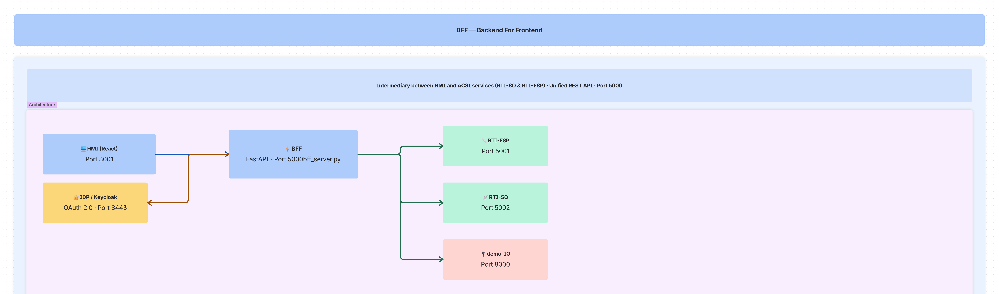
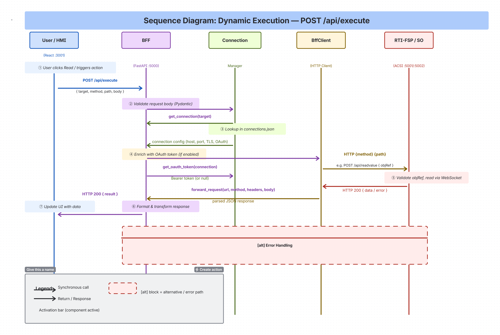
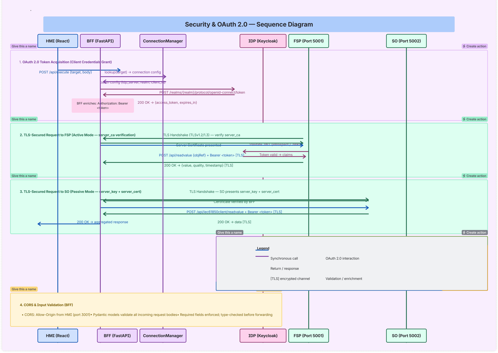

== BFF: Backend For Frontend

The **BFF (Backend For Frontend)** layer in the RTI Demo serves as an intermediary between 
the **HMI (Human Machine Interface)** and the **ACSI services** (RTI-SO and RTI-FSP). 
It provides a unified REST API that abstracts the complexity of direct service communication, 
connection management, authentication, and data transformation.

=== Purpose

* **Abstraction**: Hide the complexity of multiple ACSI endpoints (SO and FSP) behind a single, consistent API
* **Security**: Centralize authentication, authorization, and TLS configuration
* **Aggregation**: Combine multiple backend calls into single frontend requests
* **Transformation**: Adapt backend responses to frontend-expected formats
* **Connection Management**: Maintain and monitor connections to multiple RTI services

=== Architecture Diagram

=== Data Flow

HMI (React) -> HTTP REST -> BFF (FastAPI) -> HTTP/REST -> RTI-FSP (ACSI-Server)  
                          BFF (FastAPI) -> HTTP/REST -> RTI-SO (ACSI-Client)

*Note: The FSP and SO services use WebSocket internally for ACSI communication, but expose REST APIs that the BFF consumes.*

=== Folder Structure

----
bff/
+-- __pycache__/              # Python cache files (generated)
+-- bff_server.py            # Main FastAPI application
+-- ConnectionManager.py      # Manages connections to RTI endpoints
+-- DataManager.py           # Data read/write operations
+-- bffClient.py             # HTTP client for BFF-to-backend communication
+-- pydantic_models.py       # Request/Response data models
+-- connections.json         # Persistent connection configurations
+-- Dockerfile.bff           # Multi-stage Docker Build
+-- README.md
----

=== HMI to BFF Connection

The HMI (React application) connects to the BFF using the apiService.js module at: `hmi/src/services/apiService.js`

**Key Functions**:
* `getBffBaseUrl()` - Retrieves BFF host/port from localStorage
* `executeApiCall(apiId, targetValue, bodyOverride, options)` - Main API execution
* `ensureBffHealthy()` - Health check before operations

**API Definitions** in API_DEFINITIONS:
* Data operations: read, write, operate
* Model operations: model-tree, data-definition
* Control operations: operate, urcb-read, brcb-read, etc.
* OAuth: reconfigure-oauth, oauth-status
* Status: health, status

**Communication Pattern**:

Mode 1: Direct API Calls - HMI -> GET/POST /api/data/read -> BFF -> Returns data directly

Mode 2: Dynamic Execution via /api/execute (Primary) - 
HMI -> POST /api/execute { target, method, path, body } -> BFF -> Forwards to target service -> Returns result

=== BFF to SO/FSP Connection Flow

. **HMI Request**: User clicks Read button, HMI calls executeApiCall
. **BFF Receives**: FastAPI /api/execute endpoint processes request
. **BFF Forwards**: BffClient sends HTTP request to RTI-FSP
. **RTI-FSP Processes**: Validates objRef, reads ACSI data via WebSocket
. **BFF Returns**: Formats response and sends back to HMI
. **HMI Updates**: Displays data to user

Special OAuth Handling: When HMI calls /api/reconfig-oauth, BFF automatically enriches request 
with OAuth fields from connections.json.

=== Core Components

==== bff_server.py (Main Application)
* Framework: FastAPI with async support
* Port: 5000 (default)
* Route groups: Health, Endpoints, Connections, Data, Operate, Execute, Reports, Stats

==== ConnectionManager.py
* Manages all connections to RTI endpoints
* Connection types: RTI-FSP, RTI-SO, IDP-Server
* Features: Load/save connections, add/update/delete, health monitoring, auto-discovery

==== DataManager.py
* Executes data operations against connected endpoints
* Methods: call_remote_service, read_data, write_data, operate

==== bffClient.py
* HTTP client wrapper for BFF-to-backend communication
* Connection pooling, error handling, JSON parsing

==== pydantic_models.py
* Data validation and OpenAPI schema generation
* Models: Connection, TLS, OAuth, Data requests

=== API Endpoints

==== Health & Status
* **GET** `/api/health` - Health check with target reachability
* **GET** `/api/endpoints` - List all configured and discovered endpoints

==== Connection Management
* **GET** `/api/connections` - Get all connections
* **POST** `/api/add-connection` - Create new connection
* **PUT** `/api/edit-connection/{name}` - Update connection
* **DELETE** `/api/delete-connection/{name}` - Delete connection

==== TLS Configuration
* **POST** `/api/connections/tls-config` - Update TLS for connection
* **GET** `/api/connections/tls-config` - Get TLS config

==== OAuth Configuration
* **POST** `/api/connections/oauth-config` - Update OAuth for connection
* **GET** `/api/connections/oauth-config` - Get OAuth config
* **GET** `/api/connections/oauth-status` - Get OAuth enable status

==== Data Operations
* **POST** `/api/data/read` - Read data from connection
* **POST** `/api/data/write` - Write data to connection

==== Control Operations
* **POST** `/api/operate` - Perform control operation

==== Dynamic Execution
* **POST** `/api/execute` - Execute any API on registered target

==== Reports
* **GET** `/api/reports` - List available reports
* **POST** `/api/reports/export` - Export reports data

==== Statistics
* **GET** `/api/stats` - Get system statistics

=== Security Features

==== TLS Encryption (per-connection)
* Supports TLSv1.2 and TLSv1.3
* Passive mode: server_key + server_cert
* Active mode: server_ca (CA certificate)

==== OAuth 2.0 Authentication
* Integration with IDP servers (Keycloak)
* Per-connection OAuth configuration
* Automatic token enrichment for requests
* Token refresh support

==== CORS Support
* Allows cross-origin requests from HMI

==== Input Validation
* Pydantic models for all request types
* Required field validation
* Type checking

=== Configuration Files

==== connections.json
Persistent storage of all connection configurations with:
* Connection details (host, port, type, acsi role, ws_mode)
* OAuth configuration
* TLS configuration
* Status and properties info

Example FSP:
----
{
  "name": "rti-fsp",
  "host": "192.168.100.40",
  "port": 5001,
  "type": "RTI-FSP",
  "acsi": "server",
  "ws_mode": "active",
  "status": "connected"
}
----

Example SO:
----
{
  "name": "rti-so",
  "host": "192.168.100.41",
  "port": 5002,
  "type": "RTI-SO",
  "acsi": "client",
  "ws_mode": "passive",
  "status": "connected"
}
----

==== Dockerfile.bff
Multi-stage Docker build with:
* Builder stage using uv for dependency management
* Runtime stage with minimal image
* Health check configuration

=== Docker Integration
The BFF service in docker-compose.yml:
* Container: bff-server
* Port: 5000:5000
* Network: rti-network
* Volumes: connections.json persistence, Docker socket for discovery
* Depends on: Healthy bff-server for HMI

All services communicate through rti-network Docker network.

=== Usage Examples

==== Starting the BFF Server
With Docker:
----
docker-compose up bff-server
----

Without Docker:
----
python -m pip install fastapi uvicorn httpx requests
python bff_server.py
----

==== Health Check
----
curl http://localhost:5000/api/health
----

==== Dynamic Execution
----
curl -X POST http://localhost:5000/api/execute \
  -H "Content-Type: application/json" \
  -d '{"target": "127.0.0.1:5001", "method": "POST", "path": "/api/readvalue", "body": {"objRef": "LD0/LLN0$ST$Mod"}}'
----

==== Managing Connections
----
curl -X POST http://localhost:5000/api/add-connection \
  -d '{"name": "my-fsp", "host": "192.168.1.100", "port": 5001, "type": "RTI-FSP", "acsi": "server", "ws_mode": "active"}'

curl http://localhost:5000/api/connections
curl -X DELETE http://localhost:5000/api/delete-connection/my-fsp
----

=== Key Design Patterns
* **Backend For Frontend Pattern** - Primary architectural pattern
* **Adapter Pattern** - DataManager and BffClient adapt between frontend/backend
* **Singleton Pattern** - Global managers instantiated once
* **Factory Pattern** - ConnectionManager.add_connection creates connections
* **Proxy Pattern** - BFF proxies requests to backend services

=== Summary
The BFF folder provides a critical middleware layer that:
* Simplifies HMI interaction with multiple ACSI services
* Secures communication with TLS and OAuth
* Manages connections to RTI-FSP (ACSI-Server) and RTI-SO (ACSI-Client)
* Aggregates multiple backend calls
* Transforms data formats
* Monitors service health
* Proxies requests through unified REST API

Built on FastAPI (Python), communicates with:
* Frontend: React HMI via HTTP REST (port 5000)
* Backend: RTI-FSP and RTI-SO via HTTP/REST (ports 5001, 5002, etc.)
* Identity: Keycloak via OAuth 2.0 (port 8443)
