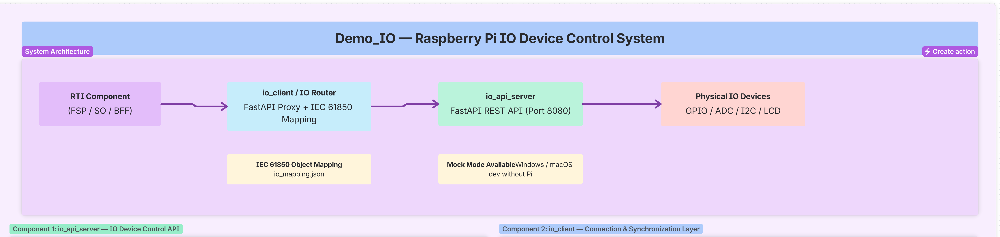

== Demo_IO: Raspberry Pi IO Device Control

This directory contains a complete **IO Device Control System** for Raspberry Pi, 
consisting of two main components:

1. **`io_api_server/`** - A FastAPI-based REST API service for direct hardware control
2. **`io_client/`** - Connection and use of IO server services and synchronization between 
   IO server and RTI component (ACSI client/server with WebSocket passive/active)

=== Overview

The demo_IO system enables remote control and monitoring of physical IO devices 
(LEDs, potentiometers, buttons, LCD displays) through:

* **Direct REST API** via the `io_api_server` service
* **ACSI Integration** via the `io_client` library that proxies requests to the IO server
* **IEC 61850 Object Mapping** to connect IO devices to power system data model objects

=== Architecture

=== Directory Structure

----
demo_IO/
├── io_api_server/                      # IO Device REST API Service
│   ├── main.py                         # Entry point - IOController + FastAPI app
│   ├── io_controller.py                # Core IO device management (LEDs, pots, buttons, LCDs)
│   ├── devices.py                      # Device configuration classes and types
│   ├── api_endpoint.py                 # FastAPI endpoints for device control
│   ├── io_config.py                    # Configuration loading/saving
│   └── io_config.json                  # Default device configurations
│
├── io_client/                          # Connection and synchronization between IO server and RTI
│   ├── async_client_io.py              # Async client for demo_IO API
│   ├── io_router.py                    # FastAPI router for ACSI BFF
│   ├── io_utils.py                     # Utility functions
│   ├── mapping_manager.py              # IEC 61850 to IO device mapping
│   └── io_mapping.json                 # Default IEC 61850 object mappings
│
└── __init__.py
----

=== Component 1: io_api_server - IO Device Control API

A **FastAPI-based web service** that provides REST API endpoints for controlling 
physical IO devices connected to a Raspberry Pi or simulated devices for development.

[cols="1,1",options="header"]
|===
|Feature |Description
|Multi-Device Support |LEDs, Potentiometers, Buttons, LCDs (16x2, I2C)
|Hardware Abstraction |Clean separation between hardware drivers and API logic
|Mock Mode |Works without Raspberry Pi hardware (Windows/macOS development)
|REST API |Complete CRUD operations for all device types
|Swagger UI |Interactive API documentation at `/api/io/docs`
|Thread-Safe |Safe concurrent access to IO devices
|Plug-in Architecture |Easy to add new device types
|===

[cols="1,1,1,1",options="header"]
|===
|Device Type |Description |Direction |Configuration
|LED |Digital output - on/off control |OUTPUT |GPIO pin, initial state
|Potentiometer |Analog input via ADS1115 ADC |INPUT |ADC channel, min/max values
|Button |Digital input with debounce |INPUT |GPIO pin, debounce time, pull-up
|LCD (HD44780) |16x2 character display |OUTPUT |GPIO pins (RS, E, D4-D7)
|LCD I2C |LCD with I2C backpack (PCF8574) |OUTPUT |I2C address, pin mappings
|===

==== API Endpoints
All endpoints are under `/api/io/` prefix.

===== Configuration via Environment Variables
[cols="1,1,1",options="header"]
|===
|Variable |Default |Description
|PORT |8080 |Server port
|IO_CONFIG_FILE |io_config.json |Path to configuration file
|===

===== Hardware Requirements
* Raspberry Pi (any model with GPIO header)
* LEDs: 5mm standard, 220Ω-470Ω resistors
* ADS1115 ADC: For analog inputs (potentiometers)
* Potentiometer: 10kΩ recommended
* LCD: HD44780-compatible 16x2 display
* I2C LCD Backpack: PCF8574-based (address 0x27 or 0x39)

=== Component 2: io_client - Connection and Synchronization Layer

The `io_client` directory provides connection and synchronization between the IO server 
services and the RTI component (ACSI client/server with WebSocket passive/active).

[cols="1,1",options="header"]
|===
|Feature |Description
|AsyncDemoIOClient |Python client for demo_IO REST API
|IO Router |FastAPI router that proxies requests to demo_IO
|IEC 61850 Mapping |Map IO devices to IEC 61850 data objects
|Automatic Integration |IO router auto-included in ACSI BFF
|Connection Management |Connect/disconnect from demo_IO via API
|Bulk Operations |Control multiple devices at once
|===

==== Architecture
Two integration paths:
1. **Direct Client Usage**: Import and use AsyncDemoIOClient directly in code
2. **Router Proxy**: ACSI exposes IO endpoints that proxy to demo_IO via IO router

===== Direct Client Usage
----
from demo_IO.io_client.async_client_io import AsyncDemoIOClient

client = AsyncDemoIOClient(base_url="http://localhost:8080")
client.config_led(name="led1", gpio_pin=17, description="Status LED")
client.turn_on("led1")
client.toggle_led("led2")
state = client.get_led_state("led1")
client.all_leds_on()
client.all_leds_off()
if client.is_healthy():
    print("demo_IO is healthy")
----

===== IEC 61850 Object Mapping
----
{
  "leds": {
    "led1": {
      "device_name": "led1",
      "objRef": "connected",
      "direction": "output",
      "device_type": "led"
    }
  },
  "buttons": {
    "button1": {
      "device_name": "button1",
      "objRef": "LD0/LPHD.PwrUp.stVal",
      "direction": "input",
      "device_type": "button"
    }
  }
}
----

Allows:
* Automatic IEC 61850 integration when devices change state
* BFF endpoints to expose IO device states as IEC 61850 objects
* Client applications to subscribe to IEC 61850 objects that control IO devices

=== Configuration Files

==== io_api_server/io_config.json
Defines all IO devices and their configurations:
* Device name, type, identifier
* GPIO pins for digital devices
* ADC channels for analog devices
* I2C addresses for I2C devices
* Initial states and descriptions
* ACSI server integration settings
* IEC 61850 object mappings

==== io_client/io_mapping.json
Defines mappings between IEC 61850 objects and IO devices:
* Which IO device corresponds to which IEC 61850 data object
* Object reference (objRef) for each device
* Direction (input/output)
* Device type for validation

=== IEC 61850 Integration
1. **Object Mapping**: Map IO devices to IEC 61850 data objects (LD, LN, DO, DA)
2. **BFF Endpoints**: Expose IO device states through ACSI's BFF
3. **ACSI Integration**: Connect IO devices to ACSI server for protocol-level control

=== GPIO Pin Mapping

==== Raspberry Pi 5 Pinout Diagram
----
       3V3  (1) [o] [o] (2)  5V
  GPIO2/SDA (3) [o] [o] (4)  5V
  GPIO3/SCL (5) [o] [o] (6)  GND
   GPIO4    (7) [o] [o] (8)  GPIO14 (TXD)
       GND  (9) [o] [o] (10) GPIO15 (RXD)
  GPIO17   (11) [o] [o] (12) GPIO18
  GPIO27   (13) [o] [o] (14) GND
  GPIO22   (15) [o] [o] (16) GPIO23
      3V3  (17) [o] [o] (18) GPIO24
  GPIO10   (19) [o] [o] (20) GND
   GPIO9   (21) [o] [o] (22) GPIO25
  GPIO11   (23) [o] [o] (24) GPIO8 (CE0)
       GND  (25) [o] [o] (26) GPIO7 (CE1)
 GPIO0/ID_SD(27) [o] [o] (28) GPIO1/ID_SC
   GPIO5   (29) [o] [o] (30) GND
   GPIO6   (31) [o] [o] (32) GPIO12
  GPIO13   (33) [o] [o] (34) GND
  GPIO19   (35) [o] [o] (36) GPIO16
  GPIO26   (37) [o] [o] (38) GPIO20
       GND  (39) [o] [o] (40) GPIO21
----

Default GPIO configuration:
[cols="1,1,1,1,1,1",options="header"]
|===
|Device Name |Device Type |GPIO |Physical Pin |Direction |Description
|led1 |LED |17 |11 |OUTPUT |LED 1
|led2 |LED |18 |12 |OUTPUT |LED 2
|led3 |LED |22 |15 |OUTPUT |LED 3
|button1 |Button |10 |19 |INPUT |Button (latching, pull-up)
|pot1 |Potentiometer |- |- |INPUT |ADC Channel 0
|lcd1 |LCD 16x2 |Multiple |Multiple |OUTPUT |HD44780 4-bit mode
|===

==== LCD Pin Mapping (HD44780 4-bit mode)
[cols="1,1,1,1,1",options="header"]
|===
|LCD Pin |Pin Name |Raspberry Pi GPIO |Physical Pin |Function
|4 |RS |26 |37 |Register Select (0=Command, 1=Data)
|5 |RW |GND |- |Read/Write (GND = Write mode)
|6 |E |19 |35 |Enable (clock signal)
|11 |D4 |13 |33 |Data Bit 4 (MSB)
|12 |D5 |12 |32 |Data Bit 5
|13 |D6 |16 |36 |Data Bit 6
|14 |D7 |20 |38 |Data Bit 7 (LSB)
|===

==== Wiring Connections
**LEDs (Active High)**:
* LED1: GPIO 17 (Pin 11) -> LED anode -> Resistor (220-470Ω) -> GND
* LED2: GPIO 18 (Pin 12) -> LED anode -> Resistor (220-470Ω) -> GND
* LED3: GPIO 22 (Pin 15) -> LED anode -> Resistor (220-470Ω) -> GND

**Button**:
* BUTTON1: GPIO 10 (Pin 19) -> Button -> GND (pull-up enabled in software)

**LCD 16x2 (HD44780)**:
* RS: GPIO 26 (Pin 37) -> LCD Pin 4
* RW: GND -> LCD Pin 5 (hardwired to write mode)
* E: GPIO 19 (Pin 35) -> LCD Pin 6
* D4: GPIO 13 (Pin 33) -> LCD Pin 11
* D5: GPIO 12 (Pin 32) -> LCD Pin 12
* D6: GPIO 16 (Pin 36) -> LCD Pin 13
* D7: GPIO 20 (Pin 38) -> LCD Pin 14
* VDD: +5V -> LCD Pin 2
* VSS: GND -> LCD Pin 1
* V0: Adjustable via potentiometer -> LCD Pin 3
* Backlight: +5V -> LCD Pin 15, GND -> LCD Pin 16

=== Troubleshooting

[cols="1,1",options="header"]
|===
|Issue |Solution
|Port already in use |Use PORT=8081 python main.py
|gpiozero import error (Windows) |Normal - uses mock mode. Install gpiozero for Pi.
|GPIO permission denied (Linux) |Run with sudo or add user to gpio group
|ADS1115 not detected |Check I2C wiring, enable I2C in raspi-config
|LEDs not responding |Verify wiring (resistor +, GND -), check GPIO numbering
|ACSI connection failed |Verify DEMO_IO_URL, check demo_IO is running
|===

Debug Commands:
----
curl http://localhost:8080/api/io/health
curl http://localhost:5001/api/io/connection
curl http://localhost:8080/api/io/devices
curl http://localhost:8080/api/io/devices/led1
sudo i2cdetect -y 1
ls /dev/gpio*
----

Enable I2C:
----
sudo raspi-config
# Navigate to: Interface Options -> I2C -> Enable
sudo reboot
----

Enable SPI:
----
sudo raspi-config
# Navigate to: Interface Options -> SPI -> Enable
sudo reboot
----

=== IO API Server Usage

Start:
----
cd demo_IO/io_api_server
python main.py
PORT=8080 python main.py
cd demo_IO
docker-compose up rti-io
----

API Endpoints:
* Health: GET /api/io/health
* List devices: GET /api/io/devices
* Device state: GET /api/io/{device_name}
* Write to device: POST /api/io/{device_name}
* LCD write: POST /api/io/lcd/{device_name}/write - Body: {"text": ["line1", "line2"]}
* LCD write line: POST /api/io/lcd/{device_name}/write-line - Body: {"line": 0, "text": "text"}
* LCD clear: POST /api/io/lcd/{device_name}/clear

Device Configuration Example:
----
{
  "devices": [
    {
      "name": "led1",
      "device_type": "led",
      "type": "led",
      "gpio_pin": 17,
      "direction": "output"
    },
    {
      "name": "lcd_i2c",
      "device_type": "lcd_i2c",
      "type": "lcd_i2c",
      "i2c_address": 40,
      "i2c_bus": 1,
      "columns": 16,
      "rows": 2,
      "direction": "output"
    }
  ]
}
----

See `demo_IO/io_api_server/devices.py` for all supported device types.
