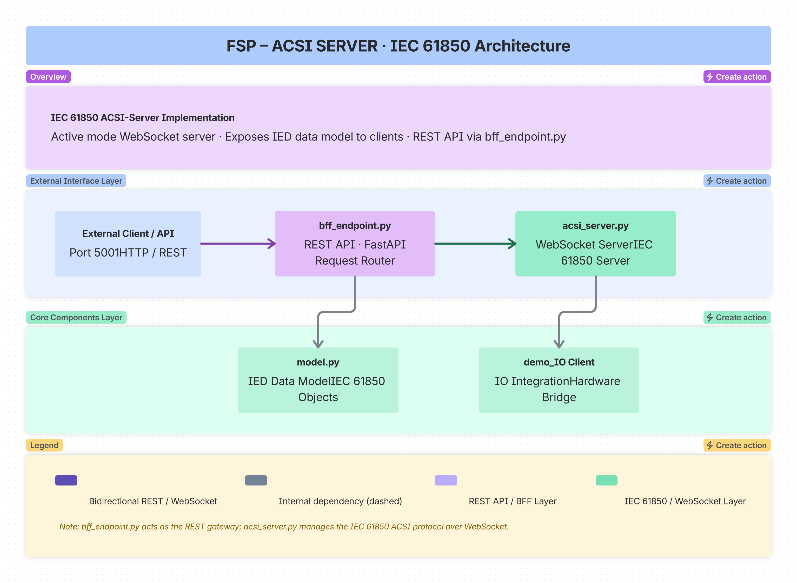

== FSP: IEC 61850 ACSI Server

This folder contains the **FSP (Functional Server Platform)** implementation - an **IEC 61850 ACSI Server** 
that provides WebSocket-based communication in active mode for substation automation and power system control.

=== Overview

The FSP directory implements a complete **IEC 61850 ACSI (Abstract Communication Service Interface) Server** that:

* Exposes IEC 61850 data model via WebSocket (active mode)
* Provides REST API endpoints for server management (BFF - Backend for Frontend)
* Manages IED (Intelligent Electronic Device) models
* Handles read/write operations on data objects
* Supports dynamic model reloading
* Integrates with IO devices via `demo_IO` service

=== Architecture

=== Directory Structure

----
fsp/
├── acsi_server.py        # Core WebSocket Server (Active Mode)
├── bff_endpoint.py       # REST API (FastAPI)
├── model.py              # IED Model (Python)
├── BFF_API.md            # API Documentation
├── Dockerfile            # Container Configuration
├── check_syntax.py        # Validation
├── run_bff.py            # Execution Script
├── start_bff.bat          # Windows Startup
├── test_start.py         # Tests
└── README.md
----

=== Key Components

==== acsi_server.py - IEC 61850 WebSocket Server (Active Mode)

The core server implementation that handles:

* WebSocket connection lifecycle (connect, disconnect, connection management)
* IEC 61850 server instantiation using ws61850 library
* Model loading and caching from model.py
* Async event loop management for concurrent operations
* Runtime state tracking (status, connections, errors)
* Message logging (received and sent messages)
* Action tracking for audit purposes

[cols="1,1",options="header"]
|===
|Class |Purpose
|`ACSIServerRuntime` |Manages server runtime state, connections, model, actions, msgs
|`ACSIServer` |Main server controller with WebSocket endpoint integration
|===

==== bff_endpoint.py - REST API (Backend for Frontend)

A FastAPI application that provides REST endpoints for managing the ACSI Server.

[cols="1,2",options="header"]
|===
|Category |Endpoints
|**Status** |GET `/api/iec61850server/status`, GET `/api/iec61850server/connections`
|**Model** |GET `/api/iec61850server/model`, POST `/api/iec61850server/update-iedmodel`
|**Lifecycle** |POST `/api/iec61850server/start`, POST `/api/iec61850server/stop`
|**Operations** |POST `/api/iec61850server/readvalue`, POST `/api/iec61850server/writevalue`
|**Logging** |GET/POST `/api/iec61850server/actions`, GET/POST `/api/iec61850server/messages`
|**IO Client** |POST `/api/io/connect`, GET `/api/io/connection`, POST `/api/io/disconnect`
|===

=== Quick Start

==== Docker
----
docker build -t rti-demo-fsp -f examples/rti-demo/fsp/Dockerfile .
docker run --rm -p 5001:5001 rti-demo-fsp
# With network
docker network create rti-network
docker run --rm -p 5001:5001 --network rti-network --name rti-fsp rti-demo-fsp
----

Health Check:
----
curl http://localhost:5001/api/iec61850server/status
----

==== Direct Python
----
python -m pip install -e . Flask==3.0.0 Flask-CORS==4.0.0
python bff_endpoint.py
# Custom port
PORT=5001 python bff_endpoint.py
----

=== Configuration

[cols="1,1,1",options="header"]
|===
|Variable |Default |Description
|`PORT` |5001 |REST API port
|`CP` |cp1 |Communication point identifier
|`DEMO_IO_URL` |None |demo_IO service URL (for auto-connect)
|===

Server Defaults: Host: 0.0.0.0, WebSocket Port: 8765, Mode: server, CP: cp1

=== Integration

* With demo_IO: POST `/api/io/connect` {base_url: "http://demo-io:8000"}
* With SO: FSP (Server, Port 8765) <--WebSocket--> SO (Client)
* With BFF: HTTP/REST at port 5001

=== Troubleshooting

[cols="1,1",options="header"]
|===
|Issue |Solution
|Port 5001 in use |Use PORT=5002 python bff_endpoint.py
|Port 8765 in use |Change WebSocket port in start request
|Docker not found |Install Docker Desktop
|Module not found |pip install -e . from repo root
|Server not starting |Check model.py exists and is valid
|===

Debug Commands:
----
curl http://localhost:5001/api/iec61850server/status
curl http://localhost:5001/api/iec61850server/connections
curl http://localhost:5001/api/iec61850server/actions
curl http://localhost:5001/api/iec61850server/messages
----

=== IO Client Integration

----
curl -X POST http://localhost:5001/api/io/connect \
  -H "Content-Type: application/json" \
  -d '{"base_url": "http://demo-io:8000"}'

curl http://localhost:5001/api/io/connection
curl -X POST http://localhost:5001/api/io/disconnect
----

=== Files Reference

[cols="1,1,1",options="header"]
|===
|File |Purpose |Key Classes/Functions
|acsi_server.py |WebSocket Server (active mode) |ACSIServerRuntime, ACSIServer
|bff_endpoint.py |REST API |FastAPI app, endpoint routes
|model.py |IED model |Generated data model
|check_syntax.py |Validation |Syntax checking
|run_bff.py |Runner |Simple execution
|start_bff.bat |Windows startup |Batch script
|test_start.py |Tests |Startup validation
|BFF_API.md |API docs |Endpoint specifications
|Dockerfile |Container |Multi-stage build
|===
