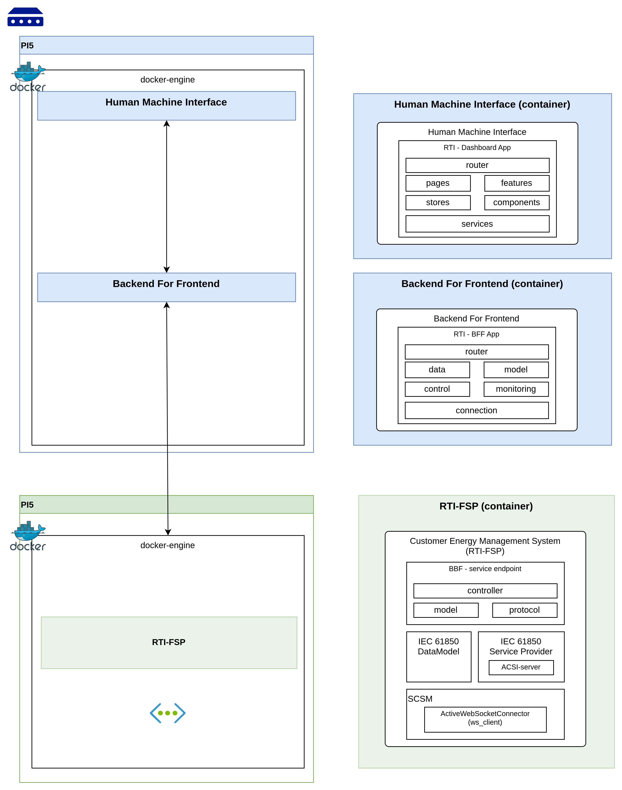

# Milestone 1 — First Executable End-to-End

## Goal

Establish a running, containerized stack that proves the full communication path from HMI through BFF to a simulated
RTI-FSP, using the `ws61850` library over plain WebSockets (the ActiveWebSocketConnector).

---

## Scope

### In scope

| Deliverable         | Description                                                                                                        |
|---------------------|--------------------------------------------------------------------------------------------------------------------|
| **HMI**             | React + TypeScript single-page app; shows connection status and live data                                          |
| **BFF**             | Python (Flask) REST API; hosts the RTI-FSP logic                                                                   |
| **RTI-FSP**         | Python headless process; simulates a point-of-common-coupling for a customer                                       |
| **RTI-SO**          | Python headless process; simulates a system opertaor (as a standalone container, without integration with the BFF) |
| **Docker Compose**  | `docker compose up` starts all four containers                                                                     |
| **GitHub workflow** | Branch strategy, PR template, CI lint/test job                                                                     |

### Out of scope for M1

- TLS / WSS (deferred — see Limitations below)
- OAuth 2.0 / JWKS token validation (deferred)
- Multiple simultaneous IED connections
- Production-grade retry/back-off tuning

---

## Architecture



## Project Layout (template)

```
<repo-root>/
├── .github/
│   ├── workflows/
│   │   ├── ci.yml                  # Lint + test on every PR
│   │   └── docker-build.yml        # Optional: build images on push to main
│   └── PULL_REQUEST_TEMPLATE.md
│
├── bff/                            # BFF container
│
├── simulators/                     # RTI-Simulators
│   ├── rti-fsp/                    # RTI-FSP container
│   │   ├── Dockerfile
│
│   ├── rti-so/                    # RTI-SO container
│   │   ├── Dockerfile
│
│
├── hmi/                            # HMI container
│   ├── Dockerfile
│   ├── package.json
│   ├── tsconfig.json
│   ├── vite.config.ts
│   ├── index.html
│   └── src/
│       ├── main.tsx
│       ├── App.tsx
│       ├── api/
│       │   └── client.ts           # Typed fetch wrappers
│       └── components/
│           ├── StatusBadge.tsx
│           └── DataView.tsx
│
├── docker-compose.yml              # M1 stack
├── docker-compose.dev.yml          # Hot-reload overrides
├── .env.example
└── docs/
    └── milestones/
        └── M1.md                   # This document
```

---

> **Development overrides** — `docker-compose.dev.yml` can mount source directories as volumes
> and replace the HMI container with the Vite dev server (hot reload) while keeping the BFF and
> RTI-FSP unchanged.

---

## Way of Working — GitHub

### Repository conventions

| Item               | Convention                                                  |
|--------------------|-------------------------------------------------------------|
| Default branch     | `main` — protected, CI must pass, 1 approval required       |
| Integration branch | `initial-refactor` — merged to `main` per milestone         |
| Feature branches   | `feature/<id>-<slug>` e.g. `feature/42-bff-status-endpoint` |
| Bug branches       | `fix/<id>-<slug>` e.g. `fix/57-reconnect-race`              |
| Docs branches      | `docs/<slug>` e.g. `docs/m1-milestone`                      |

### Commit message format

```
<type>(<scope>): <short summary in imperative>

[optional body]
```

| Type       | When to use                            |
|------------|----------------------------------------|
| `feat`     | New feature or capability              |
| `fix`      | Bug fix                                |
| `docs`     | Documentation only                     |
| `refactor` | Code change with no feature/bug effect |
| `test`     | Adding or adjusting tests              |
| `chore`    | Tooling, CI, dependency updates        |
| `build`    | Docker, Compose, packaging changes     |

**Scope** maps to container/layer: `hmi`, `bff`, `rti-fsp`, `rti-so`, `docs`, `ci`.

Examples:

```
feat(bff): expose GET /api/data/<ref> endpoint
fix(rti-fsp): handle reconnect when BFF restarts before FSP
docs(m1): add M1 milestone doc
build(ci): add ruff and tsc check to PR workflow
```

### Pull request checklist (`.github/PULL_REQUEST_TEMPLATE.md`)

```markdown
## Summary

<!-- One sentence: what changed and why -->

## Type

- [ ] feat - [ ] fix - [ ] docs - [ ] refactor - [ ] test - [ ] chore

## Checklist

- [ ] `docker compose up --build` runs without errors
- [ ] `GET /api/status` returns `{"connected": true}` after FSP connects
- [ ] `ruff check` and `black --check` pass (backend)
- [ ] `tsc --noEmit` passes (frontend)
- [ ] Tests added / updated where relevant
- [ ] Docs updated if API surface changed
```

### CI workflow (`.github/workflows/ci.yml` sketch)

Example

```yaml
name: CI
on:
  pull_request:
    branches: [ main, develop ]

jobs:
  lint-backend:
    runs-on: ubuntu-latest
    steps:
      - uses: actions/checkout@v4
      - uses: actions/setup-python@v5
        with: { python-version: "3.12" }
      - run: pip install ruff black
      - run: ruff check bff/ rti-fsp/
      - run: black --check bff/ rti-fsp/

  lint-frontend:
    runs-on: ubuntu-latest
    steps:
      - uses: actions/checkout@v4
      - uses: actions/setup-node@v4
        with: { node-version: "20" }
      - run: cd hmi && npm ci
      - run: cd hmi && npx tsc --noEmit

  test-backend:
    runs-on: ubuntu-latest
    steps:
      - uses: actions/checkout@v4
      - uses: actions/setup-python@v5
        with: { python-version: "3.12" }
      - run: pip install -e ".[dev]"
      - run: pytest tests/ -v
```

---

## Definition of Done

M1 is complete when all the following are true:

1. `docker compose up --build` starts all four containers without errors.
2. HMI loads at `http://localhost` and shows a connection-status indicator.
4. `GET http://localhost:8000/api/status` returns `{"status": "ok", "connected": true}` after
   the RTI-FSP container connects to the BFF.
5. The RTI-FSP simulates periodic value updates visible via the BFF REST API.
5. A pull request to `main` passes the CI pipeline (lint + type-check + tests).
6. The M1 branch is merged to `main` after at least one reviewer approval.

---

## Known Limitations and Next Steps (M2+)

| Limitation                                          | Planned resolution                                          |
|-----------------------------------------------------|-------------------------------------------------------------|
| No TLS — all traffic is plain `ws://` and `http://` | M2: add `TLSConfig` + `wss://` + HTTPS                      |
| No authentication — BFF is open                     | M2: add OAuth 2.0 / JWKS (Keycloak)                         |
| RTI-SO embedded in BFF process                      | M2: extract RTI-SO to its own container                     |
| Single IED model, single connection point           | M3: multi-CP support, dynamic model loading                 |
| HMI is read-only (no control)                       | M3: add setDataValues / operate via REST                    |
| No buffered reporting (BRCB)                        | M3: enable BRCB, stream updates via SSE or WebSocket to HMI |

---

## Reference

- Example used as base: [`examples/ws61850_interactive`](../../examples/ws61850_interactive/)
- Full-stack reference (with TLS + OAuth 2.0): [`examples/ws61850_ui`](../../examples/ws61850_ui/)
- Architecture background: [
  `docs/architecture/endpoint-architecture.md`](../../../../docs/architecture/endpoint-architecture.md)
- Protocol specification: [
  `docs/protocol_specification/RTI_2.0_Protocol_Specification.md`](../../../../docs/protocol_specification/RTI_2.0_Protocol_Specification.md)
