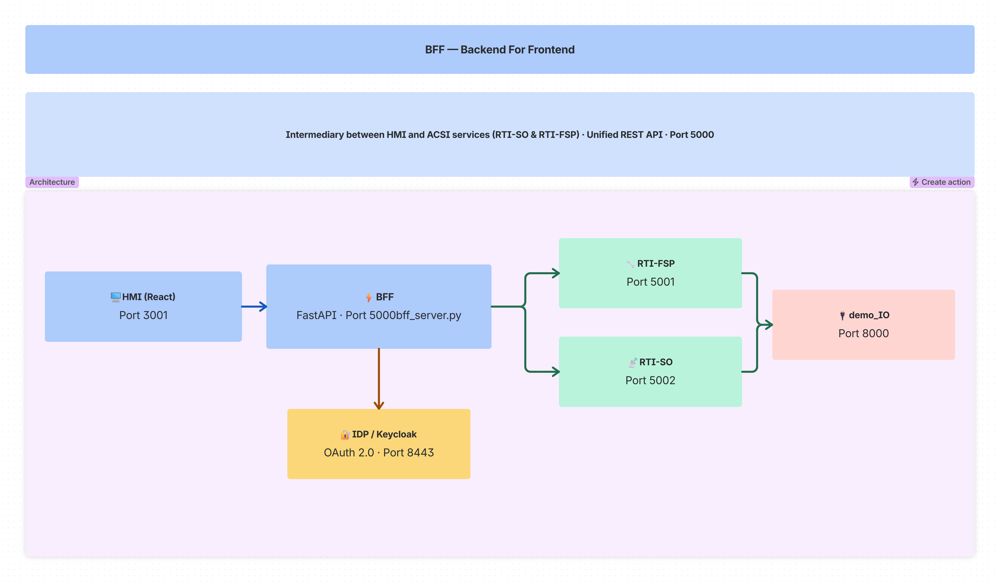
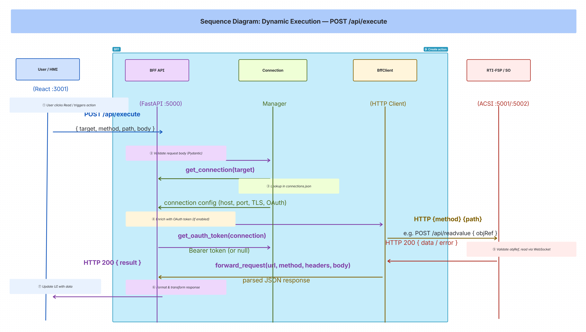
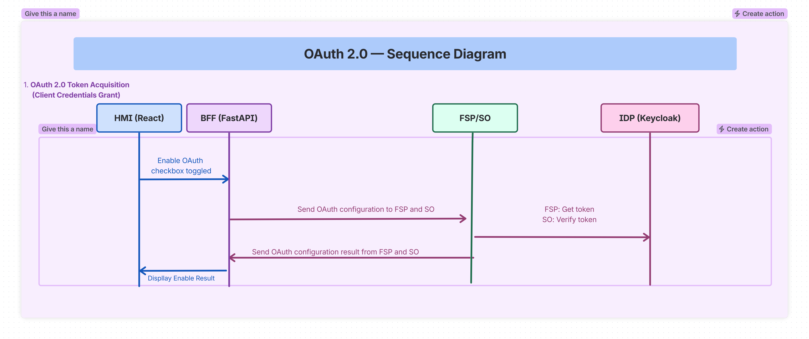

<!--
SPDX-FileCopyrightText: 2026 Netbeheer Nederland

SPDX-License-Identifier: Apache-2.0
-->

# RTI Demo BFF (Backend For Frontend) - Complete Documentation

## Table of Contents
1. [Overview](#overview)
2. [Architecture](#architecture)
3. [Folder Structure](#folder-structure)
4. [HMI to BFF Connection](#hmi-to-bff-connection)
5. [BFF to SO/FSP Connection Flow](#bff-to-sofsp-connection-flow)
6. [Core Components](#core-components)
7. [API Endpoints](#api-endpoints)
8. [Security Features](#security-features)
9. [Configuration Files](#configuration-files)
10. [Docker Integration](#docker-integration)
11. [Usage Examples](#usage-examples)
12. [Key Design Patterns](#key-design-patterns)

---

## Overview

The **BFF (Backend For Frontend)** layer in the RTI Demo serves as an intermediary between the **HMI (Human Machine Interface)** and the **ACSI services** (RTI-SO and RTI-FSP). It provides a unified REST API that abstracts the complexity of direct service communication, connection management, authentication, and data transformation.

### Purpose
- **Abstraction**: Hide the complexity of multiple ACSI endpoints (SO and FSP) behind a single, consistent API
- **Security**: Centralize authentication, authorization, and TLS configuration
- **Aggregation**: Combine multiple backend calls into single frontend requests
- **Transformation**: Adapt backend responses to frontend-expected formats
- **Connection Management**: Maintain and monitor connections to multiple RTI services

---

## Architecture



### Data Flow

HMI (React) -> HTTP REST -> BFF (FastAPI) -> HTTP/REST -> RTI-FSP (ACSI-Server)
                          BFF (FastAPI) -> HTTP/REST -> RTI-SO (ACSI-Client)

The BFF translates between:
- **Frontend**: JSON over HTTP REST
- **Backend**: JSON over HTTP/REST (to FSP/SO services)

Note: The FSP and SO services use WebSocket internally for ACSI communication, but expose REST APIs that the BFF consumes.

---

## Folder Structure

```
modules/bff/
├── pyproject.toml
├── docker/Dockerfile          # multi-stage build, built from the repository root
├── src/bff/
│   ├── bff_server.py          # FastAPI application: all routes and the /ws push channel
│   ├── connection_manager.py  # registered RTI-FSP / RTI-SO / IDP-Server connections, health checks
│   ├── bff_client.py          # HTTP client for BFF-to-instance calls
│   ├── pydantic_models.py     # request/response models
│   ├── cert_store.py          # lists the certificate directory for GET /api/certs
│   ├── playbook.py            # demo playbooks: parse, execute through the BFF, check each step
│   ├── playbook_store.py      # built-in and saved playbooks
│   ├── playbook_runs.py       # the one playbook run at a time, in a worker thread
│   └── connections.json       # seed connections, copied to the config volume on first start
└── tests/
```

---

## HMI to BFF Connection

### Frontend Integration

The HMI (React application) connects to the BFF using the apiService.js module located at:
```
hmi/src/services/apiService.js
```

**Key Functions**:

1. **getBffBaseUrl()** - Retrieves BFF host/port from localStorage

2. **executeApiCall(apiId, targetValue, bodyOverride, options)** - Main API execution

3. **ensureBffHealthy()** - Health check before operations

### API Definitions

The HMI defines all available backend API endpoints in API_DEFINITIONS:
- Data operations: read, write, operate
- Model operations: model-tree, data-definition
- Control operations: operate, urcb-read, brcb-read, etc.
- OAuth: reconfigure-oauth, oauth-status
- Status: health, status

### Communication Pattern

The HMI uses two modes to communicate with the BFF:

**Mode 1: Direct API Calls**
```
HMI -> GET/POST /api/data/read -> BFF -> Returns data directly
```

**Mode 2: Dynamic Execution via /api/execute (Primary)**
```
HMI -> POST /api/execute { target: "127.0.0.1:5001", method: "POST", path: "/api/readvalue", body: {...} }
     -> BFF -> Forwards to target service -> Returns result
```

The dynamic execution mode allows the HMI to target specific backend services and have the BFF enrich requests with OAuth tokens automatically.

---

## BFF to SO/FSP Connection Flow

### Step-by-Step Data Read Operation

1. **HMI Request**: User clicks Read button, HMI calls executeApiCall
2. **BFF Receives**: FastAPI /api/execute endpoint processes request
3. **BFF Forwards**: BffClient sends HTTP request to RTI-FSP
4. **RTI-FSP Processes**: Validates objRef, reads ACSI data via WebSocket
5. **BFF Returns**: Formats response and sends back to HMI
6. **HMI Updates**: Displays data to user

### Special OAuth Handling

When HMI calls /api/reconfig-oauth, BFF automatically enriches request with OAuth fields from connections.json, allowing HMI to trigger OAuth reconfiguration without knowing sensitive credentials.

---

## Core Components

### 1. bff_server.py (Main Application)
- Framework: FastAPI with async support
- Port: 5000 (default)
- Route groups: Health, Endpoints, Connections, Data, Operate, Execute, Reports, Stats

### 2. connection_manager.py
- Manages all connections to RTI endpoints
- Connection types: RTI-FSP, RTI-SO, IDP-Server
- Features: Load/save connections, add/update/delete, health monitoring, auto-discovery

### 3. bff_client.py
- HTTP client wrapper for BFF-to-backend communication
- Connection pooling, error handling, JSON parsing

### 4. pydantic_models.py
- Data validation and OpenAPI schema generation
- Models: Connection, TLS, OAuth, Data requests

### 5. playbook.py, playbook_store.py, playbook_runs.py
- Demo playbooks: YAML (or JSON) steps for one SO and its FSPs, executed through the BFF the same way the HMI does
- Built-in playbooks from `examples/rti-demo/playbooks` (read-only) and saved ones on the config volume
- One run at a time, in a worker thread; progress is pushed over `/ws` as `playbook-run` messages

---

## API Endpoints

### Health & Status
- GET /api/health - Health check with target reachability
- GET /api/diagnostics - System log across the BFF and every reachable RTI-SO/RTI-FSP (see `docs/rti-demo/design/logging-kinds.md`)
- WebSocket /ws - push channel for the HMI: connection list changes, actions, playbook runs

### Endpoints Management  
- GET /api/endpoints - Get all configured and discovered endpoints

### Connection Management
- GET /api/connections - Get all connections
- POST /api/add-connection - Create new connection
- DELETE /api/delete-connection/{name} - Delete connection
- PUT /api/edit-connection/{name} - Update connection

### TLS Configuration
- POST /api/connections/tls-config - Update TLS for connection
- GET /api/connections/tls-config - Get TLS config
- GET /api/certs - Certificates and keys in the certificate directory (`TLS_CERT_DIR`, default `/certs`): name, `file:` reference, subject, SANs, expiry - never key contents

### OAuth Configuration
- POST /api/connections/oauth-config - Update OAuth for connection
- GET /api/connections/oauth-config - Get OAuth config
- GET /api/connections/oauth-status - Get OAuth enable status
- GET /api/idp/discovery - Read a realm's OIDC discovery document from an IDP-Server connection (issuer, JWKS and token endpoints)

### Data and control operations
Reads, writes and operates go to an SO or FSP through `POST /api/execute` (below); the BFF has no separate data routes.

### Dynamic Execution
- POST /api/execute - Execute any API on registered target



### Reports
- GET /api/reports - List available reports
- POST /api/reports/export - Export reports data

### Statistics
- GET /api/stats - Get system statistics

### Playbooks
- GET /api/playbooks - `{ok, playbooks: [...]}`
- GET /api/playbooks/run - `{ok, run: state|null}`
- POST /api/playbooks/run/stop - `{ok, run}`
- GET /api/playbooks/{name} - `{ok, name, builtin, playbook, labels}`; 400 bad name, 404, 422 broken file
- GET /api/playbooks/{name}/file - the file's text, as a download (`Content-Disposition: attachment; filename="<file>"`)
- PUT /api/playbooks/{name} - body `{playbook}` (a recording) or `{text, format}` (an upload) → `{ok, name}`; 400, 409 (built-in)
- DELETE /api/playbooks/{name} - `{ok}`; 400, 404, 409 (built-in)
- POST /api/playbooks/{name}/run - body `{pace?, keep_going?}` (optional) → `{ok, run}`; 400, 404, 409 (already running)

A run's progress also pushes over `/ws` as `{"type": "playbook-run", "data": <state>}`, once when the run starts and again after every step.

Environment variables:
- `BFF_PLAYBOOKS_DIR` - where saved playbooks (recordings, uploads) live. Default: a `playbooks/` directory next to the connections file.
- `BFF_PLAYBOOKS_BUILTIN_DIR` - where the read-only built-in playbooks live. Default: `examples/rti-demo/playbooks`.

---

## Security Features



### 1. TLS Encryption
- Per-connection TLS configuration
- Supports TLSv1.2 and TLSv1.3
- Passive mode: server_key + server_cert
- Active mode: server_ca (CA certificate)

### 2. OAuth 2.0 Authentication
- Integration with IDP servers (Keycloak)
- Per-connection OAuth configuration
- Automatic token enrichment for requests
- Token refresh support

### 3. CORS Support
- Allows cross-origin requests from HMI

### 4. Input Validation
- Pydantic models for all request types
- Required field validation
- Type checking

---

## Configuration Files

### connections.json
Persistent storage of all connection configurations with:
- Connection details (host, port, type, acsi role, ws_mode)
- OAuth configuration
- TLS configuration
- Status and properties info

### docker/Dockerfile
Multi-stage Docker build (context: repo root) with:
- Builder stage using uv for dependency management
- Runtime stage with minimal image
- Health check configuration

---

## Docker Integration

The BFF service in docker-compose.yml:
- Container: rti-bff
- Port: 5000:5000
- Network: rti-network
- Volumes: `bff-config` at `/config` (connections.json and saved playbooks), `./playbooks` read-only (built-in playbooks), `testing/certs` read-only at `/certs` (TLS certificates, see the rti-demo README's *TLS certificates*)
- Depends on: Healthy rti-bff for HMI

All services communicate through rti-network Docker network.

---

## Usage Examples

### Starting the BFF Server

**With Docker**:
```bash
docker compose up rti-bff
```

**Without Docker** (from repository root - `bff` is a member of the
shared uv workspace):
```bash
uv sync --all-packages
uv run --package bff python -m bff.bff_server
```

### Health Check
```bash
curl http://localhost:5000/api/health
```

### Dynamic Execution
```bash
curl -X POST http://localhost:5000/api/execute \
  -H "Content-Type: application/json" \
  -d '{"target": "127.0.0.1:5001", "method": "POST", "path": "/api/readvalue", "body": {"objRef": "LD0/LLN0$ST$Mod"}}'
```

### Managing Connections
```bash
# Create
curl -X POST http://localhost:5000/api/add-connection \
  -d '{"name": "my-fsp", "host": "192.168.1.100", "port": 5001, "type": "RTI-FSP", "acsi": "server", "ws_mode": "active"}'

# List
curl http://localhost:5000/api/connections

# Delete
curl -X DELETE http://localhost:5000/api/delete-connection/my-fsp
```

---

## Key Design Patterns

1. **Backend For Frontend Pattern** - Primary architectural pattern
2. **Adapter Pattern** - BffClient and the /api/execute forwarding adapt between frontend/backend
3. **Singleton Pattern** - Global managers instantiated once
4. **Factory Pattern** - ConnectionManager.add_connection creates connections
5. **Proxy Pattern** - BFF proxies requests to backend services

---

## Summary

The BFF folder provides a critical middleware layer that:
- Simplifies HMI interaction with multiple ACSI services
- Secures communication with TLS and OAuth
- Manages connections to RTI-FSP (ACSI-Server) and RTI-SO (ACSI-Client)
- Aggregates multiple backend calls
- Transforms data formats
- Monitors service health
- Proxies requests through unified REST API

Built on FastAPI (Python), it communicates with:
- Frontend: React HMI via HTTP REST (port 5000)
- Backend: RTI-FSP and RTI-SO via HTTP/REST (ports 5001, 5002, etc.)
- Identity: Keycloak via OAuth 2.0 (port 8443)
