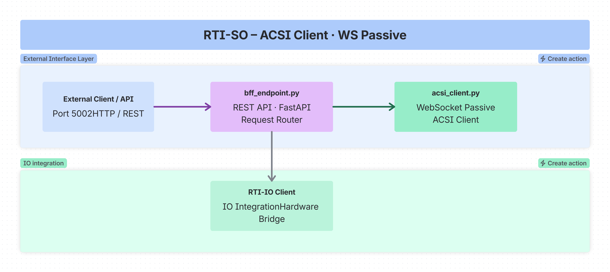

<!--
SPDX-FileCopyrightText: 2026 Netbeheer Nederland

SPDX-License-Identifier: Apache-2.0
-->

    # SO: IEC 61850 ACSI Client Implementation

This folder contains the **SO (System Operator)** implementation - an **IEC 61850 ACSI Client** that uses WebSocket in passive mode to connect to ACSI servers for substation automation monitoring and control.

## Overview

The SO directory implements a complete **IEC 61850 ACSI (Abstract Communication Service Interface) Client** that:

- Connects to IEC 61850 servers via WebSocket (passive mode)
- Provides REST API endpoints for client management (BFF - Backend for Frontend)
- Retrieves and navigates server directory structures
- Reads data values from connected servers
- Writes data values to connected servers
- Manages multiple connections and communication points
- Integrates with IO devices via `demo_IO` service

### Architecture



```
+------------------+     +---------------------+     +------------------+
|                  |     |                     |     |                  |
|   External       |<--->|   bff_endpoint.py   |<--->|   acsi_client.py  |
|   Client/API     |     |   (REST API)        |     |   (WebSocket)     |
|   (Port 5002)    |     |   FastAPI           |     |   IEC 61850 Client|
|                  |     |                     |     |   (Passive Mode)  |
+------------------+     +----------+----------+     +----------+----------+
                                    |                        |
                                    v                        v
                            +--------------------+    +-------------------+
                            |   Server Directory  |    |   demo_IO Client   |
                            |   Navigation        |    |   (IO Integration) |
                            +--------------------+    +-------------------+
```

### Directory Structure

```
modules/so/
├── pyproject.toml
├── docker/Dockerfile
├── tests/
├── src/so/
│   ├── acsi_client.py                  # Core IEC 61850 WebSocket client implementation (passive mode)
│   │                                    # - ACSIClientRuntime: Runtime state management
│   │                                    # - ACSIClient: Main client controller
│   │                                    # - WebSocket connection management
│   │                                    # - Model building and caching
│   │                                    # - Server directory navigation
│   │
│   └── bff_endpoint.py                 # REST API (FastAPI) for client management
│                                        # - Connection management (connect/disconnect)
│                                        # - Server directory operations
│                                        # - Model operations (get server/model tree)
│                                        # - Data operations (read/write values)
│                                        # - Action/message logging
│                                        # - IO client integration
│
└── README.md                           # This file
```

## Key Components

### 1. acsi_client.py - IEC 61850 WebSocket Client (Passive Mode)

The core client implementation that handles:

- **WebSocket connection lifecycle** (connect, disconnect, reconnect)
- **IEC 61850 client instantiation** using ws61850 library
- **Server directory navigation** (get server tree, logical devices, logical nodes)
- **Model building and caching** from connected servers
- **Async event loop management** for concurrent operations
- **Runtime state tracking** (status, connections, errors)
- **Message logging** (received and sent messages)
- **Action tracking** for audit purposes
- **Report handling** with callbacks for real-time updates

#### Key Classes

| Class | Purpose |
|-------|---------|
| `ModelInfo` | Manages model building state and data for each communication point |
| `ACSIClientRuntime` | Manages client runtime state, connections, model, actions, messages |
| `ACSIClient` | Main client controller with WebSocket endpoint integration |

### 2. bff_endpoint.py - REST API (Backend for Frontend)

A **FastAPI** application that provides REST endpoints for managing the ACSI client. Acts as a bridge between HTTP clients and the WebSocket-based IEC 61850 client in passive mode. For complete API documentation, open the interactive OpenAPI docs that FastAPI serves at
`http://localhost:5002/docs` while the service runs.

---

## Quick Start

### Prerequisites

- Python 3.11+
- Docker (optional, for containerized deployment)
- A running IEC 61850 server (FSP or other ACSI server)
- Required Python packages (see below)

### Option 1: Docker (Recommended)

#### Build and Run (from repository root)

The build context must be the repository root - this Dockerfile also
needs `src/ws61850` (the core library) and the shared uv workspace lock.

```bash
# Build the Docker image
docker build -t netbeheer-nederland/iec61850-websocket/rti-so -f examples/rti-demo/modules/so/docker/Dockerfile .

# Run the container
docker run --rm -p 5002:5002 netbeheer-nederland/iec61850-websocket/rti-so

# With custom network (for multi-container setup)
docker network create rti-network
docker run --rm -p 5002:5002 --network rti-network --name rti-so netbeheer-nederland/iec61850-websocket/rti-so
```

#### API Health Check

```bash
curl http://localhost:5002/api/iec61850client/status
```

### Option 2: Direct Python Execution (Without Docker)

#### Install Dependencies

From repository root - `so` is a member of the shared uv workspace
(alongside `ws61850`, `fsp` and `bff`):

```bash
uv sync --all-packages
```

#### Run SO API

From repository root:

```bash
# Default port (5002)
uv run --package so python -m so.bff_endpoint

# Custom port (Linux/macOS/WSL/Git Bash)
PORT=5002 uv run --package so python -m so.bff_endpoint

# Custom port (Windows PowerShell)
$env:PORT="5002"
uv run --package so python -m so.bff_endpoint
```

#### Health Check

```bash
curl http://localhost:5002/api/iec61850client/status
```

---

## IO Client Integration

The SO client can drive the IO devices (LEDs, LCDs) of the `io` service and take input from its buttons and
potentiometers. The IO code is not part of this package: on request, the service downloads the `io_client` files from
the IO server (`/api/io-plugin/files`), loads them and adds the `/api/io/*` routes to the running app. Nothing is
fetched at startup.

### Connect to the IO service

```bash
curl -X POST http://localhost:5002/api/io-plugin/connect \
  -H "Content-Type: application/json" \
  -d '{"server_url": "http://localhost:8000", "acsi_url": "http://localhost:5002"}'
```

`server_url` defaults to `IO_SERVER_URL`. In Docker use `http://rti-io:8000`; for an IO server started directly with
`main.py`, `http://localhost:8080`. The mapping between IO devices and IEC 61850 objects is
`io/io_client/io_mapping.json`; see the *Hardware demo* section of `examples/rti-demo/README.md`.

### Check/Disconnect IO

```bash
# Check connection
curl http://localhost:5002/api/io-plugin/connection-status

# Disconnect
curl -X POST http://localhost:5002/api/io-plugin/disconnect
```

---

## Configuration

### Environment Variables

| Variable | Default | Description |
|----------|---------|-------------|
| `PORT` | 5002 | REST API port |
| `IO_SERVER_URL` | `http://localhost:8000` | Default IO server for `/api/io-plugin/connect` |
| `IO_URL` | None | Read by the loaded IO router: connects its IO client without a separate `/api/io/connect` |
| `IO_PLUGIN_STORAGE` | `/app/io_plugin_dynamic` | Where the downloaded `io_client` files are kept |

### Connection Defaults

- **Host**: localhost
- **Port**: 8765
- **CP**: cp1 (communication point)

---

## Testing

Run tests from the repository root:

```bash
uv run --package so pytest examples/rti-demo/modules/so/tests -q
```

See `examples/rti-demo/TESTING.md` for the other modules and the integration tests.

---

## Model Status Values

| Status | Description |
|--------|-------------|
| `idle` | No model building in progress |
| `building` | Model is being built from server |
| `ready` | Model is ready for use |
| `error` | Error occurred during model building |

## Connection Status Values

| Status | Description |
|--------|-------------|
| `disconnected` | Not connected to any server |
| `connecting` | Connection attempt in progress |
| `connected` | Successfully connected to server |
| `disconnecting` | Disconnection in progress |
| `error` | Connection error occurred |

---

## Integration

### With FSP (Server)

FSP connects to SO as a WebSocket client (SO in passive mode):

```
SO (Server, Port 5002) <--HTTP--> External Clients
SO (WS Server, Passive) <--WebSocket--> FSP (Client)
```

### With demo_IO

SO integrates with `demo_IO` to control physical IO devices through IEC 61850 objects.

**Flow**: Write to IEC 61850 object -> SO sends to FSP -> FSP updates -> demo_IO controls physical device

### Typical Setup

```
+-----------+    +-----------+    +-----------+
|           |    |           |    |           |
|  Client   +--->+   SO      +--->+   FSP     |
|  (HTTP)   |    | (BFF)     |    | (Server)  |
|           |    | Port 5002 |    | Port 5001 |
+-----------+    +-----+-----+    +-----+-----+
                  |                 |           |
                  +-----------------+           |
                                    |           |
                                    v           v
                              +-----------+-----------+
                              | Physical Devices   |
                              +-----------+-----------+
                                    (via demo_IO or direct)
```

---

## Files Reference

| File | Purpose | Key Classes/Functions |
|------|---------|---------------------|
| `acsi_client.py` | WebSocket client (passive mode) | ModelInfo, ACSIClientRuntime, ACSIClient |
| `bff_endpoint.py` | REST API | FastAPI app, endpoint routes |
| `docker/Dockerfile` | Container | Multi-stage build |

---

## License

Part of the **RTI_DEMO** project. See main project for licensing information.
