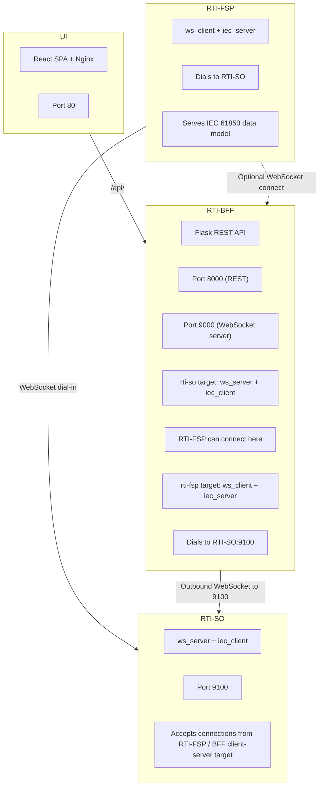
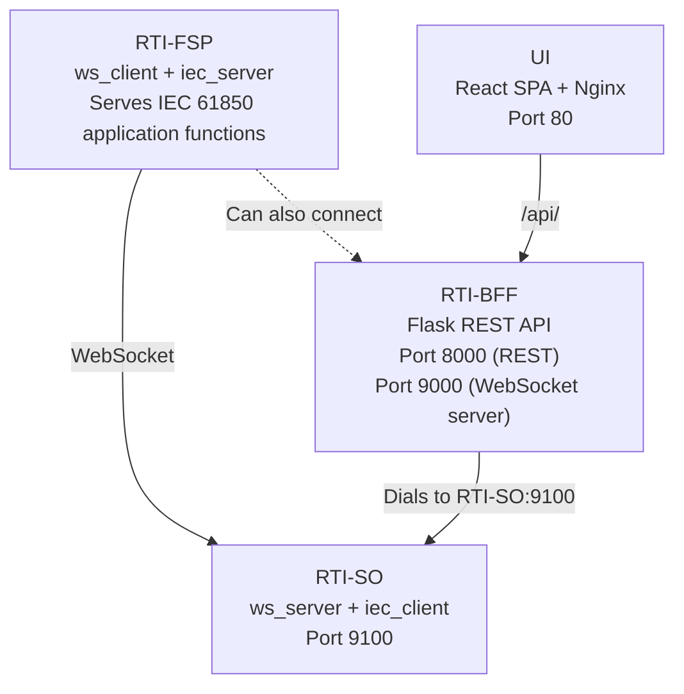
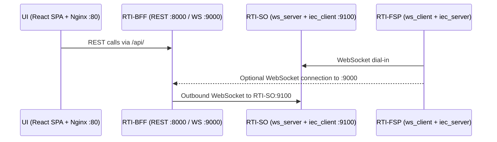
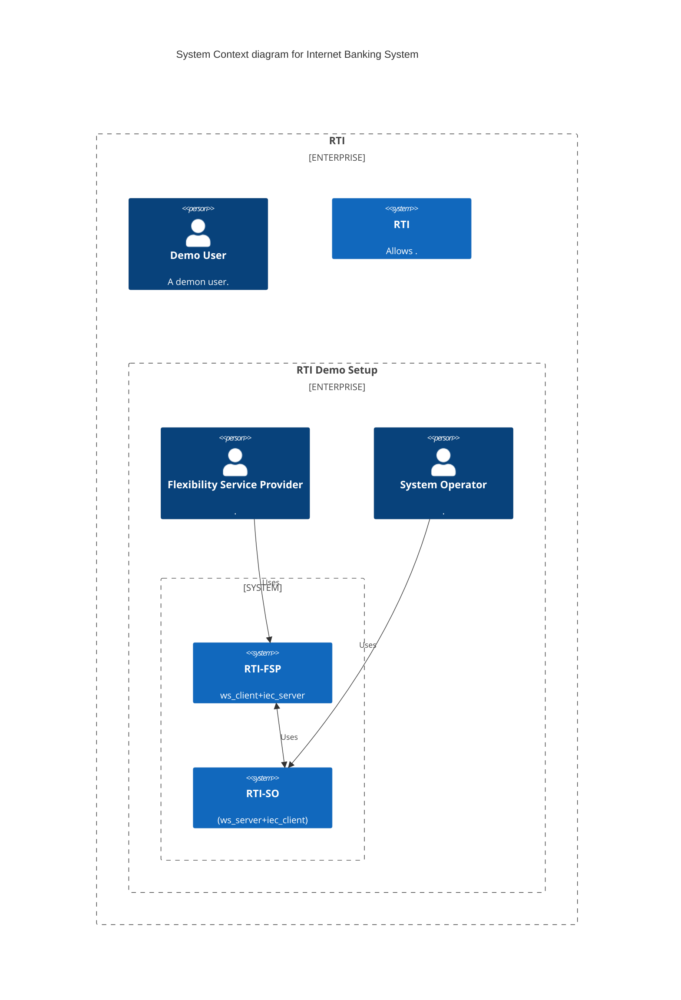

# UI Architecture

See the design specification produced for:

- session management
- model explorer
- stream viewer
- point detail
- scenario runner
- diagnostics

This scaffold implements the baseline project structure and extension points for those features.

